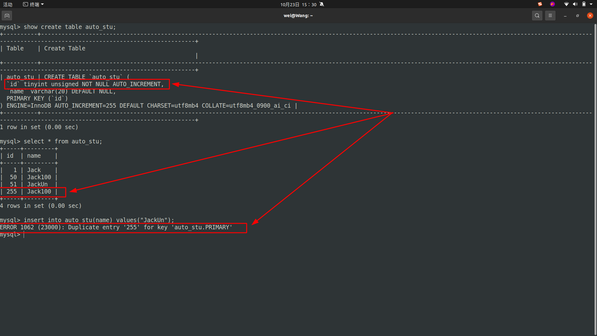

# 自增长与锁
&nbsp;&nbsp;这种锁是采用一种特殊的表锁机制，为了提高插入的性能，锁不是在一个事务完成之后才释放，而是在完成对自增长值插入的SQL语句后立即释放。

&nbsp;&nbsp;自增长列必须是一个索引

---
## 疑问
### 1. 当自增长值用完会怎么样
> 结论： 当值用完，下一次的INSERT请求会报 "duplicate-key error. "
> > When an AUTO_INCREMENT integer column runs out of values, a subsequent INSERT operation returns a duplicate-key error. This is general MySQL behavior.

### 2. 自增长的顺序是什么样的
+ 下一个数据行自增长列的取值(前提是未指定自增长值)是在目前表中数据最大增长值的基础上加1
+ 当到达了最大值，再次插入时会报错了。如下图:
   - 
  
       + 如上图，自增长列还有值可用，但是还是报错，说明 MySQL不会遍历是否有空闲的自增长值可以使用。

+ 如何重置自增主键的值呢? 删除该字段，重新建一个字段(将之前id值保存到临时字段，将自增id列删除重建).如：
    1. 添加临时列: alter table auto_stu add column old_id tinyint unsigned;
    2. 备份自增长列: update auto_stu set old_id = id;
    3. 删除自增长列:alter table auto_stu drop column id;
    4. 重建自增长列: alter table auto_stu add column id tinyint unsigned auto_increment primary key;
    5. 但此时，如果将old_id 值更新到 id 上，那么自增长值还是从更新后id列(自增列)最大值+1.

## 参考资料
1. [官方文档：https://dev.mysql.com/doc/refman/8.0/en/innodb-auto-increment-handling.html](https://dev.mysql.com/doc/refman/8.0/en/innodb-auto-increment-handling.html)
2. 《MySQL技术内幕InnoDB存储引擎第2版》 P262  