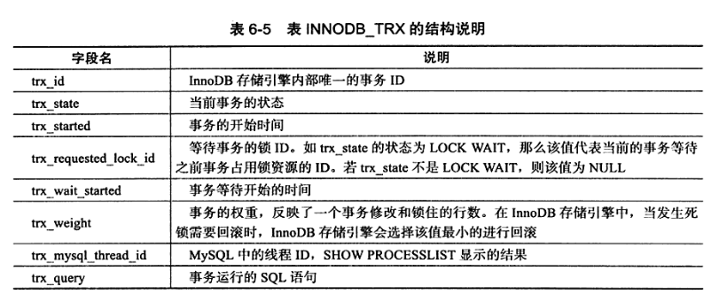
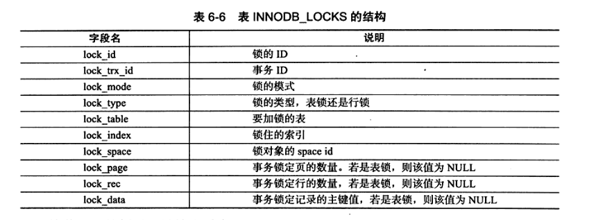
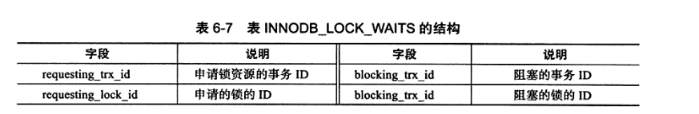

# MySQL InnoDB锁分类
## 类别一: 行级锁InnoDB存储引擎实现了如下两种标准的行级锁
- 共享锁(S Lock): 允许事务读一行数据。
- 排他锁(X Lock): 允许事务删除或更新一行数据

### S、X兼容情况如下
&nbsp;&nbsp;S和X都是行级锁，兼容是指对同一记录(row)锁的兼容情况.

|锁类型|X|S|
|---|---|---|
|X|不兼容|不兼容|
|S|不兼容|兼容|

---

## 类别二: 意向锁
&nbsp;&nbsp;InnoDB支持多粒度锁定，这种锁定允许事务在行级上的锁和表级上的锁同时存在。为了支持这一能力，InnoDB支持一种额外的锁定方式--意向锁。

&nbsp;&nbsp;意向锁是将锁定的对象分为多个层次，**意向锁意味着事务希望在更细粒度上进行加锁**，但若要对最细粒度进行加锁，那么首先需要对粗粒度上的对象进行加锁。
> 若需要对页上的记录r上X锁，那么分别需要对数据库A、表、页上意向锁IX，最后再对记录r上X锁。若前面任意一个部分导致等待，那么该操作

### 意向锁分类
- 意向共享锁（IS Lock）: 事务想获取一张表中某几行的共享锁。
- 意向排他锁（IX Lock）: 事务想获取一张表中某几行的排他锁。

&nbsp;&nbsp;InnoDB存储引擎支持的是行级别的锁，因此意向锁不会阻塞除全表扫描以外的任何请求。

### IX、IS、X、S兼容性
|锁类型|IS|IX|S|X|
|-|-|-|-|-|
|IS|兼容|兼容|兼容|不兼容|
|IX|兼容|兼容|不兼容|不兼容|
|S|兼容|不兼容|兼容|不兼容|
|X|不兼容|不兼容|不兼容|不兼容|

---

## 锁信息查看
### show engine innodb status;
&nbsp;&nbsp;可以通过该SQL查看当前锁请求信息。

### 事务锁相关信息(表位于 information_schema )
1. INNODB_TRX

2. INNODB_LOCKS  

3. INNODB_LOCK_WAITS

