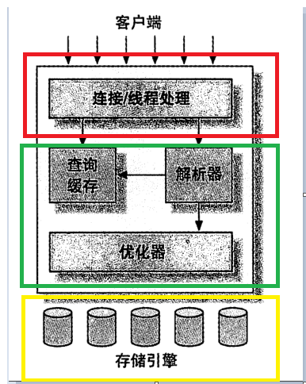

# MySQL逻辑架构
&nbsp;&nbsp;MySQL逻辑架构，如下为MySQL逻辑架构图:

## 分层说明
### 第一层：Server层(服务层)
&nbsp;&nbsp;该层服务并不是MySQL特有，大多数基于网络的客户端/服务端的工具或者服务都有类似的架构。比如连接处理、授权认证、安全等

### 第二层：核心服务层
&nbsp;&nbsp;大多数MySQL的核心服务都在这一层，包括查询解析、分析、优化、缓存以及所有的内置函数(如日期，时间，数学和加密函数)，所有跨存储引擎的功能都在这一层实现：存储过程、触发器、视图等

### 第三层：存储引擎层 
&nbsp;&nbsp; 存储引擎负责MySQL中数据的存储和读取。server通过API与存储引擎进行通信，这些接口屏蔽了不同存储引擎之间的差异，使得这些差异对上层的查询过程透明。存储引擎API包含几十个底层函数，用于执行诸如： 开始一个事务、根据主键提取一行记录等操作。但存储引擎不会解析SQL，不同存储引擎之间也不会相互通信，而只是简单地响应上层(server层)等请求