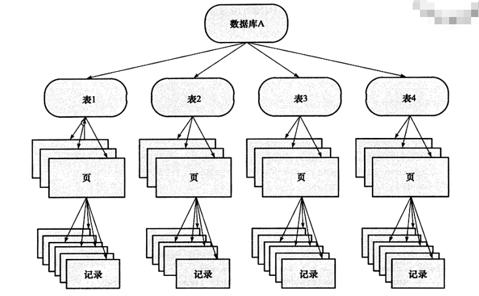

# InnoDB存储引擎之锁
&nbsp;&nbsp;MySQL中锁的对象是事务，用来锁定得失数据库中的对象，如表、页、行。并且一般lock的对象仅在事务commit或rollback后进行释放<sub>也有违背二段锁机制，在核心服务层过滤之后就释放锁的</sub>。且lock是由死锁机制的。
## 锁的类型
### 行级锁
&nbsp;&nbsp;InnoDB存储引擎实现了如下两种标准的**行级锁**:
1. 共享锁(S Lock),允许事务读一行数据
2. 排他锁(X Lock),允许事务删除或更新一行数据。

&nbsp;&nbsp;锁的兼容性如下：<sub>S、X都是行级锁，兼容性是指对同一记录锁的兼容性情况</sub>
1. 兼容： 如果一个事务T1已经获得了行r的共享锁，那么另外的事务T2可以立即获得行r的共享锁，因为读取并没有改变行r的数据，称这种情况为锁兼容
2. 不兼容： 若有其他的事务T3想获得行r的排他锁，则必然等待事务T1、T2释放行r上的共享锁，这种情况称之为锁不兼容
    |锁类型|X|S|
    |--|--|--|
    |X|不兼容|不兼容|
    |S|不兼容|兼容|
### 表级锁
&nbsp;&nbsp;InnoDB存储引擎支持多粒度锁定，这种锁定允许事务在行级上的锁和表级上的锁同时存在，例如：**诸如此类的语句“LOCK TABLES ... WRITE”在指定的表上获取排他锁（一个X锁）**。为了支持在不同粒度上进行加锁操作，InnoDB存储引擎支持一种额外的加锁方式，即意向锁（Intention Lock）.意向锁是将锁定的对象分为多个层次，意向锁意味着事务希望在更细粒度上进行加锁。

&nbsp;&nbsp;若将上锁的对象看成一棵树，那么对最下层的对象上锁，也就是对最细粒度的对象进行上锁，那么首先需要对粗粒度的对象上锁。如下图:
  

&nbsp;&nbsp;如果需要对页上的记录r行上X锁，那么分别需要对数据库A、表、页上意向锁IX，最后对记录r上X锁。若其中任何一个部分导致等待，那么该操作需要等待粗粒度锁的完成。
+ 例如：在对记录r加X锁之前，已经有事务对表1进行了S表锁，那么表1上已存在S锁<sup>这里的S锁是表级锁</sup>。之后事务需要对记录r在表1上加上IX，由于不兼容，所以该事务需要等待表锁操作的完成。

&nbsp;&nbsp;InnoDB存储引擎支持意向锁设计比较简练，其意向锁即为表级别的锁。设计的主要目的是为了在一个事务中揭示下一行被请求的锁类型<sup>原文: Intention locks are table-level locks that indicate which type of lock (shared or exclusive) a transaction requires later for a row in a table</sup>。其支持两种意向锁：
1. 意向共享锁("IS Lock")，事务想要获得一张表中某几行数据的共享锁
2. 意向排他锁("IX Lock"), 事务想要获得一张表中某几行的排他锁

&nbsp;&nbsp;由于InnoDB存储引擎支持的似乎行级别的锁，因此意向锁其实不会阻塞除全表扫描以外的任何请求。兼容性如下：
|锁类型|X|IX|S|IS|
|---|---|---|---|---|
|X	| 冲突 | 冲突 | 冲突 | 冲突 |
|IX	| 冲突 | 兼容 | 冲突 | 兼容 |
|S	| 冲突 | 冲突 |	兼容 | 兼容 |
|IS | 冲突 | 兼容 | 兼容 | 兼容 |

&nbsp;&nbsp;意向锁协议如下：
+ Before a transaction can acquire a shared lock on a row in a table, it must first acquire an IS lock or stronger on the table.
  - 在事务可以获取表中行的共享锁之前，它必须首先获取IS表上的锁或更强的锁。
+ Before a transaction can acquire an exclusive lock on a row in a table, it must first acquire an IX lock on the table.
  - 在事务获得表中行的排他锁之前，它必须首先获得IX 表的锁。


## [一致性非锁定读](https://dev.mysql.com/doc/refman/5.7/en/innodb-consistent-read.html)
### 什么是一致性非锁定读?
&nbsp;&nbsp;什么是一致性非锁定读? 即运行在REPEATABLE READ 、READ COMMITTED隔离级别下的普通的SELECT操作(不是针对与DELETE ， UPDATE，INSERT操作)。也就是多版本并发控制，可以参考《003.MySQL事务/002.InnoDB之多版本并发控制-MVCC.md》
```sql
   -- 如SELECT操作没有获取到数据(因为快照读)，但是UPDATE可以成功
   SELECT COUNT(c2) FROM t1 WHERE c2 = 'abc';
   -- Returns 0: no rows match.
   UPDATE t1 SET c2 = 'cba' WHERE c2 = 'abc';
   -- Affects 10 rows: another txn just committed 10 rows with 'abc' values.
   SELECT COUNT(c2) FROM t1 WHERE c2 = 'cba';
   -- Returns 10: this txn can now see the rows it just updated.UPDATE之后就可以看到了
```

### 一致性非锁定读
&nbsp;&nbsp;一致性非锁定读是指InnoDB存储引擎通过多版本并发控制(MVCC)的方式来读取当前执行时间数据库中行的数据（一致性读取意味着InnoDB使用多版本控制向查询提供数据库在某个时间点的快照。查询查看在该时间点之前提交的事务所做的更改，而不查看以后或未提交的事务所做的更改）。即若读取的行正在执行DELETE或UPDAE操作，这时读取操作不会因此去等待行上锁的释放。相反，InnoDB存储引擎会读取行的一个快照数据.

### 一致性非锁定读与事务隔离级别的关系
&nbsp;&nbsp;在事务隔离级别READ COMMITTED 和 REPEATABLE READ下，InnoDB存储引擎使用非锁定的一致性读。然而，对于快照数据的定义却不同：

#### REPEATABLE READ
&nbsp;&nbsp;在REPEATABLE READ事务隔离级别下，对于快照数据，非一致性读总是读取事务开始时的数据版本。如果需要查询更新的数据，你就需要提交当前事务然后再次发起查询操作。
   + 假设您在默认REPEATABLE READ隔离级别下运行 。当您发出一致读取（即普通 SELECT语句）时， InnoDB为您的事务提供一个时间点，您的查询根据该时间点查看数据库。如果另一个事务在分配您的时间点后删除一行并提交，您不会看到该行已被删除。插入和更新的处理方式类似。
   + 若要读取数据的最新状态，使用READ COMMITTED隔离级别或 锁定读取(SELECT .... FROM t LOCK IN SHARE MODE)
       - 使用READ COMMITTED隔离级别，事务中的每个一致性读取设置并读取自己的新快照。
       - 使用LOCK IN SHARE MODE，会发生锁定读取：一个 SELECT阻塞(即Select  LOCK IN SHARE MODE会被阻塞)，直到包含最新行的事务结束(即：**底限就是只能读取已提交的数据**)
   + 实操如下:
     <table>
      <tr>
       <td>事务A</td>
       <td>事务B</td>
      </tr>
      <tr>
       <td>begin;</td>
       <td>begin;</td>
      </tr>
      <tr>
       <td>
          select * from people;
          <table>
              <tr>
                <td>id</td>
                <td>name</td>
                <td>age</td>
              </tr>
              <tr>
                <td>1</td>
                <td>Zhang San</td>
                <td>1</td>
              </tr>
          </table>
       </td>
       <td></td>
      </tr>
      <tr>
       <td></td>
       <td>
         update people set age =3 where id =1;
         insert into people(name,age) values("Li Si",1);
       </td>
      </tr>
      <tr>
       <td>
          此时是无法获取事务B的insert和update操作.
          select * from people;
          <table>
              <tr>
                <td>id</td>
                <td>name</td>
                <td>age</td>
              </tr>
              <tr>
                <td>1</td>
                <td>Zhang San</td>
                <td>1</td>
              </tr>
          </table>
       </td>
       <td></td>
      </tr>
      <tr>
       <td>
          select * from people lock  in share mode; 此时事务B没有提交，该语句会被阻塞，直到超时
       </td>
       <td></td>
      </tr>
      <tr>
       <td></td>
       <td>commit;</td>
      </tr>
      <tr>
       <td>
          因为是普通的SELECT操作(具体参考《003.MySQL事务/002.InnoDB之多版本并发控制-MVCC.md》“ReadView与RC、RR的关系”小节)，此时读取的是快照。因此在事务A中目前还无法获取事务B的insert和update操作.
          select * from people;
          <table>
              <tr>
                <td>id</td>
                <td>name</td>
                <td>age</td>
              </tr>
              <tr>
                <td>1</td>
                <td>Zhang San</td>
                <td>1</td>
              </tr>
          </table>
       </td>
       <td></td>
      </tr>
      <tr>
       <td>
          使用锁定读发现，在事务A中通过锁定读是可以读取到事务B提交的内容
          select * from people lock  in share mode;
          <table>
              <tr>
                <td>id</td>
                <td>name</td>
                <td>age</td>
              </tr>
              <tr>
                <td>1</td>
                <td>Zhang San</td>
                <td>3</td>
              </tr>
              <tr>
                <td>3</td>
                <td>Li Si</td>
                <td>1</td>
              </tr>
          </table>
       </td>
       <td></td>
      </tr>
      <tr>
       <td>commit;</td>
       <td></td>
      </tr>
   </table>    
         
#### READ COMMITTED
&nbsp;&nbsp;在READ COMMITTED事务隔离级别下，对于快照数据，非一致性读总是读取被读取行的**最新一份快照数据**<sub>即离当前时间最近的一次提交的数据</sub>，即如果需要查询更新的数据，只需要再发起一次查询操作即可。具体可以参考《003.MySQL事务/002.InnoDB之多版本并发控制-MVCC.md》<sub>“ReadView与RC、RR的关系”小节</sub>，即了解MVCC的实现方式及原理。

&nbsp;&nbsp;操作前请将事务隔离级别调整为READ COMMITTED。实操如下:
  <table>
      <tr>
       <td>事务A</td>
       <td>事务B</td>
      </tr>
      <tr>
       <td>begin;</td>
       <td>begin;</td>
      </tr>
      <tr>
       <td>
          select * from people;
          <table>
              <tr>
                <td>id</td>
                <td>name</td>
                <td>age</td>
              </tr>
              <tr>
                <td>1</td>
                <td>Zhang San</td>
                <td>1</td>
              </tr>
          </table>
       </td>
       <td></td>
      </tr>
      <tr>
       <td></td>
       <td>
         update people set age =3 where id =1;
         insert into people(name,age) values("Li Si",1);
       </td>
      </tr>
      <tr>
       <td>
          此时在事务A中无法获取事务B的insert和update操作.**因为当前事务还没有提交，读取到的只能是已提交的数据**
          select * from people;
          <table>
              <tr>
                <td>id</td>
                <td>name</td>
                <td>age</td>
              </tr>
              <tr>
                <td>1</td>
                <td>Zhang San</td>
                <td>1</td>
              </tr>
          </table>
       </td>
       <td></td>
      </tr>
      <tr>
        <td></td>
        <td>commit;</td>
      </tr>
      <tr>
       <td>
          事务B提交了，再查询一次(发现，此时没有使用锁定读并且在事务A中也能将事务B提交的内容读取到)
          select * from people;
          <table>
              <tr>
                <td>id</td>
                <td>name</td>
                <td>age</td>
              </tr>
              <tr>
                <td>1</td>
                <td>Zhang San</td>
                <td>3</td>
              </tr>
              <tr>
                <td>3</td>
                <td>Li Si</td>
                <td>1</td>
              </tr>
          </table>
       </td>
       <td></td>
      </tr>
      <tr>
        <td>commit;</td>
        <td></td>
      </tr>
  </table>

#### 一致性非锁定读不适用场景
&nbsp;&nbsp;一致性非锁定读不适用场景如下:

##### 一致性非锁定读不适用于DDL语句
1. 不适用于DROP TABLE
2. 不适用于ALTER TABLE

##### 一致性非锁定读不适用与特殊查询
&nbsp;&nbsp;一致性非锁定读不适用与特殊查询，例如INSERT INTO ... SELECT, UPDATE ... (SELECT), and CREATE TABLE ... SELECT 等没有指定FOR UPDATE 或 LOCK IN SHARE MODE的操作。
   + 默认情况下，InnoDB在这些语句中会使用更强的锁，并且SELECT部分的行为类似与READ COMMIT，其中每个一致的读取，即使在同一个事务中，也会设置和读取自己的新快照。
   + 要在这种情况下执行非锁定读取，请启用该 innodb_locks_unsafe_for_binlog 选项并将事务的隔离级别设置为 READ UNCOMMITTED、 READ COMMITTED，或者 REPEATABLE READ避免对从所选表读取的行设置锁定。

-----
### 一致性锁定读 <sub>锁定读取只有在禁用自动提交时才可能</sub>
&nbsp;&nbsp;在MySQL默认的配置下，即事务的隔离级别为REPEATABLE READ，InnoDB存储引擎的SELECT操作使用一致性非锁定读。但是在某些情况下，用户需要显式地对数据库读操作进行加锁以保证数据逻辑的一致性。而这要求数据库支持加锁语句，即使是对于SELECT的只读操作。InnoDB存储引擎对于SELECT语句支持两种一致性的锁定读(Locking Read)操作:
1. SELECT .... FOR UPDATE;
   - 对于搜索遇到的索引记录，锁定行和任何关联的索引条目。其他事务被阻止更新这些行、执行SELECT ... LOCK IN SHARE MODE或读取某些事务隔离级别的数据。
   - SELECT .... FOR UPDATE对读取的行记录加一个X锁，其他事务不能对已锁定的行加上任何锁。
2. SELECT .... LOCK IN SHARED MODE;
   - 在读取的任何行上设置共享锁。其他会话可以读取这些行，但是在事务提交之前无法修改他们。
   - SELECT .... LOCK IN SHARED MODE 对读取的行记录加一个S锁，其他事务可以向被锁定的行加S锁，但是如果加X锁，则会被阻塞。

&nbsp;&nbsp;对于一致性非锁定读，即使读取的行已经执行了SELECT .... FOR UPDATE;，也是可以进行读取的。此外，SELECT .... FOR UPDATE; SELECT .... LOCK IN SHARED MODE;必须在一个事务中，当事务提交了，锁也就释放了。因此在上述两句SELECT锁定语句时，务必加上BEGIN，START TRANSACTION或者AUTOCOMMIT=0;

#### 关于一致性锁定读的注意事项
1. 除非在子查询中还指定了锁定读取子句，否则外部语句中的锁定读取子句不会锁定嵌套子查询中表的行。例如，以下语句不会锁定 table 中的行 t2。
   - SELECT * FROM t1 WHERE c1 = (SELECT c1 FROM t2) FOR UPDATE;

-----------

## 参考资料
1. 官方文档:[https://dev.mysql.com/doc/refman/5.7/en/innodb-locking.htm](https://dev.mysql.com/doc/refman/5.7/en/innodb-locking.htm)
2. 《MySQL技术内幕InnoDB存储引擎第2版》
