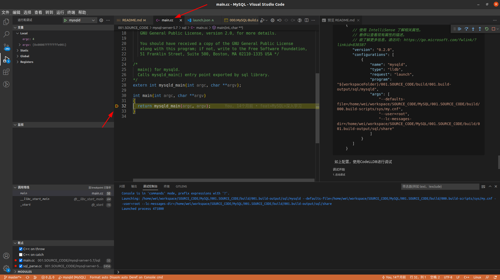
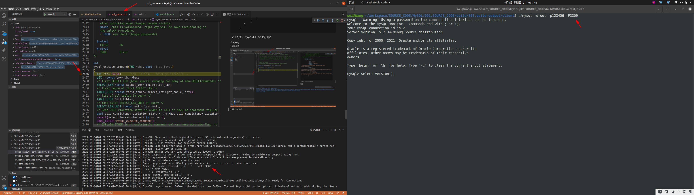

# MySQL编译调试<sup>MySQL5.7版本</sup>
## 步骤
1. 在一个新建的空的文件夹A下执行文件: 001.SOURCE_CODE/000.mysql-server-5.7/mysql-server-5.7/BUILD/compile-pentium-debug-max-no-ndb  是为了生成makefile文件，再在Eclipse中使用这些文件来调试
    - 注意，需要在一个新建的空的文件夹下执行，因为该步骤会在${PWD}下生成很多文件，需要将这些文件排除,不需要提交到远程仓库
2. 进入到脚本所在的文件夹，执行脚本即可
   > 参照编译脚本即可: 001.SOURCE_CODE/000.mysql-server-5.7/build/000.build-scripts/000.MySQL-Build.sh

---
## 编译环境(软件)
### gcc 、 g++
```txt
  wei@Wang:~$ gcc -v
     Using built-in specs.
     COLLECT_GCC=gcc
     COLLECT_LTO_WRAPPER=/usr/lib/gcc/x86_64-linux-gnu/4.7/lto-wrapper
     Target: x86_64-linux-gnu
     Configured with: ../src/configure -v --with-pkgversion='Ubuntu/Linaro 4.7.4-3ubuntu12' --with-bugurl=file:///usr/share/doc/gcc-4.7/README.Bugs --enable-languages=c,c++,go,fortran,objc,obj-c++ --prefix=/usr --program-suffix=-4.7 --enable-shared --enable-linker-build-id --libexecdir=/usr/lib --without-included-gettext --enable-threads=posix --with-gxx-include-dir=/usr/include/c++/4.7 --libdir=/usr/lib --enable-nls --with-sysroot=/ --enable-clocale=gnu --enable-libstdcxx-debug --enable-gnu-unique-object --disable-libmudflap --enable-plugin --with-system-zlib --enable-objc-gc --with-cloog --enable-cloog-backend=ppl --disable-cloog-version-check --disable-ppl-version-check --enable-multiarch --disable-werror --with-arch-32=i686 --with-abi=m64 --with-multilib-list=m32,m64,mx32 --with-tune=generic --enable-checking=release --build=x86_64-linux-gnu --host=x86_64-linux-gnu --target=x86_64-linux-gnu
     Thread model: posix
     gcc version 4.7.4 (Ubuntu/Linaro 4.7.4-3ubuntu12)

  
   wei@Wang:~$ g++ -v
      Using built-in specs.
      COLLECT_GCC=g++
      COLLECT_LTO_WRAPPER=/usr/lib/gcc/x86_64-linux-gnu/4.7/lto-wrapper
      Target: x86_64-linux-gnu
      Configured with: ../src/configure -v --with-pkgversion='Ubuntu/Linaro 4.7.4-3ubuntu12' --with-bugurl=file:///usr/share/doc/gcc-4.7/README.Bugs --enable-languages=c,c++,go,fortran,objc,obj-c++ --prefix=/usr --program-suffix=-4.7 --enable-shared --enable-linker-build-id --libexecdir=/usr/lib --without-included-gettext --enable-threads=posix --with-gxx-include-dir=/usr/include/c++/4.7 --libdir=/usr/lib --enable-nls --with-sysroot=/ --enable-clocale=gnu --enable-libstdcxx-debug --enable-gnu-unique-object --disable-libmudflap --enable-plugin --with-system-zlib --enable-objc-gc --with-cloog --enable-cloog-backend=ppl --disable-cloog-version-check --disable-ppl-version-check --enable-multiarch --disable-werror --with-arch-32=i686 --with-abi=m64 --with-multilib-list=m32,m64,mx32 --with-tune=generic --enable-checking=release --build=x86_64-linux-gnu --host=x86_64-linux-gnu --target=x86_64-linux-gnu
      Thread model: posix
      gcc version 4.7.4 (Ubuntu/Linaro 4.7.4-3ubuntu12) 
```

### cmake & make
```txt
wei@Wang:~$ cmake --version
cmake version 3.16.3

CMake suite maintained and supported by Kitware (kitware.com/cmake).

---

wei@Wang:~$ make -v
   GNU Make 4.2.1
   为 x86_64-pc-linux-gnu 编译
   Copyright (C) 1988-2016 Free Software Foundation, Inc.
   许可证：GPLv3+：GNU 通用公共许可证第 3 版或更新版本<http://gnu.org/licenses/gpl.html>。
   本软件是自由软件：您可以自由修改和重新发布它。
   在法律允许的范围内没有其他保证。
```

### Boost库
- boost_1_59_0

### openSSL
```txt
   sudo apt-get install openssl
   sudo apt-get install libssl-dev
```

### bison
```txt
  sudo apt-get install bison
```

### OS
Ubuntu 20.04

### IDE && 插件
#### IDE
+ Visual Studio Code
#### 插件
1. C/C++ Extension Pack
2. C/C++ Themes
3. C/C++
4. Better C++ Syntax
5. CMake
6. CMake Language Support
7. CMake Tools
8. CodeLLDB
9. GDB Debugger-Beyond

---
## 编译环境创建步骤(源码调试环境搭建)
&nbsp;&nbsp;如编译脚本: 001.SOURCE_CODE/000.mysql-server-5.7/build/000.build-scripts/000.MySQL-Build.sh (内有注释)，本脚本的作用是编译MySQL源代码，并初始化数据库，并启动服务(为什么初始化和启动要写在这里?后面解释)

&nbsp;&nbsp;目录介绍:
```txt
 wei@Wang:~/workspace/SOURCE_CODE/MySQL/001.SOURCE_CODE/000.mysql-server-5.7/build$ tree build/
 build/  # 编译&&调试文件根目录
 ├── 000.build-scripts # 存放编译文件和数据库文件
 │   ├── 000.MySQL-Build.sh # 编译脚本(源文件编译、数据库初始化、数据库启动(调试时使用launch.json))
 │   ├── data  # 存放数据库文件(表文件....,初始化时登录更新后的数据库用户名密码也在这里面)
 │   └── sys
 │       └── my.cnf # 调试环境数据库配置(编译启动&&调试时均用该配置文件)
 └── 001.build-output # 编译产生的文件(如mysqld)，不需要被git追踪,所以该目录被git排除
```
### 调试环境搭建
#### 1. 执行编译脚本: 000.MySQL-Build.sh
&nbsp;&nbsp;执行该脚本，会编译MySQL源文件，并初始化MySQL数据库，最后启动MySQL.
> 之所以初始化并启动，是为了创建一个用户，为了后面的调试做准备.
>> 在输出的日志中，存在临时密码，这个是第一次登录密码，着重注意一下

##### 输出日志(部分)
```log
   2022-09-04T00:56:12.413188+08:00 0 [Warning] TIMESTAMP with implicit DEFAULT value is deprecated. Please use --explicit_defaults_for_timestamp server option (see documentation for more details).
   2022-09-04T00:56:12.413376+08:00 0 [ERROR] Can't find error-message file '/usr/local/mysql/share/errmsg.sys'. Check error-message file location and 'lc-messages-dir' configuration directive.
   2022-09-04T00:56:12.415593+08:00 0 [Warning] One can only use the --user switch if running as root
   
   2022-09-04T00:56:13.008229+08:00 0 [Warning] InnoDB: New log files created, LSN=45790
   2022-09-04T00:56:13.168603+08:00 0 [Warning] InnoDB: Creating foreign key constraint system tables.
   2022-09-04T00:56:13.241713+08:00 0 [Warning] No existing UUID has been found, so we assume that this is the first time that this server has been started. Generating a new UUID: 5156152f-2ba9-11ed-b6ba-dc85debb43c9.
   2022-09-04T00:56:13.243922+08:00 0 [Warning] Gtid table is not ready to be used. Table 'mysql.gtid_executed' cannot be opened.
   2022-09-04T00:56:13.746414+08:00 0 [Warning] CA certificate ca.pem is self signed.
   2022-09-04T00:56:13.822895+08:00 1 [Note] A temporary password is generated for root@localhost: rirk(+OFj1Na
   2022-09-04T00:56:17.420026+08:00 0 [Warning] TIMESTAMP with implicit DEFAULT value is deprecated. Please use --explicit_defaults_for_timestamp server option (see documentation for more details).
   2022-09-04T00:56:17.420131+08:00 0 [Note] --secure-file-priv is set to NULL. Operations related to importing and exporting data are disabled
   2022-09-04T00:56:17.420172+08:00 0 [Note] ./sql/mysqld (mysqld 5.7.34-debug) starting as process 468753 ...
   2022-09-04T00:56:17.420206+08:00 0 [ERROR] Can't find error-message file '/usr/local/mysql/share/errmsg.sys'. Check error-message file location and 'lc-messages-dir' configuration directive.
   2022-09-04T00:56:17.426757+08:00 0 [Note] InnoDB: PUNCH HOLE support available
   2022-09-04T00:56:17.426857+08:00 0 [Note] InnoDB: !!!!!!!! UNIV_DEBUG switched on !!!!!!!!!
   2022-09-04T00:56:17.426869+08:00 0 [Note] InnoDB: Mutexes and rw_locks use GCC atomic builtins
   2022-09-04T00:56:17.426876+08:00 0 [Note] InnoDB: Uses event mutexes
   2022-09-04T00:56:17.426887+08:00 0 [Note] InnoDB: GCC builtin __atomic_thread_fence() is used for memory barrier
   2022-09-04T00:56:17.426894+08:00 0 [Note] InnoDB: Compressed tables use zlib 1.2.11
   2022-09-04T00:56:17.426900+08:00 0 [Note] InnoDB: Using Linux native AIO
   2022-09-04T00:56:17.427330+08:00 0 [Note] InnoDB: Number of pools: 1
   2022-09-04T00:56:17.427492+08:00 0 [Note] InnoDB: Using CPU crc32 instructions
   2022-09-04T00:56:17.429942+08:00 0 [Note] InnoDB: Initializing buffer pool, total size = 128M, instances = 1, chunk size = 128M
   2022-09-04T00:56:17.498060+08:00 0 [Note] InnoDB: Completed initialization of buffer pool
   2022-09-04T00:56:17.501707+08:00 0 [Note] InnoDB: If the mysqld execution user is authorized, page cleaner thread priority can be changed. See the man page of setpriority().
   2022-09-04T00:56:17.514365+08:00 0 [Note] InnoDB: Highest supported file format is Barracuda.
   2022-09-04T00:56:17.560172+08:00 0 [Note] InnoDB: Creating shared tablespace for temporary tables
   2022-09-04T00:56:17.560279+08:00 0 [Note] InnoDB: Setting file './ibtmp1' size to 12 MB. Physically writing the file full; Please wait ...
   2022-09-04T00:56:17.603497+08:00 0 [Note] InnoDB: File './ibtmp1' size is now 12 MB.
   2022-09-04T00:56:17.611570+08:00 0 [Note] InnoDB: 96 redo rollback segment(s) found. 96 redo rollback segment(s) are active.
   2022-09-04T00:56:17.611595+08:00 0 [Note] InnoDB: 32 non-redo rollback segment(s) are active.
   2022-09-04T00:56:17.613218+08:00 0 [Note] InnoDB: Waiting for purge to start
   2022-09-04T00:56:17.663523+08:00 0 [Note] InnoDB: 5.7.34 started; log sequence number 1316708
   2022-09-04T00:56:17.664223+08:00 0 [Note] Plugin 'FEDERATED' is disabled.
   2022-09-04T00:56:17.664718+08:00 0 [Note] InnoDB: Loading buffer pool(s) from /home/wei/WorkSpace/open_source/my-sql/001.SOURCE_CODE/000.mysql-server-5.7/build/000.build-scripts/data/ib_buffer_pool
   2022-09-04T00:56:17.673326+08:00 0 [Note] InnoDB: Buffer pool(s) load completed at 220904  0:56:17
   2022-09-04T00:56:17.681687+08:00 0 [Note] Found ca.pem, server-cert.pem and server-key.pem in data directory. Trying to enable SSL support using them.
   2022-09-04T00:56:17.681719+08:00 0 [Note] Skipping generation of SSL certificates as certificate files are present in data directory.
   2022-09-04T00:56:17.682369+08:00 0 [Warning] CA certificate ca.pem is self signed.
   2022-09-04T00:56:17.682416+08:00 0 [Note] Skipping generation of RSA key pair as key files are present in data directory.
   2022-09-04T00:56:17.682538+08:00 0 [Note] Server hostname (bind-address): '*'; port: 3309
   2022-09-04T00:56:17.682585+08:00 0 [Note] IPv6 is available.
   2022-09-04T00:56:17.682600+08:00 0 [Note]   - '::' resolves to '::';
   2022-09-04T00:56:17.682619+08:00 0 [Note] Server socket created on IP: '::'.
   2022-09-04T00:56:17.716924+08:00 0 [Note] Event Scheduler: Loaded 0 events
   2022-09-04T00:56:17.717364+08:00 0 [Note] 
```

&nbsp;&nbsp;上面输出日志中，有这么一行:
```txt
     2022-09-04T00:56:13.822895+08:00 1 [Note] A temporary password is generated for root@localhost: rirk(+OFj1Na
```
该行日志打印出了 root@localhost 密码(临时)为: "rirk(+OFj1Na". 且通过上面的日志可以发现，此时MySQL是启动着的(通过查看端口)
```txt
   wei@Wang:~$ netstat  -lnp | grep 3309
   tcp6       0      0 :::3309                 :::*                    LISTEN      377136/./sql/mysqld 
   wei@Wang:~$ 
```

&nbsp;&nbsp;使用临时密码，登录MySQL，修改用户密码:
> 使用自行编译出的MySQL客户端: 001.SOURCE_CODE/build/001.build-output/client/mysql

```txt
   wei@Wang:~/workspace/SOURCE_CODE/MySQL/001.SOURCE_CODE/build/001.build-output/client$ ./mysql -uroot -p
   Enter password: 
   Welcome to the MySQL monitor.  Commands end with ; or \g.
   Your MySQL connection id is 3
   Server version: 5.7.34-debug
   
   Copyright (c) 2000, 2021, Oracle and/or its affiliates.
   
   Oracle is a registered trademark of Oracle Corporation and/or its
   affiliates. Other names may be trademarks of their respective
   owners.
   
   Type 'help;' or '\h' for help. Type '\c' to clear the current input statement.
   
   mysql> alter user 'root'@'localhost' identified by '123456';
   Query OK, 0 rows affected (0.00 sec)
   
   mysql> create user 'root'@'%' identified by '123456';
   Query OK, 0 rows affected (0.01 sec)
   
   mysql> grant all privileges on *.* to 'root'@'%' with grant option;
   Query OK, 0 rows affected (0.01 sec)
   
   mysql> 

```

&nbsp;&nbsp; 关闭由脚本启动的MySQL
> (<font color="red">此时,数据库用户名密码以及基础数据库信息初始化到001.SOURCE_CODE/000.mysql-server-5.7/build/000.build-scripts/data 目录下，可以开始调试了</font>),后续调试时，使用客户端登录时使用此时设置的密码。

#### 2. Debug配置
&nbsp;&nbsp;如文件: .vscode/launch.json ：
```json
    {
            "name": "mysqld-5.7-debug",
            "type": "lldb",
            "request": "launch",
            "program": "${workspaceFolder}/001.SOURCE_CODE/000.mysql-server-5.7/build/001.build-output/sql/mysqld",
            "args": [
                "--defaults-file=/home/wei/WorkSpace/open_source/my-sql/001.SOURCE_CODE/000.mysql-server-5.7/build/000.build-scripts/sys/my.cnf",
                "--user=root",
                "--lc-messages-dir=/home/wei/WorkSpace/open_source/my-sql/001.SOURCE_CODE/000.mysql-server-5.7/build/001.build-output/sql/share",
                "--debug=d,info,error,query,general,where:O,/tmp/mysqld.trace" // 打印MySQL日志到控制台,见001.SOURCE_CODE/002.docs/001.debug-docs
            ],
            "postDebugTask": "MySQL-5.7-Debug-Shutdown"
        }
```

&nbsp;&nbsp;如上配置，使用CodeLLDB进行调试

##### 调试开始
###### 1. 启动调试


###### 2. 调试SQL执行


+ 如上，密码就是编译时启动设置的.
+ 客户端是由编译产生的。