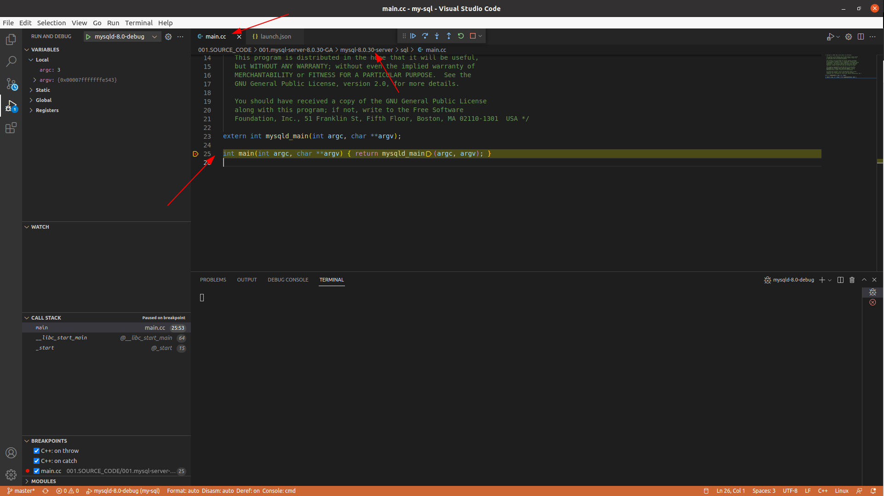
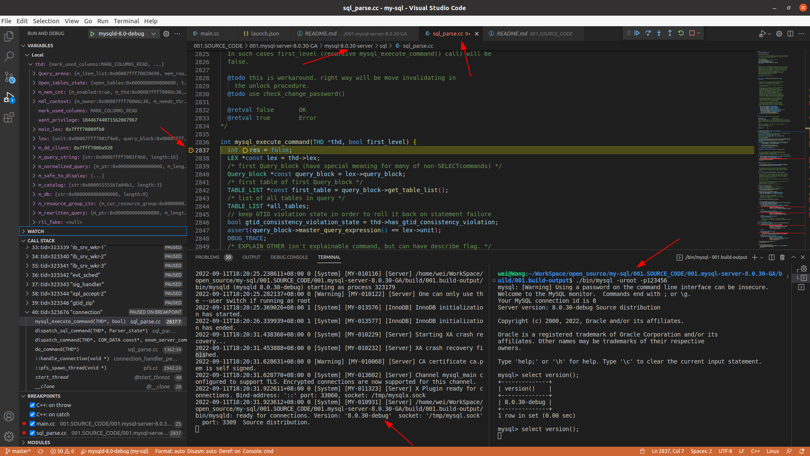

# MySQL8.0.30-GA编译&调试
## 编译环境
1. GCC & G++
```txt
  wei@Wang:~$ gcc -v
  Using built-in specs.
  COLLECT_GCC=gcc
  COLLECT_LTO_WRAPPER=/usr/lib/gcc/x86_64-linux-gnu/9/lto-wrapper
  OFFLOAD_TARGET_NAMES=nvptx-none:hsa
  OFFLOAD_TARGET_DEFAULT=1
  Target: x86_64-linux-gnu
  Configured with: ../src/configure -v --with-pkgversion='Ubuntu 9.4.0-1ubuntu1~20.04.1' --with-bugurl=file:///usr/share/doc/gcc-9/README.Bugs --enable-languages=c,ada,c++,go,brig,d,fortran,objc,obj-c++,gm2 --prefix=/usr --with-gcc-major-version-only --program-suffix=-9 --program-prefix=x86_64-linux-gnu- --enable-shared --enable-linker-build-id --libexecdir=/usr/lib --without-included-gettext --enable-threads=posix --libdir=/usr/lib --enable-nls --enable-clocale=gnu --enable-libstdcxx-debug --enable-libstdcxx-time=yes --with-default-libstdcxx-abi=new --enable-gnu-unique-object --disable-vtable-verify --enable-plugin --enable-default-pie --with-system-zlib --with-target-system-zlib=auto --enable-objc-gc=auto --enable-multiarch --disable-werror --with-arch-32=i686 --with-abi=m64 --with-multilib-list=m32,m64,mx32 --enable-multilib --with-tune=generic --enable-offload-targets=nvptx-none=/build/gcc-9-Av3uEd/gcc-9-9.4.0/debian/tmp-nvptx/usr,hsa --without-cuda-driver --enable-checking=release --build=x86_64-linux-gnu --host=x86_64-linux-gnu --target=x86_64-linux-gnu
  Thread model: posix
  gcc version 9.4.0 (Ubuntu 9.4.0-1ubuntu1~20.04.1) 
  
  wei@Wang:~$ g++ -v
  Using built-in specs.
  COLLECT_GCC=g++
  COLLECT_LTO_WRAPPER=/usr/lib/gcc/x86_64-linux-gnu/9/lto-wrapper
  OFFLOAD_TARGET_NAMES=nvptx-none:hsa
  OFFLOAD_TARGET_DEFAULT=1
  Target: x86_64-linux-gnu
  Configured with: ../src/configure -v --with-pkgversion='Ubuntu 9.4.0-1ubuntu1~20.04.1' --with-bugurl=file:///usr/share/doc/gcc-9/README.Bugs --enable-languages=c,ada,c++,go,brig,d,fortran,objc,obj-c++,gm2 --prefix=/usr --with-gcc-major-version-only --program-suffix=-9 --program-prefix=x86_64-linux-gnu- --enable-shared --enable-linker-build-id --libexecdir=/usr/lib --without-included-gettext --enable-threads=posix --libdir=/usr/lib --enable-nls --enable-clocale=gnu --enable-libstdcxx-debug --enable-libstdcxx-time=yes --with-default-libstdcxx-abi=new --enable-gnu-unique-object --disable-vtable-verify --enable-plugin --enable-default-pie --with-system-zlib --with-target-system-zlib=auto --enable-objc-gc=auto --enable-multiarch --disable-werror --with-arch-32=i686 --with-abi=m64 --with-multilib-list=m32,m64,mx32 --enable-multilib --with-tune=generic --enable-offload-targets=nvptx-none=/build/gcc-9-Av3uEd/gcc-9-9.4.0/debian/tmp-nvptx/usr,hsa --without-cuda-driver --enable-checking=release --build=x86_64-linux-gnu --host=x86_64-linux-gnu --target=x86_64-linux-gnu
  Thread model: posix
  gcc version 9.4.0 (Ubuntu 9.4.0-1ubuntu1~20.04.1) 
```

2. Boost库
> 1.77版本: 001.SOURCE_CODE/001.mysql-server-8.0.30-GA/libs/000.Boost1.77库安装.md

3. 其他
- 其他编译环境&&IDE参考: [001.SOURCE_CODE/000.mysql-server-5.7/README.md](../000.mysql-server-5.7/README.md)
---
## 编译步骤
&nbsp;&nbsp;执行编译脚本：  001.SOURCE_CODE/001.mysql-server-8.0.30-GA/build/000.build-scripts/000.MySQL-Build.sh 即可
> 如果遇到编译依赖没有安装，可以根据输出日志进行安装

---
## 调试步骤
&nbsp;&nbsp;先看一下目录结构:
```txt
   001.SOURCE_CODE/001.mysql-server-8.0.30-GA
   .
   ├── build
   │   ├── 000.build-scripts  # 存放编译文件和数据库文件
   │   │   ├── 000.MySQL-Build.sh  # 编译脚本(源文件编译、数据库初始化、数据库启动(调试时使用launch.json))
   │   │   ├── data                # 存放数据库文件(表文件....,初始化时登录更新后的数据库用户名密码也在这里面)
   │   │   └── sys                 # 存放MySQL启动时的配置文件,如my.cnf
   │   └── 001.build-output        # 编译产生的文件(如mysqld)，不需要被git追踪,所以该目录被git排除
   |   |
   |   └── libs                    # 编译所需要的库
   |      
   └── README.md
```

### 使用临时密码，登录MySQL，修改用户密码:
&nbsp;&nbsp;编译脚本"000.MySQL-Build.sh"执行完成后，在输出日志中，有编译脚本启动时的一个初始密码:
```txt
2022-09-11T17:38:26.190433+08:00 0 [System] [MY-013169] [Server] /home/wei/WorkSpace/open_source/my-sql/001.SOURCE_CODE/001.mysql-server-8.0.30-GA/build/001.build-output/runtime_output_directory/mysqld (mysqld 8.0.30-debug) initializing of server in progress as process 310236
2022-09-11T17:38:26.193808+08:00 0 [Warning] [MY-010122] [Server] One can only use the --user switch if running as root
2022-09-11T17:38:26.204579+08:00 1 [System] [MY-013576] [InnoDB] InnoDB initialization has started.
2022-09-11T17:38:27.401177+08:00 1 [System] [MY-013577] [InnoDB] InnoDB initialization has ended.
>>>>>>>>>>>>>>>> 初始密码在这里
2022-09-11T17:38:34.522191+08:00 6 [Note] [MY-010454] [Server] A temporary password is generated for root@localhost: UdQloNViU3=j
                 初始密码在这里 <<<<<<<<<<<<<<<<
2022-09-11T17:38:48.708349+08:00 0 [System] [MY-010116] [Server] /home/wei/WorkSpace/open_source/my-sql/001.SOURCE_CODE/001.mysql-server-8.0.30-GA/build/001.build-output/runtime_output_directory/mysqld (mysqld 8.0.30-debug) starting as process 310354
2022-09-11T17:38:48.729894+08:00 1 [System] [MY-013576] [InnoDB] InnoDB initialization has started.
2022-09-11T17:38:49.282239+08:00 1 [System] [MY-013577] [InnoDB] InnoDB initialization has ended.
2022-09-11T17:38:52.050050+08:00 0 [Warning] [MY-010068] [Server] CA certificate ca.pem is self signed.
2022-09-11T17:38:52.050096+08:00 0 [System] [MY-013602] [Server] Channel mysql_main configured to support TLS. Encrypted connections are now supported for this channel.
2022-09-11T17:38:52.314815+08:00 0 [System] [MY-011323] [Server] X Plugin ready for connections. Bind-address: '::' port: 33060, socket: /tmp/mysqlx.sock
2022-09-11T17:38:52.315036+08:00 0 [System] [MY-010931] [Server] /home/wei/WorkSpace/open_source/my-sql/001.SOURCE_CODE/001.mysql-server-8.0.30-GA/build/001.build-output/runtime_output_directory/mysqld: ready for connections. Version: '8.0.30-debug'  socket: '/tmp/mysql.sock'  port: 3309  Source distribution.
```

#### 使用临时密码，登录MySQL，修改用户密码:
```txt
    wei@Wang:~/WorkSpace/open_source/my-sql/001.SOURCE_CODE/001.mysql-server-8.0.30-GA/build/001.build-output/bin$ ./mysql -uroot -p
    Enter password: 
    Welcome to the MySQL monitor.  Commands end with ; or \g.
    Your MySQL connection id is 8
    Server version: 8.0.30-debug
    
    Copyright (c) 2000, 2022, Oracle and/or its affiliates.
    
    Oracle is a registered trademark of Oracle Corporation and/or its
    affiliates. Other names may be trademarks of their respective
    owners.
    
    Type 'help;' or '\h' for help. Type '\c' to clear the current input statement.
    
    mysql> alter user 'root'@'localhost' identified by '123456';
    Query OK, 0 rows affected (0.02 sec)
    
    mysql> create user 'root'@'%' identified by '123456';
    Query OK, 0 rows affected (0.04 sec)
    
    mysql>  grant all privileges on *.* to 'root'@'%' with grant option;
    Query OK, 0 rows affected (0.03 sec)
    
    mysql> 
```

#### 关闭由脚本启动的MySQL
&nbsp;&nbsp;(此时,数据库用户名密码以及基础数据库信息初始化到001.SOURCE_CODE/001.mysql-server-8.0.30-GA/build/000.build-scripts/data 目录下，可以开始调试了),后续调试时，使用客户端登录时使用此时设置的密码。

### Debug配置
&nbsp;&nbsp;如配置文件: .vscode/launch.json 
```json
       {
            "name": "mysqld-8.0-debug",
            "type": "lldb",
            "request": "launch",
            "program": "${workspaceFolder}/001.SOURCE_CODE/001.mysql-server-8.0.30-GA/build/001.build-output/bin/mysqld",
            "args": [
                "--defaults-file=/home/wei/WorkSpace/open_source/my-sql/001.SOURCE_CODE/001.mysql-server-8.0.30-GA/build/000.build-scripts/sys/my.cnf",
                "--user=root",
                "--debug=d,info:n:N:F:i:L:o" // 打印MySQL日志到控制台,见001.SOURCE_CODE/002.docs/001.debug-docs
            ]
        }
```

#### 调试MySQL启动
- 

#### 调试SQL执行
- 

&nbsp;&nbsp;
> 如上，密码就是编译时启动设置的. 客户端是由编译产生的。
