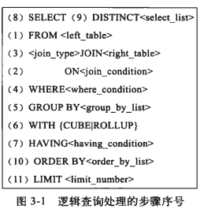
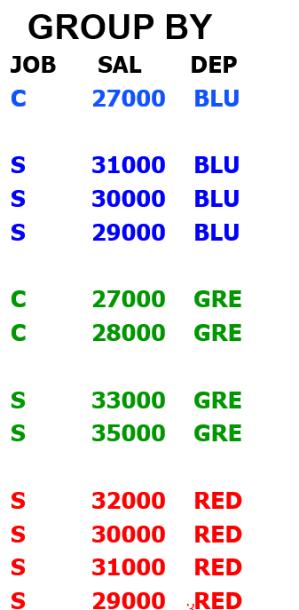

# MySQL执行顺序
+ 
```txt
(8) SELECT (9)DISTINCT <select_list>
(1) FROM <left_table>
(3) <join_type> JOIN <right_table>
(2)  ON <join_condition>
(4) WHERE <where_condition>
(5) GROUP BY <group_by_list>
(6) WITH {CUBE|ROLLUP}
(7) HAVING <having_condition>
(10) ORDER BY <order_by_list>
(11) LIMIT <limit_number>
```
## 01. MySQL执行顺序如下
### 1. FROM 
&nbsp;&nbsp;对FROM子句中的左表<left_table>和右表<right_table>执行笛卡尔积，产生虚拟表VT1.

### 2. ON连接
&nbsp;&nbsp;对虚拟表VT1 应用ON筛选，只有那些符合<join_condition>的**行**才被插入到虚拟表VT2中

### 3. JOIN连接
&nbsp;&nbsp;如果指定了OUTER JOIN保留表中未找到匹配的行将作为外部行添加到虚拟表 VT2，生成虚拟表 VT3。<**保留表**>如下：
   - LEFT OUTER JOIN把左表记为保留表
   - RIGHT OUTER JOIN把右表记为保留表
   - FULL OUTER JOIN把左右表都作为保留表
+ 在虚拟表 VT2表的基础上添加保留表中被过滤条件过滤掉的数据，非保留表中的数据被赋予NULL值，最后生成虚拟表 VT3（如果FROM子句包含两个以上的表，则对上一个连接生成的结果表VT3和下一个表重复执行步骤1~3，直到处理完所有的表为止）  

### 4. WHERE 过滤
&nbsp;&nbsp;对虚拟表 VT3应用WHERE过滤条件，只有符合<where_condition>的记录才被插入虚拟表VT4中。

### 5. GROUP BY 
&nbsp;&nbsp;根据GROUP BY 子句中的列，对VT4中的记录进行分组操作，产生VT5.
+ 那么VT5的数据形式是什么样子的呢?稍后介绍

###  6. CUBE|ROLLUP
&nbsp;&nbsp;对表VT5进行CUBE或ROLLUP操作，产生表VT6
   - CUBE 生成的结果数据集显示了所选列中值的所有组合的聚合
   - ROLLUP 生成的结果数据集显示了所选列中值的某一层次结构的聚合  
### 7. HAVING
&nbsp;&nbsp;对虚拟表VT6应用HAVING过滤，只有符合条件<having_condition>的记录才被插入虚拟表VT7中

### 8. SELECT
&nbsp;&nbsp;第二次执行SELECT操作，选择指定的列，插入到虚拟表VT8中
+ 第二次执行SELECT操作,什么意思?

### 9. DISTINCT
&nbsp;&nbsp;去除重复数据，产生虚拟表VT9

### 10. ORDER BY
&nbsp;&nbsp;将虚拟表VT9中的记录按照<order_by_list>进行排序操作，产生虚拟表VT10

### 11. LIMIT
&nbsp;&nbsp;取出指定行的记录，产生虚拟表VT11，并返回给查询用户。

--------------------------

## 02. 查询示例
### 02-1. 数据准备
+ 表customers
   ```sql
     CREATE TABLE `customers` (
       `customer_id` varchar(10) NOT NULL,
       `city` varchar(20) NOT NULL,
       PRIMARY KEY (`customer_id`)
      ) ENGINE=InnoDB DEFAULT CHARSET=latin1

      INSERT INTO `customers` VALUES ('163','HangZhou'),
                                     ('9you','ShangHai'),
                                     ('baidu','HangZhou'),
                                     ('TX','HangZhou');

      # 数据如下
         +-------------+----------+
         | customer_id | city     |
         +-------------+----------+
         | 163         | HangZhou |
         | 9you        | ShangHai |
         | baidu       | HangZhou |
         | TX          | HangZhou |
         +-------------+----------+                               
   ```

+ 表orders:
   ```sql
      CREATE TABLE `orders` (
         `order_id` int(11) NOT NULL AUTO_INCREMENT,
         `customer_id` varchar(10) DEFAULT NULL,
          PRIMARY KEY (`order_id`)
      ) ENGINE=InnoDB AUTO_INCREMENT=8 DEFAULT CHARSET=latin1;

      INSERT INTO `orders` VALUES 
      (1,'163'),
      (2,'163'),
      (3,'9you'),
      (4,'9you'),
      (5,'9you'),
      (6,'TX'),
      (7,NULL);

      # 数据如下
         +----------+-------------+
         | order_id | customer_id |
         +----------+-------------+
         |        1 | 163         |
         |        2 | 163         |
         |        3 | 9you        |
         |        4 | 9you        |
         |        5 | 9you        |
         |        6 | TX          |
         |        7 | NULL        |
         +----------+-------------+
   ```
## 02-2. 通过如下语句查询来自杭州且订单数量少于2的客户，并且查询他们的订单数量，查询结果按订单数量从小到达排序。(以下均是按照该SQL进行演示分析)
+ 查询SQL
   ```sql
   SELECT c.customer_id, COUNT(o.order_id) AS total_orders
   FROM customers AS c
   LEFT JOIN orders AS o
   ON c.customer_id = o.customer_id
   WHERE c.city = 'HangZhou'
   GROUP BY c.customer_id
   HAVING count(o.order_id) < 2
   ORDER BY total_orders DESC;

   # 执行结果如下
   +-------------+--------------+
   | customer_id | total_orders |
   +-------------+--------------+
   | TX          |            1 |
   | baidu       |            0 |
   +-------------+--------------+

   ```

## 02-3.执行步骤分析
### 第一步： 执行FROM操作，即执行笛卡尔积
&nbsp;&nbsp;第一步需要做的是对FROM子句前后的两张表进行笛卡尔积操作，也称作交叉连接，生成虚拟表VT1。如果FROM子句前的表包含a行数据，FROM子句后的表中包含b行数据，那么虚拟表VT1将包含a*b行数据。对于前面的SQL查询语句，会先执行表orders 和 customers的笛卡尔积操作：
  ```sql
    # 即语句 select * from customers,orders; 即可以获取customers表和orders表的笛卡尔积
      +-------------+----------+----------+-------------+
      | customer_id | city     | order_id | customer_id |
      +-------------+----------+----------+-------------+
      | 163         | HangZhou |        1 | 163         |
      | 9you        | ShangHai |        1 | 163         |
      | baidu       | HangZhou |        1 | 163         |
      | TX          | HangZhou |        1 | 163         |
      | 163         | HangZhou |        2 | 163         |
      | 9you        | ShangHai |        2 | 163         |
      | baidu       | HangZhou |        2 | 163         |
      | TX          | HangZhou |        2 | 163         |
      | 163         | HangZhou |        3 | 9you        |
      | 9you        | ShangHai |        3 | 9you        |
      | baidu       | HangZhou |        3 | 9you        |
      | TX          | HangZhou |        3 | 9you        |
      | 163         | HangZhou |        4 | 9you        |
      | 9you        | ShangHai |        4 | 9you        |
      | baidu       | HangZhou |        4 | 9you        |
      | TX          | HangZhou |        4 | 9you        |
      | 163         | HangZhou |        5 | 9you        |
      | 9you        | ShangHai |        5 | 9you        |
      | baidu       | HangZhou |        5 | 9you        |
      | TX          | HangZhou |        5 | 9you        |
      | 163         | HangZhou |        6 | TX          |
      | 9you        | ShangHai |        6 | TX          |
      | baidu       | HangZhou |        6 | TX          |
      | TX          | HangZhou |        6 | TX          |
      | 163         | HangZhou |        7 | NULL        |
      | 9you        | ShangHai |        7 | NULL        |
      | baidu       | HangZhou |        7 | NULL        |
      | TX          | HangZhou |        7 | NULL        |
      +-------------+----------+----------+-------------+
  ```

 ### 第二步： 应用ON过滤器
 &nbsp;&nbsp;SELECT查询共有3个过滤流程，分别是ON、WHERE、HAVING。ON是最先执行的过滤流程。根据上一小节产生的表VT1，过滤条件: ON c.customer_id = o.customer_id 

 &nbsp;&nbsp;在大多数的编程语言中，逻辑表达式的值只有两种：TRUE 和 FALSE。但是在关系数据库中起逻辑表达式作用的并非只有两种，还有一种称为三值逻辑的表达式。这是因为在数据库中对NULL值的比较与大多编程语言不同。在C语言中，NULL == NULL的比较返回的是1，即相等，而在关系型数据库中，NULL的比较就不一样了，如下：
   ```sql
      mysql> select 1 = NULL\G
      +----------+
      | 1 = NULL |
      +----------+
      |     NULL |
      +----------+

      #--------------------------

      mysql> select NULL = NULL;
      +-------------+
      | NULL = NULL |
      +-------------+
      |        NULL |
      +-------------+

      #-----------------

      mysql> select 2 = 2;
      +-------+
      | 2 = 2 |
      +-------+
      |     1 |
      +-------+

     #------------------------------

      mysql> select 1 = 2;
      +-------+
      | 1 = 2 |
      +-------+
      |     0 |
      +-------+

   ```
&nbsp;&nbsp;第一个NULL值的比较返回的是NULL而不是0，第二个NULL值标胶返回的仍然是NULL，而不是1.对于比较返回值为NULL的情况，用户应该将其视为UNKNOWN，即表示未知的。因为在某些情况下，NULL返回值可能表示1，即NULL等于NULL，而有时候NULL返回值可能代表0.

&nbsp;&nbsp; 对于在ON过滤条件下的NULL值比较，此时的比较结果为UNKNOWN，却被视为FALSE来处理，即两个NULL并不相同。但是在下面两种情况认为两个NULL值的比较是相等的(示例如附录01)：
1. GROUP BY 子句把所有的NULL值都分到一组
2. ORDER BY 子句中将所有NULL值排列在一起

&nbsp;&nbsp;因此在生成虚拟表VT2的时候，会增加一个额外的列来表示ON过滤条件的返回值，返回值有FALSE 、 TRUE 、 UNKNOWN,如下图：
```sql
         +-------------+-------------+----------+----------+-------------+
         |   Match     | customer_id | city     | order_id | customer_id |
         +-------------+-------------+----------+----------+-------------+
         | TRUE        |    163      | HangZhou |        1 | 163         |
         | FALSE       | 9you        | ShangHai |        1 | 163         |
         | FALSE       | baidu       | HangZhou |        1 | 163         |
         | FALSE       | TX          | HangZhou |        1 | 163         |
         | TRUE        | 163         | HangZhou |        2 | 163         |
         | FALSE       | 9you        | ShangHai |        2 | 163         |
         | FALSE       | baidu       | HangZhou |        2 | 163         |
         | FALSE       | TX          | HangZhou |        2 | 163         |
         | FALSE       | 163         | HangZhou |        3 | 9you        |
         | TRUE        | 9you        | ShangHai |        3 | 9you        |
         | FALSE       | baidu       | HangZhou |        3 | 9you        |
         | FALSE       | TX          | HangZhou |        3 | 9you        |
         | FALSE       | 163         | HangZhou |        4 | 9you        |
         | TRUE        | 9you        | ShangHai |        4 | 9you        |
         | FALSE       | baidu       | HangZhou |        4 | 9you        |
         | FALSE       | TX          | HangZhou |        4 | 9you        |
         | FALSE       | 163         | HangZhou |        5 | 9you        |
         | TRUE        | 9you        | ShangHai |        5 | 9you        |
         | FALSE       | baidu       | HangZhou |        5 | 9you        |
         | FALSE       | TX          | HangZhou |        5 | 9you        |
         | FALSE       | 163         | HangZhou |        6 | TX          |
         | FALSE       | 9you        | ShangHai |        6 | TX          |
         | FALSE       | baidu       | HangZhou |        6 | TX          |
         | TRUE        | TX          | HangZhou |        6 | TX          |
         | UNKNOWN     | 163         | HangZhou |        7 | NULL        |
         | UNKNOWN     | 9you        | ShangHai |        7 | NULL        |
         | UNKNOWN     | baidu       | HangZhou |        7 | NULL        |
         | UNKNOWN     | TX          | HangZhou |        7 | NULL        |
         +-------------+-------------+----------+----------+-------------+
```

 &nbsp;&nbsp;取出比较值为TRUE的记录，产生虚拟表VT2，结果如下： 
```sql
         +-------------+----------+----------+-------------+
         | customer_id | city     | order_id | customer_id |
         +-------------+----------+----------+-------------+
         | 163         | HangZhou |        1 | 163         |
         | 163         | HangZhou |        2 | 163         |
         | 9you        | ShangHai |        3 | 9you        |
         | 9you        | ShangHai |        4 | 9you        |
         | 9you        | ShangHai |        5 | 9you        |
         | TX          | HangZhou |        6 | TX          |
         +-------------+----------+----------+-------------+

```  


&nbsp;&nbsp; 在之前的认知当中，Group By会将数据分好组，即：分组之后只留一条数据,例如 group by a , 则保留一条记录a,重复的都丢失了，其他字段都是聚合信息,但是并不是这样，而仅仅是将group by 后面字段值相同的记录放在一起(就形成了一个个的组)
   - 

&nbsp;&nbsp; ，形成虚拟表。当应用having条件的时候，则会将having后面的条件应用到一个个的组上，查出数据，形成虚拟表，为下一步打好基础。 当一组有多条记录，且select 后有很多字段(不仅仅含有group by后面跟的字段)，这时候会查询到该组(经过Having的过滤,该组的数据是符合Having条件的)内主键(也有可能不是根据主键索引)最小的那一条数据
### 9. SELECT 
+ 将虚拟表 VT7中的在SELECT中出现的列筛选出来，并对字段进行处理，计算SELECT子句中的表达式，产生虚拟表 VT8。
### 10. DISTINCT
+ 将重复的行从虚拟表 VT8中移除，产生虚拟表 VT9。DISTINCT用来删除重复行，只保留唯一的。
### 11. ORDER BY 
+ 将虚拟表 VT9中的行按ORDER BY 子句中的列/列表排序，生成游标 VC10 ，注意不是虚拟表。因此使用 ORDER BY 子句查询不能应用于表达式。同时，ORDER BY子句的执行顺序为从左到右排序，是非常消耗资源的。
### 12. LIMIT/OFFSET 指定返回行
+ 从VC10的开始处选择指定数量行，生成虚拟表 VT11，并返回调用者。

## MySQL表类型
### 1. 永久表
+ 用于长期保存数据
### 2.  临时表
1. 类似于永久表，只保存临时数据，但是能够长久存在
2. 临时创建的，SQL语句执行完就会被删除
### 3. 虚表
+ 虚表其实就是视图