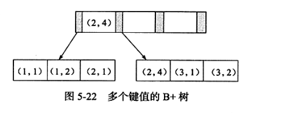

# 覆盖索引使用之使用索引扫描来排序
## 概念
&nbsp;&nbsp;MySQL可以使用同一个索引既满足排序，又用于查找行，因此，如果可能，设计索引时应该尽可能地满足这两种任务。
- 满足的条件
    1. 索引的列顺序和ORDER BY子句的顺序完全一致
    2. 索引列的排序方向（倒序或正序）都一样

&nbsp;&nbsp;如此，就可以在覆盖索引上进行排序，而不用回表查询数据了。当需要获取数据行的数据时，结合MRR就可以很快的返回数据(因为基于覆盖索引进行排序就可以获取数据行的主键值了)

&nbsp;&nbsp; 联合索引的好处是已经对第二个键值进行了排序处理。

---
## 多个键值的B+树是什么样子的?
```sql
  # 表结构
   CREATE TABLE t(
    a INT , 
    b INT,
    PRIMARY KEY(a),
    KEY idx_a_b(a,b)
   ) ENGINE=INNODB
```


&nbsp;&nbsp;通过上图的可以看到，联合索引的数据是按照(a,b)的方式存储的：(1,1)、(1,2)、(2,1)、(2,4)、(3,1)、(3,2)

### 联合索引使用情况如何?
1. SELECT * FROM t WHERE  a=xxx and b=xxx; 可以使用(a,b)这个联合索引
2. SELECT * FROM t WHERE  a=xxx ; 可以使用(a,b)这个联合索引
3. SELECT * FROM t WHERE  b=xxx; 不可以使用(a,b)这棵B+树索引，因为抛开字段a，b列在这棵B+树中并不是连续的.

---

## 实践一下
### 环境 && 数据准备
```sql
  # MySQL-Version: 8.0.30-debug
  CREATE TABLE buy_log(
    id bigint unsigned primary key auto_increment,
    user_id int unsigned not null,
    buy_date date
  );

  insert into buy_log(user_id,buy_date) values(1,'2009-01-01');
  insert into buy_log(user_id,buy_date) values(2,'2009-01-01');
  insert into buy_log(user_id,buy_date) values(3,'2009-01-01');
  insert into buy_log(user_id,buy_date) values(1,'2009-02-01');
  insert into buy_log(user_id,buy_date) values(3,'2009-02-01');
  insert into buy_log(user_id,buy_date) values(1,'2009-03-01');
  insert into buy_log(user_id,buy_date) values(1,'2009-04-01');

  alter table buy_log add key(user_id); # 索引名称: user_id
  alter table buy_log add key(user_id,buy_date); # 索引名称: user_id_2
 
```
### SQL查询实践
#### 场景1: 索引页相对较小，查询更快
```sql
   explain select * from buy_log where user_id = 2;

   mysql> explain select * from buy_log where user_id = 2;
   +----+-------------+---------+------------+------+-------------------+---------+---------+-------+------+----------+-------+
   | id | select_type | table   | partitions | type | possible_keys     | key     | key_len | ref   | rows | filtered | Extra |
   +----+-------------+---------+------------+------+-------------------+---------+---------+-------+------+----------+-------+
   |  1 | SIMPLE      | buy_log | NULL       | ref  | user_id,user_id_2 | user_id | 4       | const |    1 |   100.00 | NULL  |
   +----+-------------+---------+------------+------+-------------------+---------+---------+-------+------+----------+-------+
   1 row in set, 1 warning (0.01 sec)

   通过possible_keys可以发现，这里有两个索引可以使用。但是优化器最终选择了user_id索引，因为该索引的叶子节点包含单个键值，所以理论上一个页能存放的记录应该更多。
```

#### 场景2: 使用联合索引进行排序
```sql
   # 假设要取出user_id为1的最近3次的购买记录：
   explain select * from buy_log where user_id = 1 order by buy_date desc limit 3;  

   mysql> explain select * from buy_log where user_id = 1 order by buy_date desc limit 3;
   +----+-------------+---------+------------+------+-------------------+-----------+---------+-------+------+----------+----------------------------------+
   | id | select_type | table   | partitions | type | possible_keys     | key       | key_len | ref   | rows | filtered | Extra                            |
   +----+-------------+---------+------------+------+-------------------+-----------+---------+-------+------+----------+----------------------------------+
   |  1 | SIMPLE      | buy_log | NULL       | ref  | user_id,user_id_2 | user_id_2 | 4       | const |    4 |   100.00 | Backward index scan;(反向扫描) Using index |
   +----+-------------+---------+------------+------+-------------------+-----------+---------+-------+------+----------+----------------------------------+
   1 row in set, 1 warning (0.00 sec)

   # 对于上述索引，既可以使用user_id,也可以使用user_id_2索引，但是这次优化器使用了user_id_2这个联合索引，因为在这个联合索引中buy_date已经排好序了，根据该联合索引取出数据，无需再对buy_date再进行一次额外的排序操作。

   # 若强制使用user_id这个单列索引，会发生什么?(可以发现，需要进行一次额外的排序)
   mysql> explain select * from buy_log force index(user_id) where user_id = 1 order by buy_date desc limit 3;
   +----+-------------+---------+------------+------+---------------+---------+---------+-------+------+----------+----------------+
   | id | select_type | table   | partitions | type | possible_keys | key     | key_len | ref   | rows | filtered | Extra          |
   +----+-------------+---------+------------+------+---------------+---------+---------+-------+------+----------+----------------+
   |  1 | SIMPLE      | buy_log | NULL       | ref  | user_id       | user_id | 4       | const |    4 |   100.00 | Using filesort |
   +----+-------------+---------+------------+------+---------------+---------+---------+-------+------+----------+----------------+
   1 row in set, 1 warning (0.00 sec)
```

#### 场景3·覆盖索引-页面更小-查询更快`用于统计
&nbsp;&nbsp;覆盖索引不包含整行记录的所有信息，因此其大小远小于聚集索引，因此可以减少大量的IO操作。

```sql
 # 辅助索引远小于聚集索引，因此使用了覆盖索引进行扫描。
    mysql> explain select count(*) from buy_log ;
    +----+-------------+---------+------------+-------+---------------+---------+---------+------+------+----------+-------------+
    | id | select_type | table   | partitions | type  | possible_keys | key     | key_len | ref  | rows | filtered | Extra       |
    +----+-------------+---------+------------+-------+---------------+---------+---------+------+------+----------+-------------+
    |  1 | SIMPLE      | buy_log | NULL       | index | NULL          | user_id | 4       | NULL |    7 |   100.00 | Using index |
    +----+-------------+---------+------------+-------+---------------+---------+---------+------+------+----------+-------------+
    1 row in set, 1 warning (0.01 sec)

  # 通常情况下，(a,b)这样的联合索引，一般是不可以选择列b作为查询条件的，但如果是统计操作，并且是覆盖索引，则优化器会进行选择
     - 辅助索引远小于聚集索引，因此使用了覆盖索引进行扫描，更快.
  mysql> explain select count(*) from buy_log where buy_date >= '2011-01-01' and buy_date <='2011-02-01';
  +----+-------------+---------+------------+-------+---------------+-----------+---------+------+------+----------+--------------------------+
  | id | select_type | table   | partitions | type  | possible_keys | key       | key_len | ref  | rows | filtered | Extra                    |
  +----+-------------+---------+------------+-------+---------------+-----------+---------+------+------+----------+--------------------------+
  |  1 | SIMPLE      | buy_log | NULL       | index | user_id_2     | user_id_2 | 8       | NULL |    7 |    14.29 | Using where; Using index |
  +----+-------------+---------+------------+-------+---------------+-----------+---------+------+------+----------+--------------------------+
  1 row in set, 1 warning (0.01 sec)
```
## 参考资料
1. 《高性能MySQL · 第三版》 P173
2. 《MySQL技术内幕 InnoDB存储引擎·第二版》 P223