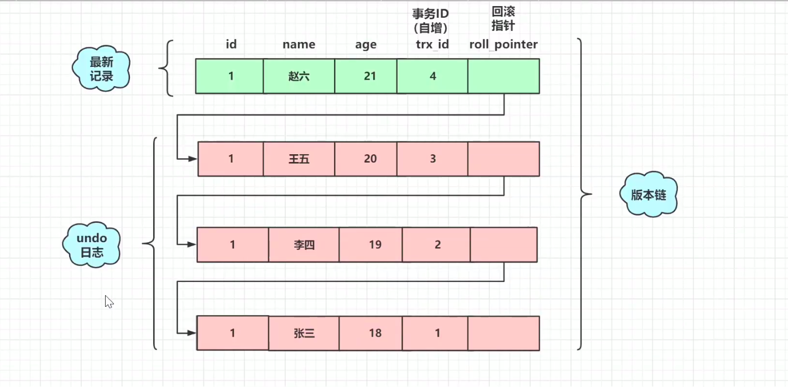

# InnoDB之多版本并发控制-MVCC(仅在RC和RR下有效)
&nbsp;&nbsp;**通过记录多个修改的历史版本代替锁，实现事务间的隔离效果，保证非阻塞读**
> 互通:[013.存储引擎内核/000.InnoDB/013.InnoDB Multi-Versioning.md](./../013.存储引擎内核/000.InnoDB/013.InnoDB%20Multi-Versioning.md)

## MVCC实现方式: 
1. 在InnoDB中，会在每行数据后添加两个额外的隐藏的值来实现MVCC。
   - 表的隐藏列：事务ID(trx_id) + 上个版本数据地址(roll_pointer)功能: 当事务成功了什么也不做，失败了，则从undolog中回滚  
2. undolog(记录各个版本修改历史,即事务链) 
3. ReadView读视图，用于判断那些版本可见。

### 隐藏列 + undolog

- 如： 原始数据为1、张三、18、1，后经过对数据的修改，最终变为了1、赵六、21、4。数据行的roll_pointer是指向该数据行的上一个版本的数据

### ReadView
&nbsp;&nbsp;如代码<mysql-server-5.7/storage/innobase/include/read0types.h>所描述，ReadView列出了那些事务的trx id，对于这些事务，一致的读操作不应该看到对数据库的修改。如下为ReadView关键的属性:
|属性名(与源码可能不同)|描述|
|---|---|
|m_ids|表示在生成ReadView时当前系统中活跃活跃的，即未commit的事务的读写事务的“事务ID”列表|
|min_trx_id|表示在生成ReadView时当前系统中活跃的读写事务中最小的“事务ID”，也就是mix_ids中最小值|
|max_trx_id|表示生成ReadView时系统中应该分配给下一个事务的“事务ID”值|
|creator_trx_id|表示生成该ReadView的事务的事务ID|

#### ReadView如何判断版本链中的哪个版本的数据可用呢?
+ 当 trx_id == creator_trx_id,可以访问这个版本的数据
   - 此时就说明这个版本的数据是自身创建的，因此是可以读取的。
+ 当 trx_id < min_trx_id,可以访问这个版本
   - 说明trx_id这个版本的数据是已经commit的了，已提交的事务id是可以访问到的。
+ 当 trx_id > max_trx_id,不可以访问这个版本
   - 需要读取的事务超过了版本链，即读取不到。
+ 当 min_trx_id <= trx_id <= max_trx_id,如果trx_id在m_ids中，则是不可以访问这个版本的，反之可以。
   - 在m_ids中，说明是未commit的，即读取不到。
   - 不在m_ids中，即已commit了，即可以读取到

#### ReadView与RC、RR的关系
+ ReadView之RR(REPEATABLE READ)
该级别事务下ReadView生成是以事务为单位的，即一个事务只会产生一个ReadView，即在事务中creator_trx_id生成一次且在本事务中不会变，那么读取的数据也就不会变了，则就解决了幻读的问题
+ ReadView之RC(READ COMMITTED)，该隔离级别下是以每一个select来生成ReadView的（即以每一个select来生成creator_trx_id）,即若此时开启一个事务，执行两个select，那么就会产生两个ReadView，所以没有解决幻读问题

## “读(当前读)[一致性锁定读](./004.一致性锁定读.md)”与“读(快照读)[一致性非锁定读](./005.一致性非锁定读.md)”的区别
&nbsp;&nbsp; 在RR级别中，通过MVCC机制，虽然让数据变得可重复读，但我们读到的数据可能是历史数据，是不及时的数据，不是数据库当前的数据！快照读不是实时数据，需要注意这在一些对于数据的时效特别敏感的业务中，就很可能出问题。

&nbsp;&nbsp; 对于这种读取历史数据的方式，我们叫它**快照读 (snapshot read)**，而读取数据库当前版本数据的方式，叫**当前读 (current read)**。很显然，在MVCC中：
+ 快照读: 普通的select操作
   - select * from table ….;
+ 当前读: 特殊的读操作，插入/更新/删除操作，属于当前读，处理的都是当前的数据，需要加锁。
   - select * from table where ? lock in share mode; (共享锁)
   - select * from table where ? for update; (排他锁)
   - insert; (排他锁)
   - update ; (排他锁)
   - delete; (排他锁)

&nbsp;&nbsp;事务的隔离级别实际上都是定义了当前读的级别，MySQL为了减少锁处理（包括等待其它锁）的时间，提升并发能力，引入了快照读的概念，使得select不用加锁。而update、insert这些“当前读”，就需要另外的模块来解决了。   

### 写(当前读)
&nbsp;&nbsp; 事务的隔离级别中虽然只定义了读数据的要求，实际上这也可以说是写数据的要求。上文的“读”，实际是讲的快照读；而这里说的“写”就是当前读了。

&nbsp;&nbsp;为了解决当前读中的幻读问题，MySQL事务使用了**Next-Key锁**

### 读(快照读)
&nbsp;&nbsp; 在MySQL中，通过MVCC机制，能够在RR隔离级别下解决幻读问题。

----
## 附录
### 什么是幻读
- 数据库中id>2的数据有3，4，5这三条数据
- 时刻A P这个线程开始一个事务读取id>2的数据，此时查出3，4，5这三条数据，并且在这个时刻有一个线程Q插入了一条id=7的数据
- P再次(事务没有提交)读取的时候，此时读到了3，4，5，7这四条数据
- 因为当前读的方式是： select  for update , 且RR级别模式是开启了间隙锁的，所以id>2后面的范围都是被锁住了，所以id=7的数据插入流程就会被阻塞，则解决了幻读问题。

-----
## 参考资料
1. 最好的文档:官方文档： [https://dev.mysql.com/doc/refman/5.7/en/innodb-multi-versioning.html](https://dev.mysql.com/doc/refman/5.7/en/innodb-multi-versioning.html)
2. 美团技术团队: [Innodb中的事务隔离级别和锁的关系](https://tech.meituan.com/2014/08/20/innodb-lock.html)
3. 《MySQL技术内幕InnoDB存储引擎第2版》 6.4.2 解决Phantom Problem
4. ReadView源码: 001.MySQL源码/mysql-server-5.7/storage/innobase/include/read0types.h
5. [一致性锁定读](./004.一致性锁定读.md)
6. [一致性非锁定读](./005.一致性非锁定读.md)

