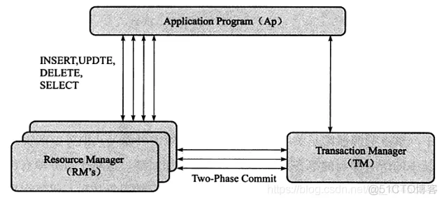

# MySQL 数据库分布式事务-XA事务
&nbsp;&nbsp;InnoDB 存储引擎提供了对XA事务的支持，并通过XA事务来支持分布式事务的实现。在使用分布式事务时，InnoDB存储引擎的事务隔离级别必须设置为SERIALIZABLE。

&nbsp;&nbsp;XA协议是由X/Open组织提供的分布式事务处理规范，主要定了事务管理器TM和局部资源管理器(RM)之间的接口。
> 因此，XA事务允许不同数据库之间的分布式事务，只要参与在全局事务中的每个节点都支持XA事务，而不论服务器的类型(MySQL、Oracle、SQL Server)

## XA 事务的组成
&nbsp;&nbsp;XA 事务由一个或多个资源管理器(Resource Managers) 、一个事务管理器(Transaction Manager)、以及一个应用程序(Application Program)组成
- 资源管理器: 提供访问事务资源的方法，通常一个数据库就是一个资源管理器。
- 事务管理器: 协调参与全局事务中的各个事务。需要和参与全局事务的所有资源管理器进行通信。
- 应用程序: 定义事务的边界，指定全局事务中的操作。

### 分布式事务模型


&nbsp;&nbsp;分布式事务使用两段式(two-phase commit)方式，在第一阶段，所有参与全局事务的节点都开始准备(PREPARE)，告诉全局事务管理器他们准备好提交了。在第二阶段，事务管理器告诉资源管理器执行ROLLBACK 还是 COMMIT。如果任意一个节点显示不能提交，那么所有的节点都被告知需要回滚。
> 分布式事务与本地事务不同的是： 分布式事务需要多一次PREPARE的操作，待收到所有节点同意信息后，再进行COMMIT 或 ROLLBACK 操作。

## MySQL XA 事务基本语法
- XA {START|BEGIN} xid [JOIN|RESUME] 启动 xid 事务 (xid 必须是一个唯一值；不支持 [JOIN|RESUME] 子句)
- XA END xid [SUSPEND [FOR MIGRATE]] 结束 xid 事务 ( 不支持 [SUSPEND [FOR MIGRATE]] 子句)
- XA PREPARE xid 准备、预提交 xid 事务
- XA COMMIT xid [ONE PHASE] 提交 xid 事务
- XA ROLLBACK xid 回滚 xid 事务
- XA RECOVER 查看处于 PREPARE 阶段的所有事务

### Try it
```log
   wei@Wang:~/WorkSpace/open_source/my-sql/001.SOURCE_CODE/001.mysql-server-8.0.30-GA/build/001.build-output$ ./bin/mysql -uroot -p123456
   mysql: [Warning] Using a password on the command line interface can be insecure.
   Welcome to the MySQL monitor.  Commands end with ; or \g.
   Your MySQL connection id is 8
   Server version: 8.0.30-debug Source distribution
   
   Copyright (c) 2000, 2022, Oracle and/or its affiliates.
   
   Oracle is a registered trademark of Oracle Corporation and/or its
   affiliates. Other names may be trademarks of their respective
   owners.
   
   Type 'help;' or '\h' for help. Type '\c' to clear the current input statement.
   
   mysql> show databases;
   +--------------------+
   | Database           |
   +--------------------+
   | information_schema |
   | mysql              |
   | nacos              |
   | performance_schema |
   | sakila             |
   | seata              |
   | seata_a            |
   | seata_b            |
   | stu                |
   | sys                |
   +--------------------+
   10 rows in set (0.05 sec)
   
   mysql> use stu;
   Reading table information for completion of table and column names
   You can turn off this feature to get a quicker startup with -A
   
   Database changed
   mysql> show tables;
   +---------------+
   | Tables_in_stu |
   +---------------+
   | buy_log       |
   | mytest        |
   | mytest2       |
   | t1            |
   | t2            |
   | test1122      |
   +---------------+
   6 rows in set (0.02 sec)
   
   mysql> select * from mytest;
   +------+------+------+------+
   | t1   | t2   | t3   | t4   |
   +------+------+------+------+
   | a    | bb   | bb   | ccc  |
   | d    | ee   | ee   | fff  |
   | d    | NULL | NULL | fff  |
   | d    | ee   | ee   | fff  |
   | d    | NULL | NULL | fff  |
   | d    | NULL | NULL | fff  |
   +------+------+------+------+
   6 rows in set (0.01 sec)
   
   mysql> xa start 'a';
   Query OK, 0 rows affected (0.00 sec)
   
   mysql> insert into mytest(t1,t2,t3,t4) values('1','2','3','4');
   Query OK, 1 row affected (0.00 sec)
   
   mysql> xa end 'a';
   Query OK, 0 rows affected (0.01 sec)
   
   mysql> xa prepare 'a'
       -> ;
   Query OK, 0 rows affected (0.00 sec)
   
   mysql> xa recover \G
   *************************** 1. row ***************************
       formatID: 1
   gtrid_length: 1
   bqual_length: 0
           data: a
   1 row in set (0.00 sec)
   
   mysql> xa rollback 'a';
   Query OK, 0 rows affected (0.02 sec)
   
   mysql> select * from mytest;
   +------+------+------+------+
   | t1   | t2   | t3   | t4   |
   +------+------+------+------+
   | a    | bb   | bb   | ccc  |
   | d    | ee   | ee   | fff  |
   | d    | NULL | NULL | fff  |
   | d    | ee   | ee   | fff  |
   | d    | NULL | NULL | fff  |
   | d    | NULL | NULL | fff  |
   +------+------+------+------+
   6 rows in set (0.00 sec)
   
   mysql> 
```
