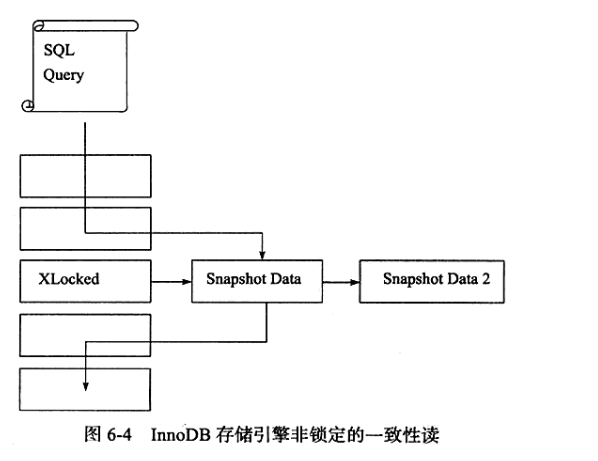

# 一致性非锁定读
&nbsp;&nbsp;一致性非锁定读是指InnoDB存储引擎通过行[多版本并发控制](./002.InnoDB之多版本并发控制-MVCC.md)的方式来读取当前执行时间数据库中行的数据。
  - 即： 如果读取的行正在执行DELETE或UPDATE操作，这时读取操作不会因此去等待行上的锁的释放。相反，InnoDB存储引擎会去读取行的一个快照数据。
  
&nbsp;&nbsp;如下图，直观的展现了InnoDB存储引擎一致性的非锁定读，因为不需要等待访问的行上X锁的释放。
  >>>>> 
  + 快照数据是指该行之前版本的数据(即这里的Snapshot Data)，该实现是通过undo段<sub>参见[002.InnoDB聚簇索引.md](../005.MySQL索引/002.InnoDB聚簇索引.md)，回滚指针就是用于指向历史版本的数据行</sub> 来完成，而undo用来在事务中回滚数据，因此快照数据本身是没有额外的开销，因此，读取快照数据是不需要上锁的，因为没有事务需要对历史的数据进行修改操作。

&nbsp;&nbsp;可以看出，非锁定读机制极大提高了数据库的并发性。在InnoDB存储引擎上的默认设置下，这是默认的读取方式，即读取不会占用和等待表上的锁。但是在不同的事务隔离级别下，读取的方式不同，并不是在每个事务隔离级别下都是采用的非锁定的一致性读。

&nbsp;&nbsp;如上图，快照数据其实就是当前行数据的历史版本，每行记录可能有多个版本。

---
## 注意事项
### 1. 一致性非锁定读和事务隔离级别的关系
&nbsp;&nbsp;在事务隔离级别 RC、RR 下，InnoDB存储引擎使用一致性非锁定读，但是因为这两种隔离级别在生成ReadView的实际不一致，分别会体现为 存在幻读(RC下存在幻读问题)和解决幻读(RR下解决了幻读)问题.具体可以参考:[多版本并发控制](./002.InnoDB之多版本并发控制-MVCC.md)
####  实践一下
```
   环境: MySQL 8.0.30-debug

   CREATE TABLE test1122(
      id bigint not null primary key auto_increment
   );
   
   insert into test1122(id) values(1);

```
##### RR
```sql
   # 事务隔离级别: 
   mysql> show variables like 'transaction_isolation';
   +-----------------------+-----------------+
   | Variable_name         | Value           |
   +-----------------------+-----------------+
   | transaction_isolation | REPEATABLE-READ |
   +-----------------------+-----------------+
   1 row in set (0.05 sec)

   # 总结：
    在RR级别下，事务是相互隔离的。
```
---
|Session A| Session B|
|-|-|
|BEGIN;|-|
|SELECT * FROM test1122 where id = 1;(查出id=1的这条记录,此时事务并没结束)|-|
|-|BEGIN;|
|-|SELECT * FROM test1122 where id = 1;(查出id=1的这条记录,此时事务并没结束)|
|-|update test1122 set id = 3 where id = 1;(影响行数: 1)|
|select * from test1122 where id = 1;(依旧会查出id=1的这行数据)|-|
|-|commit;|
|select * from test1122 where id = 1;(Empty Set)|-|

##### RC
```sql
  # 设置事务的隔离级别
  # 设置read uncommitted级别：
  # set session transaction isolation level read uncommitted;
  # 设置read committed级别：
  # set session transaction isolation level read committed;
  # 设置repeatable read级别：
  # set session transaction isolation level repeatable read;
  # 设置serializable级别：
  # set session transaction isolation level serializable;

  # 结论：
    在RC级别下，事务之间不是相互隔离的。
    对于RC，他总是读取行的最新版本，如果行被锁定了，那么就读取该行最新一个快照。
    对于RR，他总是读取事务开始时的行数据。
    > RC下，违反了事务的隔离性.
```

---
|Session A|Session B|
|-|-|
|BEGIN;|BEGIN;|
|show variables like 'transaction_isolation';(READ-COMMITTED)|show variables like 'transaction_isolation';(READ-COMMITTED)|
|select * from test1122 where id = 3;(会查询出一条数据)|-|
|-|update test1122 set id = 2 where id = 3;(影响行数: 1)|
|select * from test1122 where id = 3;（查出一条数据）|select * from test1122 where id = 3;(Empty Set)|
|-|COMMIT;|
|select * from test1122 where id = 3;(A事务并未提交,但是无法读取id=2的数据了，因为数据被修改了)|-|
|COMMIT;|-|

---
## 参考资料
1. 《MySQL技术内幕InnoDB存储引擎第2版》