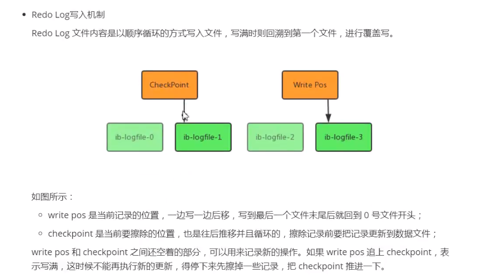

# redo log 
&nbsp;&nbsp;以恢复为目的，在数据库发生意外时重现操作。指数据库中修改的任何数据，将最新的数据备份存储的位置(redo log)，在事务提交时会将产生的redo log 写入到log buffer，并不是随着事务的提交就立即写入磁盘文件。等事务的脏页写入到磁盘之后，redo log的使命就完成了，redo log 占用的空间就可以被重用了。

&nbsp;&nbsp;redo log 记录的是物理操作日志，因此每个事务对应多个日志条目，并且事务的重做日志写入是并发的，并非在事务提交时写入。顾其在文件记录的顺序并非是事务开始的顺序。

## 写入机制
&nbsp;&nbsp;redo log文件内容是以顺序循环的方式写入文件，写满时则回溯到第一个文件，进行覆盖写。

## 文件存储
后续补充！！！