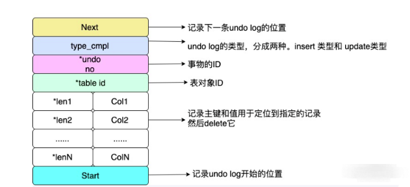
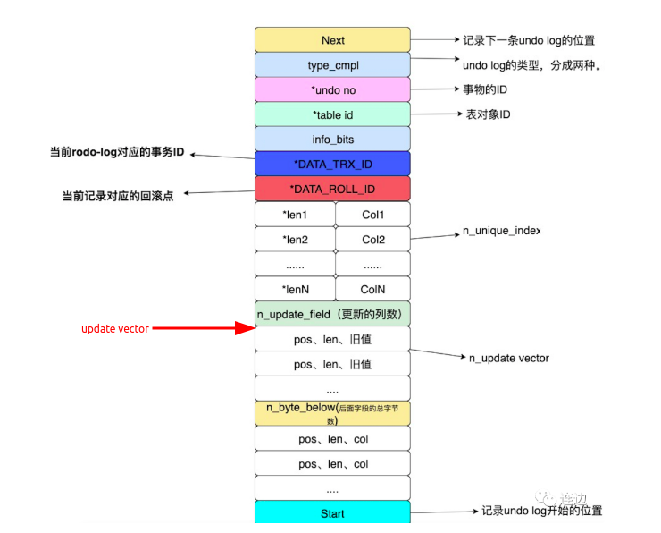

# undo log
&nbsp;&nbsp;意为插销或者取消，返回到指定某个状态的操作。数据库事务开始之前，会将要修改的记录存放到undo日志中，当事务回滚时或者数据库崩溃的时候，可以利用undo 日志，撤销未提交事务对数据库产生的影响。属于逻辑日志，记录一个变化过程。

&nbsp;&nbsp;undo log 是将数据库逻辑的恢复到原来的样子。

&nbsp;&nbsp;在InnoDB存储引擎中，undo log分为：
1. insert undo log
2. update undo log

&nbsp;&nbsp;insert undo log 是指在insert 操作中产生的undo log。**因为insert操作的记录，只对于本事务可见，对其他事务不可见，故该undo log可以在事务提交后直接删除，不需要进行purge操作。**insert undo log格式如下图: 
  + 

&nbsp;&nbsp;update undo log 记录的是对delete 和 update操作产生的undo log。**该undo log可能需要提供MVCC机制，因此不能在事务提交时就进行删除。提交时放入undo log链表，等待purge线程进行最后的删除。**update undo log的结构如图：
  + 
     
     > update vector 表示update操作导致发生变化的列，每个修改的列信息都要记录到undo log中。对于不同的undo log类型，可能还需要记录对索引列所做的修改。
        >> 因此：在执行update语句时仅更新需要的更新的列,否则会造成undo log日志占用空间大，则刷新到磁盘所需时间长。

---
## 功能
1. 实现事务的原子性
2. 实现MVCC

## undo log 的清理
&nbsp;&nbsp;当事务提交的时候，InnoDB会做如下两件事情：
1. 将undo log 放入到列表中，以供之后的purge操作。
2. 判断undo log 所在的页能否可以重用，如果可以，则分配给下个事务使用
   
&nbsp;&nbsp;事务提交之后并不能删除undo log以及undo log所在的页，这是因为还有其他的事务需要通过undo log来得到行之前的版本。故事务提交时将undo log 放入到一个链表中，是否可以最终删除undo log以及undo log所在的页由purge线程来判断。
---
## 文件存储
后续补充!!!
