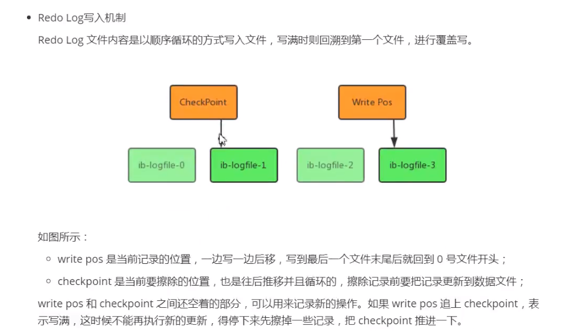

# redo log 
&nbsp;&nbsp;以恢复为目的，在数据库发生意外时重现操作。指数据库中修改的任何数据，将最新的数据备份存储的位置(redo log)，在事务提交时会将产生的redo log 写入到log buffer，并不是随着事务的提交就立即写入磁盘文件。等事务的脏页写入到磁盘之后，redo log的使命就完成了，redo log 占用的空间就可以被重用了。

&nbsp;&nbsp;redo log 记录的是物理操作日志，因此每个事务对应多个日志条目，并且事务的重做日志写入是并发的，并非在事务提交时写入。顾其在文件记录的顺序并非是事务开始的顺序。

## 写入机制
&nbsp;&nbsp;redo log文件内容是以顺序循环的方式写入文件，写满时则回溯到第一个文件，进行覆盖写。

## 文件存储
### log block(又称 redo log block)
&nbsp;&nbsp;在InnoDB存储引擎中，重做日志都是以512字节进行存储的，这意味着重做日志缓存、重做日志文件都是以块的方式保存的，即 重做日志块(redo log block),每块的大小是512字节。

&nbsp;&nbsp;若一个页中产生的重做日志数量大于512字节，则需要分割为多个log block进行保存。且log block的大小和磁盘扇区大小一样，都是512字节，因此重做日志的写入可以保证原子性磁盘IO的最小单位是512字节，不需要double write技术

&nbsp;&nbsp;重做日志块除了日志本身，还由日志块头(log block header，占用12字节) 以及 日志块尾(log block tailer，占用8字节)两部组成。因此，每个重做日志块实际可以存储的大小为 512 - 12 - 8 = 492字节。如下图，重做日志块缓存的结构: 
  - 
  - log block header
    |字段|大小|含义|
    |---|---|---|
    | LOG_BLOCK_HDR_NO| 4字节|标记该log block在这个数组中的位置,且是递增并循环使用的且第一位用于判断是否是flush bit,所以最大值是2G|
    | LOG_BLOCK_HDR_DATA_LEN|2字节|表示log block所占用的大小,当log block被写满时，该值为0x200,表示占用全部log block空间，即512字节|
    | LOG_BLOCK_FIRST_REC_GROUP|2字节|表示log block中第一个日志所在的偏移量，若该值与LOG_BLOCK_HDR_DATA_LEN相等，表示该log block不包含新日志|
    | LOG_BLOCK_CHECKPOINT_NO|4字节|该 log_block 最后被写入时的 checkpoint 值(log_sys->next_checkpoint_no低4个字节的值)|
  - log block tailer 
    |字段|大小|含义|
    |---|---|---|
    |LOG_BLOCK_TRL_NO|4字节|值与LOG_BLOCK_HDR_NO相同|
#### log block 分析
- 
   + T1的重做日志占用 762 字节，事务T2重做日志占用100字节，因为每个log block只能保存492个字节，因此对于T1、T2 log block各个字段的值:
      1. LOG_BLOCK_FIRST_REC_GROUP: 左侧log block对应字段值为12,右边的则为 12 + 270 = 282

### log group
&nbsp;&nbsp;重做日志由以下几个概念组成:
- 重做日志缓存(redo log buffer)
- 重做日志组(redo log group)
- 每个重做日志包含多个重做日志文件(redo log file)
- 归档重做日志文件(archive redo log file)
  
&nbsp;&nbsp;每个重做日志文件组存储的内容是完全相同的，是镜像关系ha_innobase.cc文件中禁用了镜像功能，因此InnoDB中实际只有一个log group，目的是为了数据库的可用性。关系如下图:(P49)
  - 

## 附录
### double write技术
1. Q: 为什么log write不需要doublewrite的支持？
   - A: 因为redolog写入的单位就是512字节，也就是磁盘IO的最小单位，所以无所谓数据损坏。

### LSN
### checkpoint

P78、P161