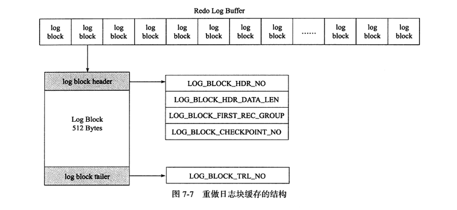
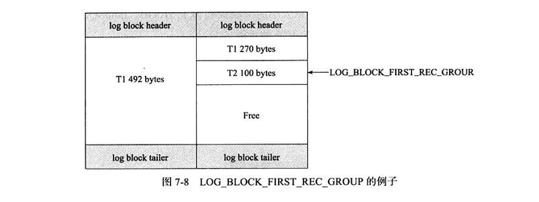
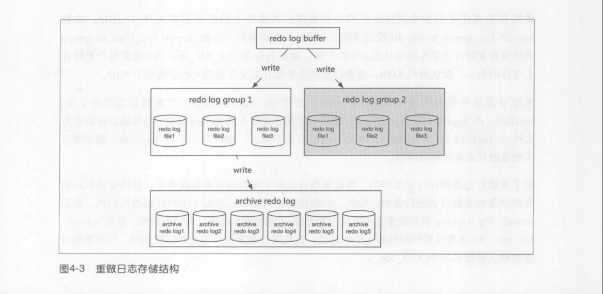
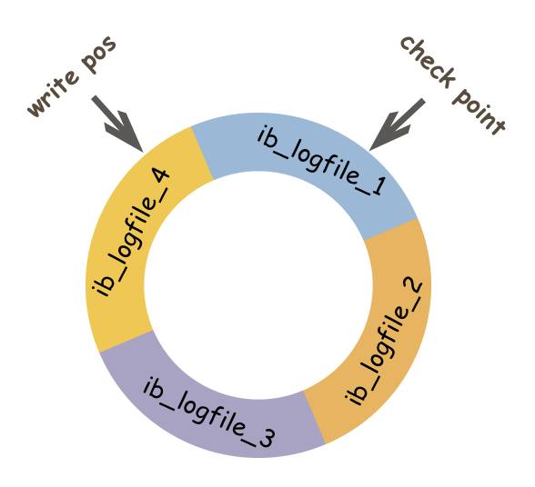
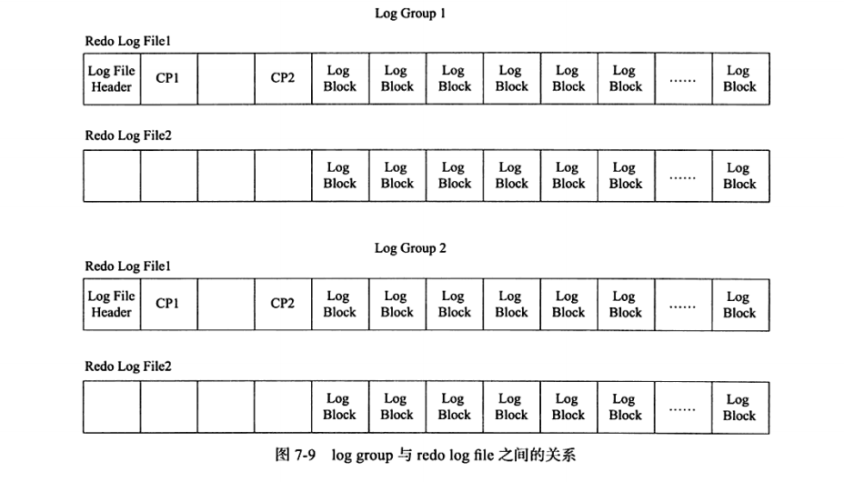
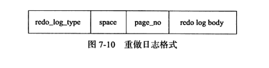
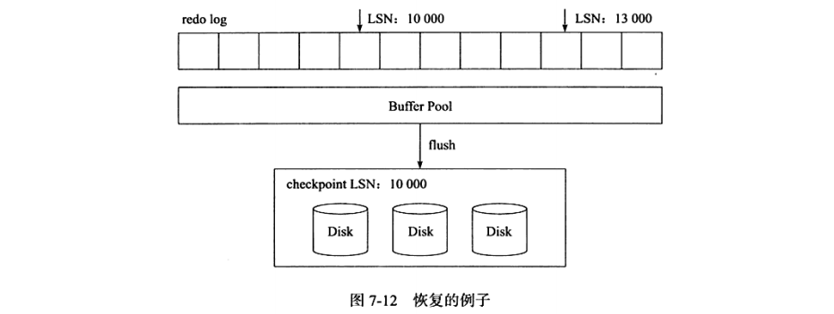

# redo log 
&nbsp;&nbsp;以恢复为目的，在数据库发生意外时重现操作。指数据库中修改的任何数据，将最新的数据备份存储的位置(redo log)，在事务提交时会将产生的redo log 写入到log buffer，并不是随着事务的提交就立即写入磁盘文件。等事务的脏页写入到磁盘之后，redo log的使命就完成了，redo log 占用的空间就可以被重用了。

&nbsp;&nbsp;redo log 记录的是物理操作日志，因此每个事务对应多个日志条目，并且事务的重做日志写入是并发的，并非在事务提交时写入。顾其在文件记录的顺序并非是事务开始的顺序。

## 文件存储
### log block(又称 redo log block)
&nbsp;&nbsp;在InnoDB存储引擎中，重做日志都是以512字节进行存储的，这意味着重做日志缓存、重做日志文件都是以块的方式保存的，即 重做日志块(redo log block),每块的大小是512字节。

&nbsp;&nbsp;若一个页中产生的重做日志数量大于512字节，则需要分割为多个log block进行保存。且log block的大小和磁盘扇区大小一样，都是512字节，因此重做日志的写入可以保证原子性磁盘IO的最小单位是512字节，不需要double write技术

&nbsp;&nbsp;重做日志块除了日志本身，还由日志块头(log block header，占用12字节) 以及 日志块尾(log block tailer，占用8字节)两部组成。因此，每个重做日志块实际可以存储的大小为 512 - 12 - 8 = 492字节。如下图，重做日志块缓存的结构: 
  - 
  - log block header
    |字段|大小|含义|
    |---|---|---|
    | LOG_BLOCK_HDR_NO| 4字节|标记该log block在这个数组中的位置,且是递增并循环使用的且第一位用于判断是否是flush bit,所以最大值是2G|
    | LOG_BLOCK_HDR_DATA_LEN|2字节|表示log block所占用的大小,当log block被写满时，该值为0x200,表示占用全部log block空间，即512字节|
    | LOG_BLOCK_FIRST_REC_GROUP|2字节|表示log block中第一个日志所在的偏移量，若该值与LOG_BLOCK_HDR_DATA_LEN相等，表示该log block不包含新日志|
    | LOG_BLOCK_CHECKPOINT_NO|4字节|该 log_block 最后被写入时的 checkpoint 值(log_sys->next_checkpoint_no低4个字节的值)|
  - log block tailer 
    |字段|大小|含义|
    |---|---|---|
    |LOG_BLOCK_TRL_NO|4字节|值与LOG_BLOCK_HDR_NO相同|
#### log block 分析
- 
  
  + T1的重做日志占用 762 字节，事务T2重做日志占用100字节，因为每个log block只能保存492个字节，因此对于T1、T2 log block各个字段的值:
      1. LOG_BLOCK_FIRST_REC_GROUP: 左侧log block对应字段值为12,右边的则为 12 + 270 = 282

### log group
&nbsp;&nbsp;重做日志由以下几个概念组成:
- 重做日志缓存(redo log buffer)
  > 大小由innodb_log_buffer_size控制，默认大小为1MB
- 重做日志组(redo log group)
- 每个重做日志包含多个重做日志文件(redo log file)
- 归档重做日志文件(archive redo log file)
  
&nbsp;&nbsp;每个重做日志文件组存储的内容是完全相同的，是镜像关系ha_innobase.cc文件中禁用了镜像功能，因此InnoDB中实际只有一个log group，目的是为了数据库的可用性即当一组中的重做日志发生介质损坏时，InnoDB存储引擎依旧能提供服务。关系如下图:(P49)
  - 

&nbsp;&nbsp;log group由多个重做日志文件组成，每个log group中的日志文件大小是相同的，InnoDB1.2之前重做日志文件的总大小要小于4GB,从InnoDB1.2开始重做日志文件总大小的限制提高为了512GB。

&nbsp;&nbsp;重做日志文件中存储的就是之前在log buffer中保存的log block,因此重做日志文件也是根据块的方式进行物理存储的管理，每个块的大小与log block一样，同样为512字节。在InnoDB存储引擎运行过程中，log buffer会根据一定的规则将内存中的log block刷新到磁盘上。规则如下:
  1. 事务提交时
  2. 当log buffer中有一半的内存空间已经被使用时
  3. log checkpoint 时

&nbsp;&nbsp;重做日志文件是循环反复(round-robin)使用的，假设设置三个重做日志文件: ib_logfile0、ib_logfile1、ib_logfile2。重做日志缓存先写入到ib_logfile0中，当写满后再依次写文件 ib_logfile1、ib_logfile2,当ib_logfile2也写满，则再写ib_logfile0,而之前写入的重做日志条目将被覆盖。

&nbsp;&nbsp;由于重做日志文件是循环往复使用的，因此重做日志由于覆盖而导致丢失。归档重做日志的作用就是对重做日志进行备份(只对重做日志组1中的日志进行归档，且默认不开启)

### redo log file怎么写入的
&nbsp;&nbsp;redo log 实际上记录数据页的变更,而这种变更记录是没有必要全部保存的???,因此redo log 实际上采用了大小固定，循环写入的方式，写满时会回溯到第一个文件，进行覆盖写。如下图: 
- 
  
  + 如上图，wtite pos 表示redo log当前记录的LSN（逻辑序列号）位置，checkpoint表示数据页更改记录刷盘后对应redo log所处的LSN位置。 **write pos 到 checkpoint之间的部分是redo log 空着的部分，用于记录新的记录**。**checkpoint到write pos 之间是记录待落盘的数据页变更记录**。当write pos追上checkpoint时，会先推动checkpoint向前移动，空出的位置再记录新的日志。

#### > **redo log 存在的意义是什么?**
> 在InnoDB中，既有redo log需要刷盘，还有数据页需要刷盘，**redo log 存在的意义主要就是降低数据页刷盘的要求**

&nbsp;&nbsp;启动InnoDB时，不论上次是正常关闭还是异常关闭，总是会进行恢复操作。因为redo log 记录的是数据页的物理变化，因此恢复时速度比逻辑日志(如 binlog)要快很多。

#### **数据页刷盘和redo log刷盘的关系**
&nbsp;&nbsp;重启InnoDB时，首先会检查磁盘中数据页的LSN，如果数据页的LSN小于日志中的LSN，则会从checkpoint开始恢复。还有一种情况，在宕机前正处于checkpoint的刷盘过程，且数据页的刷盘进度超过了日志页的刷盘进度，此时会出现数据页中记录的LSN大于日志中的LSN，这时超出日志进度的部分将不会重做，因为这本身就表示已经做过的事情，无需再重做。

### log group 与 log file之间的关系
- 

  + redo log file除了保存log buffer 刷新到磁盘的log block,还保存一些其他信息。对于log group中第一个redo log file,其前2KB的部分保存了4个512字节大小的块，内容如下下面的信息仅在log group的第一个redo log file中存储:
  + |名称|大小(字节)|
    |---|---|
    |log file header|512|
    |checkpoint1|512|
    |空|512|
    |checkpoint2|512 (Q:为什么要两个checkpoint，如Q&A)|
  + 在log file header后面的部分为InnoDB存储引擎保存的checkpoint值，其设计是交替写入除了要写入log block,还要更新前2KB部分的信息，这样的设计避免了因介质失败而导致无法找到可用的checkoutpoint的情况。  

### 重做日志格式
&nbsp;&nbsp;不同的数据库操作会有对应的重做日志格式重做日志格式与具体操作相关，InnoDB存储引擎的存储管理是基于页的，故其重做日志格式也是基于页的。虽然有着不同的重做日志格式，但是他们有着通用的头部格式.如下图:
- 
- + redo_log_type: 重做日志类型
- + space: 表空间的ID
- + page_no: 页的偏移量
- + redo log body: 根据重做日志类型的不同，会有不同的存储内容

### 恢复
&nbsp;&nbsp;InnoDB存储引擎在启动时不管上次数据库运行是否正常关闭，都会尝试进行恢复操作。因为重做日志记录的是物理日志，因此恢复的速度比逻辑日志（如 二进制日志）要快得多，且InnoDB存储引擎自身也对恢复进行了一定程度的优化，如 顺序读取及并行应用重做日志。

&nbsp;&nbsp;由于checkpoint表示已经刷新到磁盘上的LSN,因此在恢复过程中仅需恢复checkpoint开始的日志部分。如图：当数据库在checkpoint的LSN为1000时发生宕机，恢复操作仅恢复LSN 10000 ~ 13000范围内的日志。
- 

---
## 附录
### 1. double write技术
1. Q: 为什么log write不需要doublewrite的支持？
   - A: 因为redolog写入的单位就是512字节，也就是磁盘IO的最小单位，所以无所谓数据损坏。

### 2. LSN
&nbsp;&nbsp;LSN 即 Log Sequence Number,代表的是日志序列号，在InnoDB存储引擎中，LSN占用8个字节，且单调递增。LSN表示的含义有:
1. 重做日志写入的总量
2. checkpoint 的位置
3. 页的版本
&nbsp;&nbsp;LSN表示事务写入重做日志的字节总量，如当前重做日志的LSN为1000,事务T1写入了100字节的重做日志，那么LSN就是1100.若又有事务T2写入了200字节的重做日志，那么LSN就变成了1300.

&nbsp;&nbsp;LSN不仅记录在重做日志中，还存在每个页中。在每个页的头部，有一个值: FIL_PAGE_LSN,记录了该页的LSN。在页中，LSN表示该页最后刷新时LSN大小。**因为重做日志记录的是每个页的日志，因此页中的LSN用来判断是否需要进行恢复操作**
- 如： 页P1的LSN为10000,而数据库启动时，InnoDB检测到写入重做日志中的LSN为13000,并且该事务已经提交，那么数据库需要进行**恢复**操作，将重做日志应用到P1页中.
- + 当重做日志中LSN小于P1页中的LSN，不需要进行重做，因为P1页中的LSN表示页已经被刷新到该位置。
### 4. log file header 组成结构：

  |属性名|长度(单位：字节)|描述|
  |---|---|---|
  |LOG_HEADER_FORMAT|4|redo日志的版本|
  |LOG_HEADER_PAD1|4|做字节填充用的，没什么实际意义|
  |LOG_HEADER_START_LSN|8|标记本redo日志文件开始的LSN值，也就是文件偏移量为2048字节初对应的LSN值|
  |LOG_HEADER_CREATOR|32|一个字符串，标记本redo日志文件的创建者是谁。|
  |LOG_BLOCK_CHECKSUM|4|block的校验值，所有block都有|

### 5. checkpoint 组成结构：

  |属性名|长度(单位：字节)|描述|
  |---|---|---|
  |LOG_CHECKPOINT_NO|8|服务器做checkpoint的编号，每做一次checkpoint，该值就加1|
  |LOG_CHECKPOINT_LSN|8|服务器做checkpoint结束时对应的LSN值，系统崩溃恢复时将从该值开始|
  |LOG_CHECKPOINT_OFFSET|8|上个属性中的LSN值在redo日志文件组中的偏移量|
  |LOG_CHECKPOINT_LOG_BUF_SIZE|8|服务器在做checkpoint操作时对应的log buffer的大小|
  |LOG_BLOCK_CHECKSUM|4|block的校验值|

### redo log的幂等性
&nbsp;&nbsp;重做日志是物理日志，因此其是幂等的

---
## Q&A
### 1. redolog file 中为什么需要两个checkpoint?
&nbsp;&nbsp;checkpoint 是崩溃恢复过程中应用日志的起点。如果 checkpoint 块写入如果出现故障或者掉电，InnoDB 就无法找到日志的起点。如果两个 checkpoint 轮换写入，遇到写入checkpoint 块失败，可以在另一个 checkpoint 块上取得上次的 checkpoint LSN 作为起点。

### 2. 两个checkpoint会不会同时失败?
&nbsp;&nbsp;假设 checkpoint1 掉电损坏，则选择 checkpoint2 块选取前一个 checkpoint LSN 做恢复。按照 InnoDB 的轮换算法，第二次写入 checkpoint 点的位置仍然是 checkpoint1，再次写入掉电仍然只会在 checkpoint1 损坏，两个 checkpoint 块方法仍然是可靠的。

---
## 参考资料
1. [【图文详解】MySQL系列之redo log、undo log和binlog详解](https://cloud.tencent.com/developer/article/1801920)
2. [解析 Redo Log 实现方式](https://www.jianshu.com/p/3482fdd91e03)
3. 《MySQL技术内幕 · InnoDB存储引擎第2版》