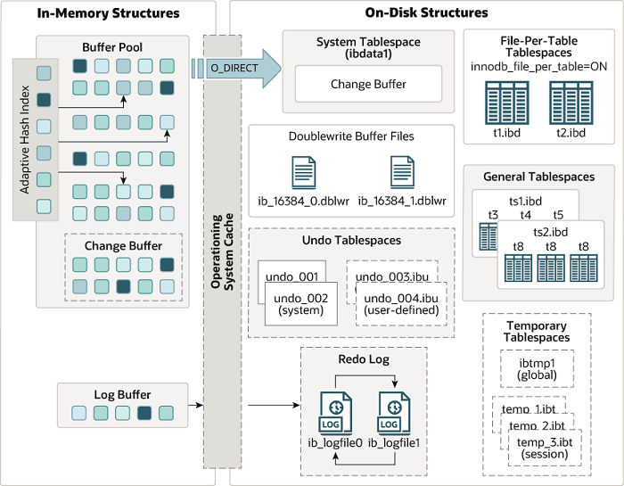

# InnoDB缓存
## InnoDB内存数据对象
- 
  
## 缓存池
&nbsp;&nbsp;InnoDB是基于磁盘存储的，并将其中的记录按照页的方式进行管理。在数据库系统中，因为CPU和磁盘之间的数据差距很大，基于磁盘的数据库系统通常使用缓存池技术来提高数据库的整体性能。
> 通过内存的速度来弥补磁盘速度较慢对于数据库性能的影响.

> 缓冲池的大小直接影响着数据库的整体性能，因此，强烈建议数据库都采用64位的OS

### 数据读操作
&nbsp;&nbsp;缓存池简单来说就是一块内存区域，通过内存的速度来弥补磁盘速度较慢对于数据库性能的影响。在数据库中进行读取页的操作，首先将从磁盘读取到的内存页放在缓存池中(该过程称为 "将页 “FIX” 在缓存池中")，下一次再读取相同的页时，首先判断该页是否在缓存池中。若在缓存池中，则称该页被缓存池命中，直接读取该页；否则，读取磁盘上的页。
> 数据页的读取首先读缓存池，缓存池没有再从磁盘读取并存储到缓存池。

### 数据写操作<sub>即redo log 以及 redo log</sub>
&nbsp;&nbsp;对于数据库中的修改，则首先修改在缓存池中的页(**修改（Update 或 Delete改变了页中的记录）之后就成了脏页**)，再以一定的频率刷新到磁盘上。页从缓存池中刷新回磁盘的操作并不是每次页发生更新时触发，而是通过Checkpoint的机制刷新回磁盘。
> 数据修改先修改缓存池，再刷回磁盘

---
### 缓存池数据页管理-LRU(Latest Recent Used,最近最少使用)列表，Free List,Flush List
&nbsp;&nbsp;InnoDB中的缓存池是通过LRU算法来管理
+ 即最近使用的页在LRU列表的前端，而最少使用的页在LRU列表的尾端，当缓冲池不能存放新读取到的页时，将首先释放LRU列表中尾端的页.

&nbsp;&nbsp;在InnoDB中，缓存池中的页的大小是16KB，同样使用LRU算法对缓存池进行管理。不同的是，InnoDB存储引擎对于传统的LRU算法进行了优化: InnoDB在LRU列表中添加了midpoint位置：新读取到的页，虽然是最新访问的页，但并不直接放到LRU列表的头部，而是放入到LRU列表的<font color="red">**midpoint**</font>位置。midpoint由参数innodb_old_blocks_pct控制(默认37%)。
+ ```txt
    mysql> show variables like 'innodb_old_blocks_pct'\G
    *************************** 1. row ***************************
    Variable_name: innodb_old_blocks_pct
            Value: 37   # midpoint 之后的列表称为old列表，之前的列表称为new列表。new 列表中的页都是最为活跃的热点数据.
    1 row in set (0.01 sec)
    
    mysql> 

   # innodb_old_blocks_time : 表示页读取到mid位置后需要等待多久时间才会被加入到LRU列表的热端。
    mysql> show variables like 'innodb_old_blocks_time'\G
    *************************** 1. row ***************************
    Variable_name: innodb_old_blocks_time
            Value: 1000
    1 row in set (0.01 sec)
    
    mysql>
  ```
+ InnoDB中，将midpoint之前的列表称为new列表，之后的列表称为old列表。可以简单的理解为 new列表中的页都是最为活跃的热点数据。
+ 为什么优化? 若直接将读取到的页放入到LRU的首部，那么某些SQL操作可能会使缓存中的页被刷出，从而影响缓存池的效率。
  - 另一个优化参数: innodb_old_blocks_time,用于表示页读取到mid位置后需要等待多久时间才会被加入到LRU列表的热端。

#### 缓存池数据页压缩
&nbsp;&nbsp;InnoDB支持压缩页的功能，即将原本16KB的数据页压缩为1KB、2KB、4KB、8KB，而由于页大小发生了变化，LRU列表也有了些许的变化： 对于非16KB的数据页，是通过unzip_LRU列表进行管理的。
```txt
mysql> show engine innodb status\G
........

----------------------
BUFFER POOL AND MEMORY
----------------------
Total large memory allocated 137428992
Dictionary memory allocated 133207
Buffer pool size   8192 # 表示共有多少个页: 8192*16KB = 128MB
Free buffers       7702 # 表示Free 列表中页的数量
Database pages     490  # LRU列表中页的数量
# Database pages  +  Free buffers 不一定等于 Buffer pool size，因为缓冲池中还包含自适应哈希索引，lock信息，insert Buffer等页,不需要LRU算法维护，因此不存在LRU列表中
Old database pages 0
Modified db pages  0  # 脏页的数量
Pending reads      0
Pending writes: LRU 0, flush list 0, single page 0
Pages made young 0, not young 0
0.00 youngs/s, 0.00 non-youngs/s
Pages read 456, created 34, written 36
0.00 reads/s, 0.00 creates/s, 0.00 writes/s
No buffer pool page gets since the last printout
Pages read ahead 0.00/s, evicted without access 0.00/s, Random read ahead 0.00/s
LRU len: 490, unzip_LRU len: 0  # LRU中包含了unzip_LRU
I/O sum[0]:cur[0], unzip sum[0]:cur[0]
--------------
ROW OPERATIONS
--------------
0 queries inside InnoDB, 0 queries in queue
0 read views open inside InnoDB
Process ID=1, Main thread ID=139689625372416, state: sleeping
Number of rows inserted 0, updated 0, deleted 0, read 8
0.00 inserts/s, 0.00 updates/s, 0.00 deletes/s, 0.00 reads/s
----------------------------
END OF INNODB MONITOR OUTPUT
============================

1 row in set (0.01 sec)

.....
```

&nbsp;&nbsp;在LRU列表中的页被修改后，该页称为**脏页**，即缓冲池中的页和磁盘上的页数据产生了不一致，这时候数据库会通过checkpoint机制将脏页刷回到磁盘，而Flush 列表中的页就是脏页，Flush列表就是脏页列表。需要注意，脏页机存在于LRU列表，也存在与Flush列表中。LRU列表用来管理缓冲池中的页的可用性，Flush列表用来管理将页刷新到磁盘，二者互不影响。

#### Free List
&nbsp;&nbsp;空闲页，即尚未使用的页(DB刚启动时，LRU列表为空，所有的页都存放在Free 列表中.)。当需要从缓存池中分页时，首先从Free 列表中查找是否有可用的空闲页，有则从Free列表中删除，放入到LRU列表中。

#### Flush List
&nbsp;&nbsp;用来管理将页刷新回磁盘。

---
## 重做日志缓存
&nbsp;&nbsp;InnoDB首先将重做日志信息先放入到这个缓冲区，然后按照一定的频率将其刷新到重做日志文件。

&nbsp;&nbsp; 重做日志缓存一般不需要设置得很大，因为一般情况下每一秒钟会将重做日志缓存刷新到日志文件，因此用户只要保证每秒产生的事务量在这个缓冲大小之内即可。该值由配置参数**innodb_log_buffer_size**控制,默认8MB。

&nbsp;&nbsp; 重做日志在3种情况下会将重做日志缓冲区中的内存刷新到磁盘中：
1. 【Master  Thread 主动处理】Master Thread 每秒将重做日志缓冲刷新到磁盘重做日志文件中
2. 【事务提交】 每个事务提交时会将重做日志缓冲刷新到重做日志文件
3. 【缓冲区空间不足】 当重做日志缓冲区剩余空间小于1/2时

&nbsp;&nbsp;MySQL事务日志，参考:[003.MySQL事务/006.InnoDB事务日志](../../003.MySQL事务/006.InnoDB事务日志)

---
## 额外的内存池
&nbsp;&nbsp;在InnoDB中，堆内存的管理是通过一种称为内存堆的方式进行的，在对一些数据结构本身的内存进行分配时，需要从额外的内存池中进行申请。当该区域内存**不够时**，会从缓冲池中进行申请。
+ 如：分配了缓冲池，但是每个缓冲池中的帧缓冲还有对应的缓冲控制对象，这些对象记录了一下诸如 LRU、锁、等待等信息，而这个对象的内存需要从额外内存池中申请。

---
## Q&&A
### 001. 数据页刷入磁盘和redo log刷入磁盘的关系
- 
- 
  + 如图，更新数据时先将数据写入到Buffer Pool中的数据页中，再写入Redo Log Buffer.

---
## Checkpoint 技术
- [Checkpoint 技术 ## Checkpoint 技术](../../003.MySQL事务/006.InnoDB事务日志/000.redo.log.md##Checkpoin技术)


---
## 注意
### buffer pool (缓存池) 与 log buffer（重做日志缓存） 不是同一个概念


## 附录
### 1. [InnoDB 架构](https://dev.mysql.com/doc/refman/8.0/en/innodb-architecture.html)
- 
- + **AHI（Adaptive Hash Index,自适应哈希索引）**:InnoDB存储引擎会监控表上各索引页的查询，如果观察到建立哈希索引可以带来速度提升，则建立哈希索引，即自适应哈希索引。AHI是通过缓冲池的B+树页构建而来，因此建立的速度很快，且不需要对整张表构建哈希索引。
- + [Change Buffer](https://dev.mysql.com/doc/refman/8.0/en/innodb-change-buffer.html)
- + - Buffer Pool中的一部分，一种特殊的数据结构，主要是对那些不在Buffer Pool中的二级索引数据页进行缓存，减少对磁盘的随机IO。
- + - 当二级索引页被加载到内存时，则将数据进行合并，再将修改后的数据写入到磁盘中

---
## 参考资料
- [InnoDB Architecture](https://dev.mysql.com/doc/refman/8.0/en/innodb-architecture.html)