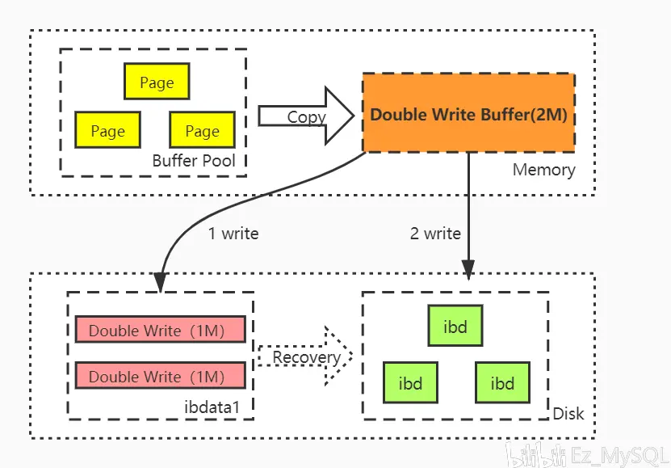

# Double Write
## 简介
&nbsp;&nbsp;为了保证数据写入的可靠性(**保证 Buffer Pool 落盘的可靠性**)，InnoDB引入了double write特性。

##  partial write (部分页失效)
InnoDB默认一个页的大小是16K，如果一个页没有写完整出现故障，这种页叫corrupt page,这种情况就是partial write.**即数据页写入失败，也称部分写失效**

&nbsp;&nbsp;InnoDB崩溃恢复，redo log恢复数据的前提是页是完整干净的，conrrupt page不恢复又会造成写入丢失，如何处理呢?

## Double Write
> > 
- + Double Write 由两部分组成：
- + - 一部分在磁盘上，存在于ibdata1中的一个段对象中，这个点由两个区(每个1M)组成。一部分在内存中。
- + - 一部分在内存中，叫double write buffer,也是2M，大小固定，不支持调整。

### Double Write的使用
&nbsp;&nbsp;缓冲池(Buffer Pool)中的页落盘时，不直接写入对应的ibd文件中：
1. **Buffer Pool -> double write buffer**： 首先，先拷贝到double write buffer中
2. **double write buffer -> ibdata1段对象**: *第一次写*: 其次，在第一步完成之后，再从double write buffer中写入double write段对象中，成功写满2M(2M/16K=128个页.顺序IO一次)之后
3. **double write buffer -> ibd**(ibd:该表对应的磁盘文件,即磁盘)： *第二次写*: 再根据space,page_no写入对应的ibd(随机IO).
4. **恢复**(Recovery)：如果操作系统在将页写入磁盘的过程中失败了，在恢复的过程中，InnoDB存储引擎可以从共享表空间的doublewrite中找到该页的一个副本，将其复制到表空间文件，再应用重做日志。
> 两次写:
>> 通过memcpy函数将脏页先复制到内存中的doublewrite buffer中，再基于doublewriter buffer再分两次写
&nbsp;&nbsp;如果double write 时发生crash，此时ibd是干净的，服务启动后通过redo log进行恢复，如果写ibd时发生crash，此时double write中存在副本，可以直接覆盖到ibd中对应的页中，然后再继续redo恢复。

>>> 即： double write 和 ibd中总有一份干净的数据。

--- 
## 参考资料
1. [Double Write保证写入可靠性](https://www.bilibili.com/read/cv6420652)
2. 《MySQL技术内幕InnoDB存储引擎·第2版》