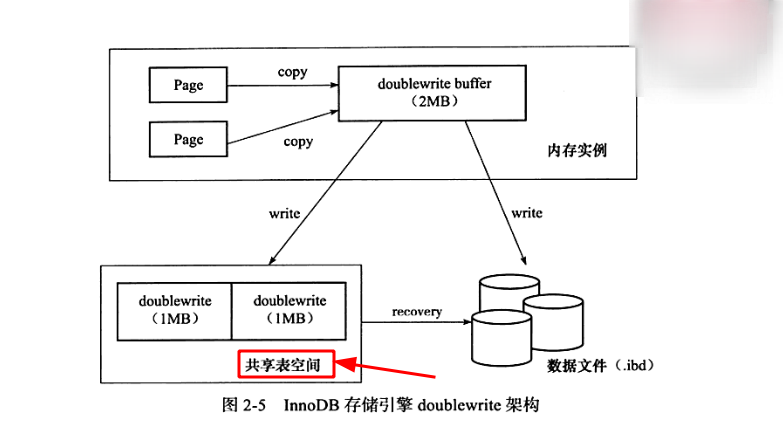
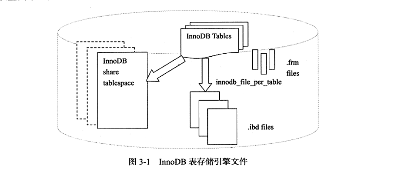

# Double Write
## 简介
&nbsp;&nbsp;为了保证数据写入的可靠性(<font color="red">**保证 Buffer Pool 落盘的可靠性**</font>)，InnoDB引入了double write特性。

##  partial write (部分页失效)
InnoDB默认一个页的大小是16K，如果一个页没有写完整出现故障，这种页叫corrupt page,这种情况就是partial write.<sup><font color="red">**即数据页写入失败，也称部分写失效**</font></sup>

&nbsp;&nbsp;InnoDB崩溃恢复，redo log恢复数据的前提是页是完整干净的，conrrupt page不恢复又会造成写入丢失，如何处理呢?

## Double Write
> > 
- + Double Write 由两部分组成：
- + - 一部分在磁盘上，存在于ibdata1中的一个段对象中，这个点由两个区(每个1M)组成。一部分在内存中。
- + - 一部分在内存中，叫double write buffer,也是2M，大小固定，不支持调整。

### Double Write的使用
&nbsp;&nbsp;缓冲池(Buffer Pool)中的页落盘时，不直接写入对应的ibd文件中：
1. **Buffer Pool -> double write buffer**： 首先，先拷贝到double write buffer中
2. **double write buffer -> ibdata1段对象**: *第一次写*: 其次，在第一步完成之后，再从double write buffer中写入double write段对象中，成功写满2M(2M/16K=128个页.顺序IO一次)之后
+ > 注意：ibdata1 是表空间文件，又称共享表空间(位于磁盘上的)，所有基于InnoDB存储引擎的表的数据都会记录到该共享表空间中。见附录二
3. **double write buffer -> ibd**(ibd:该表对应的磁盘文件,即磁盘)： *第二次写*: 再根据space,page_no写入对应的ibd(随机IO).
4. **恢复**(Recovery)：如果操作系统在将页写入磁盘的过程中失败了，在恢复的过程中，InnoDB存储引擎可以从共享表空间的doublewrite中找到该页的一个副本，将其复制到表空间文件，再应用重做日志。
> 两次写:
>> 通过memcpy函数将脏页先复制到内存中的doublewrite buffer中，再基于doublewriter buffer再分两次写
&nbsp;&nbsp;如果double write 时发生crash，此时ibd是干净的，服务启动后通过redo log进行恢复，如果写ibd时发生crash，此时double write中存在副本，可以直接覆盖到ibd中对应的页中，然后再继续redo恢复。

>>> 即： double write 和 ibd中总有一份干净的数据。

---
## 附录
### 附录一：两次写
- 

### 附录二： 表空间简记
```txt
  [mysqld]
  innodb_data_file_path = /db/ibdata1:2000M;/dr2/db/ibdata2:2000M:autoextend

  # 在这里，将/db/ibdata1 和 /dr2/db/ibdata2 两个文件来组成表空间。
  # 若将这两个文件位于不同的磁盘上，磁盘的负载可能被平均，因此可以提高数据库的整体性能。
  # ibdata1 大小为2000M，ibdata2文件大小为2000M，使用完后可以自动增长(autoextend)

  #>> 设置了innodb_data_file_path 之后，所有基于InnoDB的表的数据都会记录到该共享表空间中。
  #>> 若设置了innodb_file_per_table ，则用户可以将每个基于InnoDB的表产生一个独立的表空间。独立表空间命名规则: 表名.ibd.

  mysql> show variables like 'innodb_file_per_table' \G
  *************************** 1. row ***************************
  Variable_name: innodb_file_per_table
          Value: ON
  1 row in set (0.01 sec)
```

&nbsp;&nbsp;InnoDB存储引擎采用将存储的数据按照表空间进行存放的设计，表空间分为
+ 共享表空间: .ibdata files;
  - ibdata1 是表空间文件，又称共享表空间(位于磁盘上的)，所有基于InnoDB存储引擎的表的数据都会记录到该共享表空间中。
     + 这里的"表的数据"，不是表中存的数据，而是表的一些信息；
+ 独立表空间: .ibd files;
  - 独立表空间： 用户可以将每个基于InnoDB存储引擎的表产生一个独立的表空间，通过这样的方式，用户不用将所有数据都存放于默认的表空间内。
  - <font color="red">独立表空间文件仅存放该表的数据，索引和插入缓存BITMAP等信息，其余信息(如表字段)还是存放在默认的表空间中。</font>
- 

---
## 参考资料
1. [Double Write保证写入可靠性](https://www.bilibili.com/read/cv6420652)
2. 《MySQL技术内幕InnoDB存储引擎·第2版》