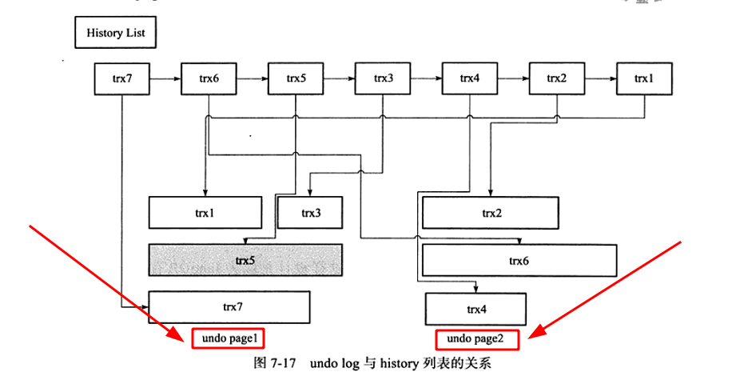

# Purge(清理、清除)
&nbsp;&nbsp;delete 和 update 操作可能并不直接删除原有的数据，如下SQL：
- DELETE FROM t WHERE a = 1;
- + 表t上列a上有聚集索引，列b上有辅助索引。对于上述的delete操作，通过前面关于undo log 的介绍已经知道仅是将主键值为1的记录的delete flag设置为1,记录并没有被删除，即记录还存在于B+树中。其次，对于辅助索引上a=1&b=1的记录同样没有做任何处理，甚至没有产生undo log。而真正删除这行记录的操作其实被“延时”了，最终在purge中完成。 
- + - delete操作是标记删除,真正的清理是purge操作
- + purge 用于最终完成update 和 delete操作，这样设计的目的就是InnoDB存储引擎支持MVCC，所以记录不能再事务提交时立即进行处理。这时其他事务可能正在引用这行，因此InnoDB存储引擎需要之前的版本，反之，如果这行记录已不被任何其他事务所引用，那么就可以进行真正的delete操作。

## undo log 与 事务的关系
&nbsp;&nbsp;InnoDB存储引擎的undo log设计： 一个页上允许多个事务的undo log存在，**虽然这不代表事务在全局过程中提交的顺序**，但是后面的事务产生的undo log总在最后。且InnoDB存储引擎还有一个history列表，他根据事务提交的顺序，将undo log进行链接。如下：
- 
- + 阴影部分(trx5)表示该undo log还被其他事务所引用
- + **history list表示按照事务提交的顺序将undo log进行组织**，在InnoDB存储引擎中，先提交的事务总在尾端
- + undo page 存放了undo log，由于可以重用，undo page可能存放了多个不同事务的undo log

### purge 处理过程
1. Step1. 遍历history list(从链表头开始遍历)，找到需要被清理的事务undo log trxN,其所在的页为undo pageN
2. Step2. 去事务trxN的undo log 所在的页undo pageN去搜寻所有可以被清理的undo log并将其清理掉。
3. Step3. 回到Step1,即继续遍历history list
4. 处理流程详细描述: 
    > 首先，从history list中找到第一个需要被清理的记录，这里为trx1.清理之后InnoDB存储引擎会在trx1的undo log所在的页中寻找是否存在其他可以被清理的记录，此时找到trx3,接着找到trx5,但是发现trx5被其他事务所引用而不能清理，故再去history list中查找，发现此时最尾端的记录为trx2,接着寻找trx2所在的页，然后依次再把事务trx6,trx4的记录进行处理。由于undo page2中所有的页都被清理了，因此该undo page可以被重用了。

&nbsp;&nbsp;这种处理方式(先从history list中寻找undo log，再从undo page中找undo log的设计模式)是为了避免大量的随机IO，从而提交purge的效率。

## 数据库参数设置
### 全局动态参数 innodb_purge_batch_size
&nbsp;&nbsp;用来设置每次purge操作需要清理的undo purge数量。默认值: InnoDB1.2之前是20,InnoDB1.2之后是300.值设置的越大，每次回收的undo page越多，这样可以重用的undo page也就越多，减少了磁盘存储空间与分配的开销。但如果过大，则每次需要purge处理更多的undo page，从而导致CPU和磁盘IO过于集中于undo log的处理，使性能下降。

### 全局动态参数 innodb_max_purge_lag
&nbsp;&nbsp;用来控制history list的长度，若长度大于该参数时数据库压力非常大，不能高效地进行purge操作，则history list会变得越来越长，会延缓 DML 的操作。默认值为0，表示不做限制。

### 全局动态参数 innodb_max_purge_lag_delay 
&nbsp;&nbsp;控制延迟的最大毫秒数

&nbsp;&nbsp;delay的对象是行，而不是DML操作。 如 当一个update操作需要更新5行数据时，每行数据的操作都会被delay，因此总的延迟时间: 5 * delay。 delay 的统计会在每次purge操作完成之后重新计算。

---
## 参考资料
1. 《MySQL技术内幕InnoDB存储引擎 · 第2版》