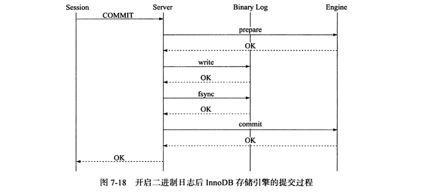
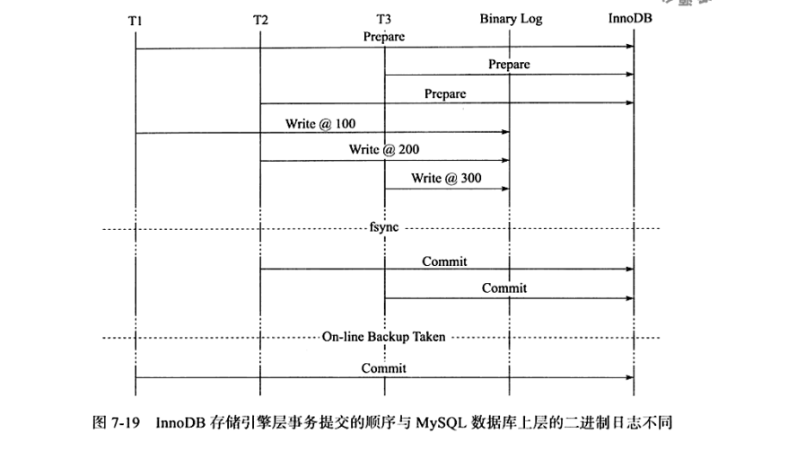
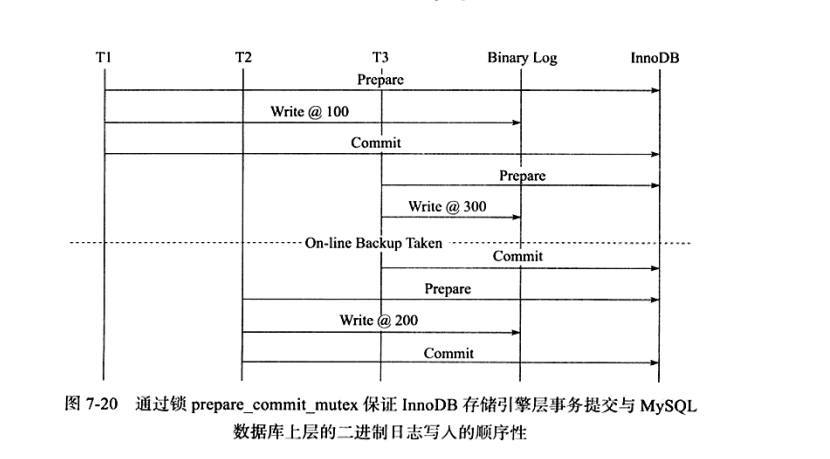
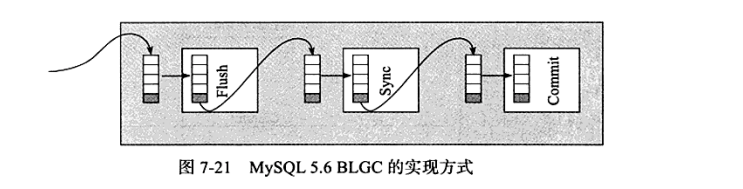
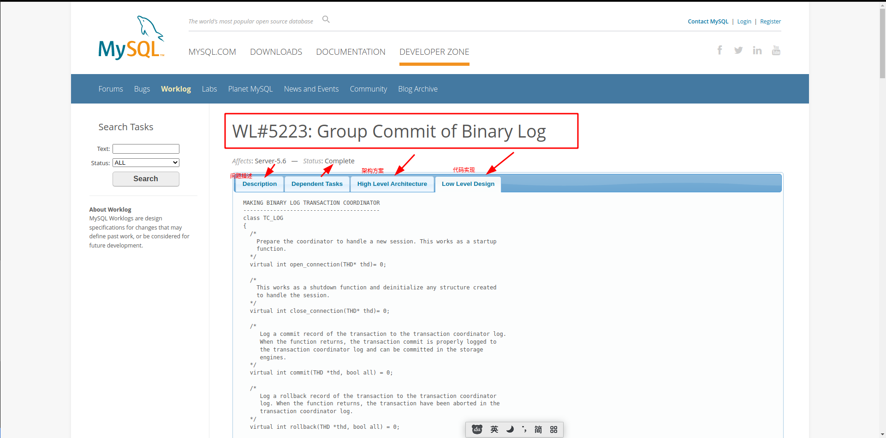

# Group Commit
&nbsp;&nbsp;从之前可以得知，若事务是非只读事务，则每次事务提交时需要进行一次fsync操作，以此保证重做日志都已经写入到磁盘了。当数据库发生宕机时，可以通过重做日志进行恢复。然而磁盘的fsync的性能是有限的，为了提高磁盘的fsync的效率，当前数据库都提供了group commit 的功能，即一次fsync可以确保多个事务日志被写入文件。

&nbsp;&nbsp;对于InnoDB存储引擎来说，事务提交时会进行两个阶段的操作：
1. 修改内存中事务对应的信息，并将日志写入到重做日志缓存。
2. 调用fsync将确保日志都从重做日志缓存写入磁盘。
 - 步骤2相对于步骤1是一个较慢的一个过程，这是因为存储引擎需要和磁盘打交道。但当所有的事务进行这个过程的时候，其他事务可以进行步骤1的操作，正在提交的事务完成提交操作后，再进行步骤2时，可以将多个事务的重做日志通过一次fsync刷新到磁盘，这样就大大减少了磁盘的压力，从而提高了数据库的整体性能。


## InnoDB1.2前，group commit功能失效
&nbsp;&nbsp;在InnoDB1.2之前，在开启二进制日志之后，InnoDB存储引擎的goup commit功能会失效，从而导致性能的下降。导致这个问题的原因：**在开启二进制日志之后，为了保证存储引擎层的事务和二进制日志的一致性，二者之前使用了两阶段事务**，如下:
1. 当事务提交时InnoDB存储引擎进行prepare操作
2. MySQL数据库上层写入二进制日志
3. InnoDB存储引擎将日志写入到重做日志文件
   -  修改内存中的事务对应的信息，将事务日志写入到重做日志缓存。
   -  调用fsync，将重做日志从重做日志缓存中写入到磁盘。
一旦步骤2完成，就确保事务的提交，即使在执行步骤3时数据库发生了宕机，此外需要注意的是，每个步骤都需要进行一次fsync操作才能确保上下两层数据的一致性。步骤2的fsync由sync_binlog参数控制，步骤3的fsync由参数innodb_flush_log_at_trx_commit控制，因此，上述过程如下图: 
   - 

&nbsp;&nbsp;为了保证MySQL数据库上层二进制日志的写入顺序和InnoDB层的事务提交顺序一致，MySQL数据库内部使用了prepare_commit_mutex这个锁。但是启用了这个锁之后，步骤3的第一步不可以在其他事务执行步骤三的第二步时执行，这就导致了group commit 的失效.

### 那么,为什么保证MySQL数据库上层日志的写入顺序和InnoDB层的事务提交顺序一致呢?
&nbsp;&nbsp;这是因为备份以及恢复的需要，如通过工具xtrabackup或者ibbackup进行备份，并用来建立replication

&nbsp;&nbsp;如果通过在线备份进行数据库恢复来重建replication，事务T1的数据会产生丢失。因为在InnoDB存储引擎会检测事务T3在上下两层都完成了提交，不需要再进行恢复，如下图:
- 

&nbsp;&nbsp;因此通过锁prepare_commit_mutex以串行的方式保证顺序，然而这会使得group commit 失效,如下图:
- 

## BLGC(Binary Log Group Commit),Group Commit的解决方案
&nbsp;&nbsp;MySQL5.6 BLGC的实现方式是将事务提交的过程分为几个步骤来完成，如图: 
- 

&nbsp;&nbsp;MySQL数据库上层进行提交时首先按顺序将其放入到一个队列中，队列中的第一个事务称为leader，其他事务称为follower,leader控制着follower的行为，BLGC分为三个阶段:
1. Flush 阶段，将每个事务的二进制日志写入到内存中
2. Sync 阶段，将内存中的二进制日志刷新到磁盘，若队列中有多个事务，那么仅一次fsync操作就完成了二进制日志的写入，这就是GLGC
3. Commit阶段，leader 根据顺序调用存储引擎事务的提交，InnoDB存储引擎本就支持group commit,因此修复了原先由于prepare_commit_mutex锁导致group commit 失效的问题。

&nbsp;&nbsp;每个阶段都有 leader、follower 两种角色。当一个事务进入三个阶段中的某一个阶段，如果发现这个阶段中的队列为空，那么这个事务就会成为 leader 的角色，之后进入同一阶段的事务，发现这个阶段的队列中已经有事务存在了，那就变成 follower 角色。leader 角色的任务是安排当前阶段队列中的事务按顺序执行，并且带领队列中所有的事务进入下一个阶段。当 leader 带领队列中的事务进入下一阶段的时候，如果发现下一阶段中已经有事务存在（即下一阶段已有 leader 存在），新来的 leader 自动变成 follower 角色

&nbsp;&nbsp;三阶段提交在每个阶段都控制了事务的顺序，从而也就控制了事务执行的整体顺序。解决了 prepare_commit_mutex 锁导致的问题，事务可以并发的执行。

&nbsp;&nbsp;group commit 的效果是由队列中的事务的数量决定的，当期交的事务越多，group commit的效果越明显，数据库的性能提升的也就越大。


---
## 附录
### 1. prepare_commit_mutex
- [https://dev.mysql.com/worklog/task/?id=5223](https://dev.mysql.com/worklog/task/?id=5223) # 注意这里说明的MySQL版本: Server-5.6
    ```txt
        PROBLEM (DETAILS)
        -----------------
        See in what follows what happens when one wants to commit a transaction and the
        binary log is enabled. This description is based on Harrison's analysis of the
        performance problems associated with the current implementation and uses Innodb
        as the storage engine because it is the only truly transactional engine kept by
        MySQL:

        1. Prepare Innodb:

           a) Write prepare record to Innodb's log buffer
           b) Sync log file to disk
           c) Take prepare_commit_mutex  # 获取锁

        2. "Prepare" binary log:

           a) Write transaction to binary log
           b) Sync binary log based on sync_binlog

        3. Commit Innodb:

           a) Write commit record to log
           b) Release prepare_commit_mutex
           c) Sync log file to disk
           d) Innodb locks are released  # 释放锁

        4. "Commit" binary log:

           a) Nothing necessary to do here.
    ```

### 2. XtraBackup备份原理
&nbsp;&nbsp;直接拷贝数据库文件，并且记录下当前二进制日志中已经提交的最后一个事务标记。在新的数据库实例上完成 recovery 操作。
&nbsp;&nbsp;了解完备份原理之后，我们就可以想到上述情况下做热备会出现什么情况。因为 T2、T3 已经提交，所以备份的时候会记录下 T3 是最后一个提交的事务，会认为 T3 之前的事务都是已经提交的，由于是直接拷贝数据库文件，可以看到 T1 事务的数据还没有提交到存储引擎层，所以备份数据中还并没有 T1 的数据。如果新的数据库是用来做主从复制的话，change master to 会指向二进制日志中 T3 的位置，从 T3 事务开始往后进行复制，这样一来 T1 事务的数据就这样没了。产生这个问题的主要原因就是：事务写入二进制日志的顺序与事务在存储引擎层提交的顺序不一致。

&nbsp;&nbsp;为了解决这个问题，MySQL 引入了 prepare_commit_mutext 的机制，当事务提交的时候，需要先获得 
prepare_commit_mutext 这个锁。有了这个锁就可以保证事务写入二进制日志的顺序与事务在存储引擎层提交的顺序一致。

&nbsp;&nbsp;但是这样一来，从图中我们也可以看到，原先是并发的事务，又变成了串行的，效率又变低了。只要是问题，必然存在解决方法。于是三阶段提交就出现了。

---
### 3. BLGC 源码
- 方法: MYSQL_BIN_LOG::commit > MYSQL_BIN_LOG::ordered_commit
  - 001.SOURCE_CODE/mysql-server-5.7/sql/tc_log.h
  - 001.SOURCE_CODE/mysql-server-5.7/sql/binlog.cc
- 
- 链接:[https://dev.mysql.com/worklog/task/?id=5223](https://dev.mysql.com/worklog/task/?id=5223)
---
## 参考资料
1. 《MySQL技术内幕InnoDB存储引擎·第2版》
2. [MySQL基础之BLGC](https://win-man.github.io/2016/12/07/win_man_20161224_mysql_binary_log_group_commit/)