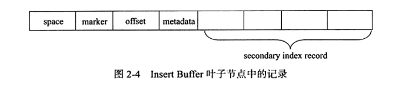

# Change Buffer(插入缓存)
## 目录
- [Change Buffer(插入缓存)](#change-buffer插入缓存)
  - [目录](#目录)
  - [简要](#简要)
  - [Insert / Change Buffer](#insert--change-buffer)
    - [Insert Buffer 在什么时候会有新数据加入](#insert-buffer-在什么时候会有新数据加入)
    - [Insert Buffer使用条件](#insert-buffer使用条件)
  - [Change Buffer](#change-buffer)
  - [Insert Buffer 内部实现](#insert-buffer-内部实现)
    - [Insert Buffer Bitmap](#insert-buffer-bitmap)
  - [Merge Insert Buffer](#merge-insert-buffer)
  - [系统信息查看](#系统信息查看)
      - [1. 插入缓存信息查看**再次强调一下 Insert Buffer 和 Change Buffer是同一个东西，后者是前者的升级版**](#1-插入缓存信息查看再次强调一下-insert-buffer-和-change-buffer是同一个东西后者是前者的升级版)
    - [Change Buffer 最大能使用多大内存?](#change-buffer-最大能使用多大内存)
  - [附录](#附录)
    - [1. InnoDB 架构](#1-innodb-架构)
    - [2. 官方文档翻译(已转pdf:003.MySQL事务/006.InnoDB事务日志/en-docs/MySQL \_\_ MySQL\_5.7\_Reference\_Manual \_ 14.5.2\_Change\_Buffer.pdf)](#2-官方文档翻译已转pdf003mysql事务006innodb事务日志en-docsmysql-__-mysql_57_reference_manual-_-1452_change_bufferpdf)
    - [Configuring Change Buffering](#configuring-change-buffering)
    - [高频问题: A.16 MySQL 5.7 FAQ: InnoDB Change Buffer(A.16 MySQL 5.7 FAQ: InnoDB Change Buffer(en-docs/MySQL \_\_ MySQL5.7\_ReferenceManual \_\_ A.16MySQL\_5.7\_FAQ\_InnoDB\_Change\_Buffer.pdf)](#高频问题-a16-mysql-57-faq-innodb-change-buffera16-mysql-57-faq-innodb-change-bufferen-docsmysql-__-mysql57_referencemanual-__-a16mysql_57_faq_innodb_change_bufferpdf)
      - [A.16.7.When is the change buffer flushed?](#a167when-is-the-change-buffer-flushed)
  - [参考资料](#参考资料)
  
---
## 简要
&nbsp;&nbsp;Change Buffer 是一种特殊的数据结构，用于缓存那些不在buffer pool中的辅助索引页的修改<sup><font color="gray">什么时候缓存，缓存什么内容</font></sup>，存在的目的是降低磁盘的I/O以及随机I/O（即降低磁盘的写入次数以及避免离散写入磁盘）,提升数据库性能。
- 辅助索引页的数据不那么急着刷入磁盘，与辅助索引页<sup>**Buffer Pool**</sup>合并之后再刷入磁盘<sup>**通过脏页刷盘机制：A.16.7.When is the change buffer flushed?**</sup>
   + 什么时候合并? "merged later when the pages are loaded into the buffer pool by other read operations",即当加载数据页时合并
   + 什么时候刷入磁盘? **都是先合并，再刷盘**。[见: Merge Insert Buffer](#merge-insert-buffer)
      1. 由[Master Thread](../../013.存储引擎内核/000.InnoDB/000.InnoDB架构.md) 线程刷入到磁盘:
      2. 用户线程读取索引页，Insert Buffer数据会合并到辅助索引数据页，之后会将脏页刷入磁盘。
      3. 辅助索引页空间不足，强制刷盘
- 适用对象: 非唯一的辅助索引<sup>因为非唯一索引不要校验数据重复</sup>
- Change Buffer Merge 的 合并对象
   + 即 Insert Buffer 对象 和 **缓冲池中辅助索引页** 进行合并，合并之后再将辅助索引页刷新到磁盘中<sup>**通过脏页刷盘机制：A.16.7.When is the change buffer flushed?**</sup>
     - Insert Buffer 和 数据页一样，也是物理页的一个组成部分。

Figure(用图画描绘) 14.3 Change Buffer
>   
 + periodic : 阶段性的
 + purge : 清除；排除；

---

## Insert / Change Buffer
```SQL
   CREATE TABLE t(
       a INT AUTO_INCREMENT,
       b VARCHAR(30),
       PRIMARY KEY(a),
       KEY(b)
   );
```

+ a列是自增长的，若对a列插入NULL值，则由于其具有AUTO_INCREMENT属性，其值会自动增长，同时页中的记录按照顺序存放。在一般情况下，不需要随机读取另一个页中的记录，因此，对于这类情况的插入操作，速度是非常快的。
+ b列是非聚集的且不唯一的索引，在进行插入操作时，数据的存放还是按主键a进行存放的，但是对于非聚集索引(即辅助索引)的叶子节点的插入不再是顺序的了，这时候需要离散的访问非聚集索引页，由于随机读取的存在导致了插入操作性能的下降。

### Insert Buffer 在什么时候会有新数据加入
&nbsp;&nbsp;InnoDB 存储引擎中，对于非聚集索引的插入或者更新操作，不是每一次都直接插入到索引页中，而是先判断插入的非聚集索引页是否在缓冲池中：
- 在：则直接插入: 即直接插入到索引页中，后续直接刷入到磁盘中。
- 不在：则先放入到一个Insert Buffer对象中,认为这个非聚集的索引已经插入到叶子节点上，而实际上并没有，只是存放在另一个位置。 最后再以一定的频率和情况<sup><font color="gray">一定的频率和情况，即Master Thread 的处理逻辑了，合并插入缓存的处理是由Master Thread处理的</font></sup>进行Insert Buffer和辅助索引页子节点的Merge(合并)操作<sup><font color="gray">将Insert Buffer对象和辅助索引页子节点进行合并，再刷新到磁盘中</font></sup>，这时候能将多个<sup><font color="gray">不仅是避免离散写入，也降低了I/O次数</font></sup>插入合并到一个操作中(因为在一个索引页中)，这就大大提高了对于非聚集索引的插入性能。

### Insert Buffer使用条件
&nbsp;&nbsp;Insert Buffer 的使用需要同时满足以下两个条件:
1. 索引是辅助索引(secondary index)
2. 索引不是唯一的（那么，唯一索引有什么区别呢? 因为唯一索引需要校验数据唯一性）
   
&nbsp;&nbsp;满足以上两个条件，InnoDB会使用Insert Buffer,这样就能提高插入操作的性能了。

---

## Change Buffer
&nbsp;&nbsp;Change Buffer 是Insert Buffer的一个升级版，Change Buffer 可以对DML操作-INSERT、DELETE、UPDATE操作都进行缓冲，他们分别是 Insert Buffer , Delete Buffer , Purge Buffer.

&nbsp;&nbsp;同Insert Buffer, Change Buffer 适用的对象依旧是非唯一的辅助索引。

&nbsp;&nbsp;对一条记录进行UPDATE 操作可能分为两个过程：
1. 将记录标记为已删除
   > ***Delete Buffer 对应UPDATE 的第一个过程，即将记录标记为已删除***
2. 真正将记录删除
   > ***Purge Buffer 对应UPDATE操作的第二个过程，即将记录真正地删除。***

---

## Insert Buffer 内部实现
&nbsp;&nbsp;Insert Buffer的数据结构： B+树。且全局只有一棵Insert Buffer B+树，负责对所有的表的辅助索引进行Insert Buffer。

&nbsp;&nbsp;Insert Buffer B+树存放在共享表空间中，默认也就是在ibdata1中。因此，试图通过独立表空间ibd文件恢复表中数据时，往往会导致[CHECK TABLE](https://dev.mysql.com/doc/refman/5.7/en/check-table.html)失败（因为表的辅助索引中的数据可能还在Insert Buffer中，也就是在共享表空间中，所以通过ibd文件进行恢复后，还需要进行REPAIR TABLE操作来重建表上所有的辅助索引）
> CHECK TABLE ？ REPAIR TABLE？

&nbsp;&nbsp;Insert Buffer是一棵B+树，因为也由叶子节点和非叶子节点组成。非叶子节点存放的是查询的search key,如下图: 
   - 
   - + search key 共占用9个字节：
   - + - space 表示待插入记录所在表的表空间id,在InnoDB中，每个表有一个唯一的space id,可以通过space id查询得知是哪张表，占4字节。
   - + - marker 占用一个字节，用来兼容老版本的Insert Buffer
   - + - offset 表示页所在的偏移量，占4字节。

&nbsp;&nbsp;当一个辅助索引要插入到页时，如果这个页不在缓冲区中，那么InnoDB首先根据上述规则构造一个search key ,接下来查询Insert Buffer这棵B+树，然后再将这条记录插入到Insert Buffer B+树的叶子节点中。

&nbsp;&nbsp;Insert Buffer 叶子节点中的记录
- 
- + space 、 marker 、 page_no 字段和非叶子节点中的含义相同，共占用9字节。为什么要重复记录呢?
- + metadata 字段占用四个字节，如下:
- + ```txt
       metadata字段存储内容
       +---------名称-----------+--字节--+---------------功能---------------------------------_------|
       | IBUF_REC_OFFSET_COUNT | 2 |排序每个记录进入Insert Buffer的顺序。通过这个顺序回放才能得到记录的正确值|
       | IBUF_REC_OFFSET_TYPE  | 1 |                                                               | 
       | IBUF_REC_OFFSET_FLAGS | 1 |                                                               |
       + ----------------------+---+---------------------------------------------------------------+
    ```
- + 从Insert Buffer叶子节点的第5列开始，就是实际插入记录的各个字段了。

### Insert Buffer Bitmap
&nbsp;&nbsp;在启用Insert Buffer 索引后，辅助索引页(space,page_no)中的记录可能被插入到Insert Buffer B+树中，所以为了保证每次Merge Insert Buffer页必须成功，还需要有一个特殊的页用来标记每个辅助索引页(space,page_no)的可用空间——Insert Buffer Bitmap

&nbsp;&nbsp;每个Insert Buffer 页用来追踪16384个辅助索引页，也就是256个区(Extent),每个Insert Buffer Bitmap 页都在16384的第二个页中。

&nbsp;&nbsp;每个辅助索引页在Insert Buffer Bitmap中占用4位，如下:

|名称| 大小(bit)|说明|
|---|---|---|
|IBUF_BITMAP_FREE|2|表示辅助索引页中的可用空间数量，可取值:<br/>&nbsp;&nbsp;0：表示无可用空间.<br/>&nbsp;&nbsp;1：剩余空间大于1/32页.<br/>&nbsp;&nbsp;2：剩余空间大于1/16页.<br/>&nbsp;&nbsp;3：剩余空间大于1/8页|
|IBUF_BITMAP_BUFFERED|1|1 表示该辅助索引页有记录被缓存在Insert Buffer B+树中|
|IBUF_BITMAP_IBUF|1|1 表示该页为Insert Buffer B+树的索引页|

---

## Merge Insert Buffer
&nbsp;&nbsp;Q：谁和谁合并呢？
+ 即 Insert Buffer 对象 和 **缓冲池中辅助索引的页**(非Insert Buffer) 进行合并，合并之后再将辅助索引页刷新到磁盘中。

&nbsp;&nbsp;若需要实现插入记录的辅助索引不在缓冲池中，则需要将辅助索引页记录首先插入到Insert Buffer B+树中。但Insert Buffer 中的记录何时合并到真正的索引页中呢?<sup><font color ="red">**所以，辅助索引的更新时先更新Insert Buffer,再从Insert Buffer(内存缓存)中刷新到磁盘**</font></sup>Merge Buffer的操作可能发生在以下几种情况<sup><font color ="#FF8C00">**相同点: 先合并，再刷入磁盘**</font></sup>:
1. 辅助索引页被读取到缓冲池
   > 当辅助索引页被读取到缓冲池中时，如执行正常的SELECT操作，这时需要检查Insert Buffer Bitmap页，然后确认该辅助索引页是否有记录存在Insert Buffer B+树中，有，则将Insert Buffer B+树中该页的记录插入到该辅助索引页<sup><font color ="red">**这里的辅助索引页是位于缓冲池(非Insert Buffer)中，再通过脏页刷入磁盘的机制,将更新后的数据刷入到磁盘中。**</font></sup>中。
   >> 如上描述，对该页多次的记录操作通过一次操作合并到原有的辅助索引页中，因此性能大幅度提升。
2. Insert Buffer Bitmap页追踪到辅助索引页已无可用空间时。
   > 若插入辅助索引页记录时检测到插入记录后可用空间小于1/32页，则会强制进行一个合并操作，即强制读取辅助索引页，将Insert Buffer B+树中该页的记录及待插入的记录插入到辅助索引页中。
3. Master Thread
   > Master Thread 线程会每秒或每10秒进行一次Merge Insert Buffer 的操作，不同之处在于每次进行merge操作的页的数量不一样。

   > Master Thread 中，由srv_innodb_io_capactiy的百分比来决定真正要合并多少个辅助索引页。

   > InnoDB 根据什么算法得知哪些辅助索引页需要合并呢?
   >> 在Insert Buffer B+树中，辅助索引页根据(space,offset)都已排序好，因此可以根据(space,offset)的排列顺序进行页的选择。但InnoDB采用的： 随机选择Insert Buffer B+树中的一个页，读取该页中的space及之后所需要数量的页。同时，若进行合并时，要进行merge的表已经被删除，此时可以直接丢弃已经被Insert/Change Buffer的数据记录<sup><font color ="red">**这也是show engine innodb status 中的*discarded operations*所展示的数据**</font></sup>

---

## 系统信息查看
#### 1. 插入缓存信息查看<sup>**再次强调一下 Insert Buffer 和 Change Buffer是同一个东西，后者是前者的升级版**</sup>
```txt
      // SHOW ENGINE INNODB STATUS;
      ........
      -------------------------------------
      INSERT BUFFER AND ADAPTIVE HASH INDEX
      -------------------------------------
      Ibuf: size 1, free list len 163443, seg size 163445, 207570192 merges
      merged operations:
       insert 298024080, delete mark 20579587, delete 1720942
      discarded operations:
       insert 0, delete mark 0, delete 0
      AHI PARTITION 1: Hash table size 3187567, node heap has 261 buffer(s)
      AHI PARTITION 2: Hash table size 3187567, node heap has 1270 buffer(s)
      AHI PARTITION 3: Hash table size 3187567, node heap has 1118 buffer(s)
      AHI PARTITION 4: Hash table size 3187567, node heap has 293 buffer(s)
      AHI PARTITION 5: Hash table size 3187567, node heap has 286 buffer(s)
      AHI PARTITION 6: Hash table size 3187567, node heap has 503 buffer(s)
      AHI PARTITION 7: Hash table size 3187567, node heap has 134 buffer(s)
      AHI PARTITION 8: Hash table size 3187567, node heap has 237 buffer(s)
      1034.77 hash searches/s, 4929.30 non-hash searches/s
       .......
      ----------------------------
      END OF INNODB MONITOR OUTPUT
      ============================

      ## 解析
      a. seg size 表示当前Insert Buffer 的大小为 163445 x 16(KB) = 2.493972778(GB)
      b. free list len 表示空闲列表的长度
      c. size 代表了已经合并记录页的数量，即正在使用的page
      d. merges 代表合并的次数，也就是实际读取页的次数。
      
      e. merged operations：表示每个change Buffer操作的次数
          > insert：表示Insert Buffer
          > delete mark: 表示Delete Buffer
          > delete: 表示 Purge Buffer

      f. discarded operations：表示当Change Buffer进行merge时，表已经被删除，此时无需将记录合并到辅助索引中了。(2:P50)

      g. 性能提升： change buffer的效果 = merges / (insert+delete mark+delete)（merged operations）结果越小说明change buffer对性能提升越有利
     　　> 207570192÷(298024080+20579587+1720942) = 0.647999517 约2:3 , 则说明插入缓冲将对于非聚集索引页的离散逻辑请求大约降低了1/3.
```

### Change Buffer 最大能使用多大内存?
```txt
   mysql> show variables like 'innodb_change_buffer_max_size'\G
   *************************** 1. row ***************************
   Variable_name: innodb_change_buffer_max_size
           Value: 25
   1 row in set (0.01 sec)

   # innodb_change_buffer_max_size 默认值为25,即25%,表示最多使用1/4的缓冲区内存空间
     > 该参数最大有效值为 50
```

---
## 附录
### 1. [InnoDB 架构](https://dev.mysql.com/doc/refman/8.0/en/innodb-architecture.html)
- 
- + **AHI（Adaptive Hash Index,自适应哈希索引）**:InnoDB存储引擎会监控表上各索引页的查询，如果观察到建立哈希索引可以带来速度提升，则建立哈希索引，即自适应哈希索引。AHI是通过缓冲池的B+树页构建而来，因此建立的速度很快，且不需要对整张表构建哈希索引。
- + [Change Buffer](https://dev.mysql.com/doc/refman/8.0/en/innodb-change-buffer.html)
- + - Buffer Pool中的一部分，一种特殊的数据结构，主要是对那些不在Buffer Pool中的二级索引数据页进行缓存，减少对磁盘的随机IO。
- + - 当二级索引页被加载到内存时，则将数据进行合并，再将修改后的数据写入到磁盘中
      > 刷入磁盘是由Master Thread执行的.

---
### 2. [官方文档翻译(已转pdf:003.MySQL事务/006.InnoDB事务日志/en-docs/MySQL __ MySQL_5.7_Reference_Manual _ 14.5.2_Change_Buffer.pdf)](https://dev.mysql.com/doc/refman/5.7/en/innodb-change-buffer.html)
&nbsp;&nbsp;The change buffer is a special data structure that caches changes to secondary index pages when those pages are not in the buffer pool. The buffered changes, which may result from INSERT, UPDATE, or DELETE operations (DML), are merged later when the pages are loaded into the buffer pool by other read operations.
> Change Buffer 是一种特殊的数据结构，用于缓存那些不在buffer pool中的辅助索引页的修改。这些缓存，是INSERT, UPDATE, 或 DELETE 这些DML操作的结果。这些缓存会在辅助索引页被其他读操作触发从而被加载到buffer pool中时被合并到辅助索引页。

Figure 14.3 Change Buffer
>   

&nbsp;&nbsp;Unlike clustered indexes, secondary indexes are usually nonunique, and inserts into secondary indexes happen in a relatively(adv. 相当地，相对地) random order. Similarly(adv.相似地；同样，也), deletes and updates may affect secondary index pages that are not adjacently(邻近地) located(adj.位于，坐落在;v.确定……的位置，探明；设立，建立；迁居) in an index tree. Merging cached changes at a later time, when affected pages are read into the buffer pool by other operations, avoids substantial(adj.大量的，价值巨大的；牢固的，结实的；基本的，实质性的;) random access I/O that would be required to read secondary index pages into the buffer pool from disk.
> 不同于聚集索引，二级索引通常是非唯一的，且插入数据到二级索引的顺序是相对随机的。同样，删除和更新也会影响位于同一索引中不相邻的二级索引页。合并缓存发生在被影响的页被其他读操作触发而加载到Buffer Pool中的时候，避免了从磁盘读取二级索引页到Buffer Pool所需要的大量的随机I/O

&nbsp;&nbsp;Periodically(adv.定期地，周期性地；偶尔，间歇), the purge operation that runs when the system is mostly(adv.adv.多半，主要地；几乎全部，几乎所有) idle, or during a slow shutdown, writes the updated index pages to disk. The purge operation can write disk blocks for a series of index values more efficiently than if each value were written to disk immediately.
> 定期的，清理操作会在系统空闲或缓慢关闭的情况下将被更新的索引页写入磁盘。与立即将每个值写入磁盘相比，清除操作可以更有效地为一系列索引值写入磁盘块

&nbsp;&nbsp;Change buffer merging may take several hours when there are many affected rows and numerous(adj.众多的，许多的) secondary indexes to update. During this time, disk I/O is increased, which can cause a significant(adj.显著的，相当数量的；重要的，意义重大的； 别有含义的，意味深长的) slowdown(n.减速；怠工；降低速度) for disk-bound(磁盘受限) queries. Change buffer merging may also continue to occur after a transaction is committed, and even after a server shutdown and restart (see Section 14.22.2, “Forcing InnoDB Recovery” for more information).

&nbsp;&nbsp;In memory, the change buffer occupies(占用) part of the buffer pool. On disk, the change buffer is part of the system tablespace, where index changes are buffered when the database server is shut down.
> 在内存中，更改缓冲区占用了缓冲池的一部分。在磁盘上，更改缓冲区是系统表空间的一部分，当数据库服务器关闭时，索引更改将被缓冲到其中。

&nbsp;&nbsp;The type of data cached in the change buffer is governed(v.
管理（govern 的过去式和过去分词）；统治；支配) by the innodb_change_buffering variable. For more information, see Configuring Change Buffering. You can also configure the maximum change buffer size. For more information, see Configuring the Change Buffer Maximum Size.

&nbsp;&nbsp;Change buffering is not supported for a secondary index if the index contains a descending index column or if the primary key includes a descending index column.
> descending index： 降序索引.(索引包含降序列，则Change Buffer不支持)

&nbsp;&nbsp;For answers to frequently asked questions about the change buffer, see Section A.16, “MySQL 5.7 FAQ: InnoDB Change Buffer”.

### Configuring Change Buffering
&nbsp;&nbsp;When INSERT, UPDATE, and DELETE operations are performed on a table, the values of indexed columns (particularly the values of secondary keys) are often in an unsorted order, requiring substantial I/O to bring secondary indexes up to date. The change buffer caches changes to secondary index entries when the relevant(adj.有关的，切题的；正确的，适宜的；有价值的，有意义的) page is not in the buffer pool, thus avoiding expensive I/O operations by not immediately reading in the page from disk. The buffered changes are merged when the page is loaded into the buffer pool, and the updated page is later flushed to disk. The InnoDB main thread merges buffered changes when the server is nearly(adv.几乎，差不多；密切地，亲密地；即将，就要) idle, and during a slow shutdown.
> 当在表上执行INSERT、UPDATE和DELETE操作时，索引列的值(尤其是辅助键的值)通常是无序的，需要大量的I/O来更新辅助索引。当相关的索引页不在Buffer Pool中时，Change Buffer缓存辅助索引条目从而不立即从磁盘读取页来避免昂贵的I/O操作。当页被加载到Buffer Pool中时，缓存的修改被合并且这些修改随后被刷新到磁盘中。InnoDB主线程在服务器空闲或者慢关闭期间合并。

&nbsp;&nbsp;Because it can result in fewer(adj.较少的) disk reads and writes, change buffering is most valuable(adj.值钱的，贵重的；有益的，宝贵的；重要的，珍贵的；可估价的) for workloads(n.工作量，工作负荷) that are I/O-bound; for example, applications with a high volume of DML operations such as bulk inserts benefit from change buffering.
> 因为能够使用较少的磁盘读和写来获取结果，change buffer对I/O受限的工作负载更有益。例如批量插入这类具有大量DML操作的应用程序可以从change buffer受益

&nbsp;&nbsp;However, the change buffer occupies a part of the buffer pool, reducing the memory available to cache data pages. If the working set almost fits in the buffer pool, or if your tables have relatively few secondary indexes, it may be useful to disable change buffering. If the working data set fits entirely within the buffer pool, change buffering does not impose extra overhead, because it only applies to pages that are not in the buffer pool.
> 然而，change buffer 占用一部分buffer pool,减少了可用于缓存数据页的内存。如果工作集几乎适合缓冲池，或者你的表有相对较少的二级索引，禁止change buffer或许更有用。如果工作数据集完全适合缓冲池，则change buffer不会带来额外的开销，因为它只适用于不在缓冲池中的页面

&nbsp;&nbsp;The innodb_change_buffering variable controls the extent to which InnoDB performs change buffering. You can enable or disable buffering for inserts, delete operations (when index records are initially marked for deletion) and purge operations (when index records are physically deleted). An update operation is a combination of an insert and a delete. The default innodb_change_buffering value is all.

&nbsp;&nbsp;Permitted innodb_change_buffering values include:
- all: The default value: buffer inserts, delete-marking operations, and purges.
- none: Do not buffer any operations.
- inserts: Buffer insert operations.
- deletes: Buffer delete-marking operations.
- changes: Buffer both inserts and delete-marking operations.
- purges: Buffer physical deletion operations that happen in the background.

&nbsp;&nbsp;You can set the innodb_change_buffering variable in the MySQL option file (my.cnf or my.ini) or change it dynamically with the SET GLOBAL statement, which requires privileges sufficient to set global system variables. See Section 5.1.8.1, “System Variable Privileges”. Changing the setting affects the buffering of new operations; the merging of existing buffered entries is not affected.

---
### 高频问题: [A.16 MySQL 5.7 FAQ: InnoDB Change Buffer(A.16 MySQL 5.7 FAQ: InnoDB Change Buffer(en-docs/MySQL __ MySQL5.7_ReferenceManual __ A.16MySQL_5.7_FAQ_InnoDB_Change_Buffer.pdf)](https://dev.mysql.com/doc/refman/5.7/en/faqs-innodb-change-buffer.html#faq-innodb-change-buffer-operations)
&nbsp;&nbsp;暂时只记录一个，这个问题说明了Insert Buffer 和 Buffer pool的关系

#### A.16.7.When is the change buffer flushed?
&nbsp;&nbsp;Q: Updated pages are flushed by the same flushing mechanism that flushes the other pages that occupy the buffer pool.
> 被更新的页像buffer pool中的其他页一样通过相同的刷新机制刷新。
>> 结合前文，即 Insert Buffer中缓存的数据被合并到Buffer Pool中缓存的辅助索引页中，此时辅助索引页就变为了脏页，再通过脏页的刷新机制刷新回磁盘。


--- 
## 参考资料
1. [14.5.2 Change Buffer(en-docs/MySQL __ MySQL_5.7_Reference_Manual _ 14.5.2_Change_Buffer.pdf)](https://dev.mysql.com/doc/refman/5.7/en/innodb-change-buffer.html) (中文版: [013.存储引擎内核/000.InnoDB/015.InnoDB In-Memory Structures/002. Change Buffer.md](../../013.存储引擎内核/000.InnoDB/015.InnoDB%20In-Memory%20Structures/002.%20Change%20Buffer.md))
2. MySQL技术内幕 InnoDB存储引擎 第二版》
3. **Change Buffer高频问题**(来自官方文档): [A.16 MySQL 5.7 FAQ: InnoDB Change Buffer(en-docs/MySQL __ MySQL5.7_ReferenceManual __ A.16MySQL_5.7_FAQ_InnoDB_Change_Buffer.pdf)](https://dev.mysql.com/doc/refman/5.7/en/faqs-innodb-change-buffer.html)