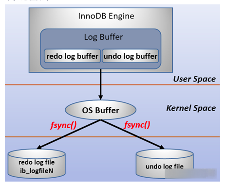

# MySQL中的事务
&nbsp;&nbsp;事务的隔离性是由锁来实现的，原子性、一致性、持久性通过数据库的redo log和undo log来完成。

## 日志简介
&nbsp;&nbsp;InnoDB是事务的存储引擎，其通过Force Log at Commit机制实现事务的持久性，即当事务提交（COMMIT）时，必须先将该事务的所有日志写入到重做日志文件进行持久化，待事务的COMMIT操作完成才算完成。这里的日志是指重做日志，在InnoDB存储引擎中，由两部分构成：
> redo log 
  >> redo log 用于保证事务的持久性和原子性

>  undo log
  >> undo log用来帮助事务回滚以及MVCC功能，即保证事务的一致性。

&nbsp;&nbsp;redo log*基本*是顺序写的，在数据库运行时不需要对redo log的文件进行读取操作。而undo log 是需要进行随机读取的。

### 日志写入
&nbsp;&nbsp;为了确保每次日志都写入重做日志文件，在每次将重做日志缓冲写入重做日志文件时，InnoDB存储引擎都需要调用一次fsync操作。如下图：
  - 

&nbsp;&nbsp;由于重做日志文件没有打开O_DIRECT选项，因此重做日志缓存先写入文件系统缓存。为了确保重做日志写入磁盘，必须进行一次fsync操作。**由于fsync的效率取决于磁盘的性能，因此磁盘的性能决定了事务提交的性能，也就是数据库的性能**

&nbsp;&nbsp;InnoDB允许用户手动设置非持久性的情况发生，以此提高数据库的性能。即当事务提交的时候，日志不写入重做日志文件，而是等待一个时间周期后再执行fsync操作。由于并非强制在事务提交时进行一次fsync操作，显然这可以提升数据库的性能。但是当数据库发生宕机的时候，由于部分日志没有刷新到磁盘上，因此会丢失最后一段时间的事务。

&nbsp;&nbsp;参数: innodb_flush_log_at_trx_commit来控制重做日志刷新到磁盘的策略。

|参数值|策略介绍|是否事务安全|
|---|---|---|
|0|事务提交时不进行写入重做日志操作，这个操作尽在master thread中完成，而在master thread中每一秒会进行一次重做日志的fsync操作。|丧失ACID特性|
|1(默认)|表示事务提交时必须调用一次fsync操作||
|2|事务提交时将重做日志写入重做日志文件，但仅仅写入系统的缓存中，不进行fsync操作。在这个设置下，当MySQL宕机而操作系统没有宕机时并不会导致事务的丢失。但是当操作系统宕机时，重启数据库会丢失未从文件系统缓存刷新到重做日志文件那部分的事务。|丧失ACID特性|

---
### 日志的purge操作
&nbsp;&nbsp;purge用于最终完成delete和update操作，这样设计是因为InnoDB存储引擎支持MVCC，所以记录不能在事务提交时立即进行处理。这时其他事务可能正在引用这行，故InnoDB需要保存记录之前的版本。而是否可以删除该条记录通过purge来进行判断。若该行记录已不被任何其他事务引用，那么就可以进行真正的delete操作。因此，purge操作是清理之前的delete和update操作，将上述操作最终完成。而实际执行的操作为delete，清理之前行记录的版本。
> 当该行记录已经不被任何其他事务所引用，那么该行记录就可以进行真正的delete操作。

---
## 注意事项
### 1. 什么才算事务完成
&nbsp;&nbsp; 需要将事务的所有日志写入到重做日志文件从上文可以看出，这里的重做日志文件包括: redo log ， undo log)中，再COMMIT，事务才算完成

### 2. 日志写入对性能的影响
&nbsp;&nbsp;InnoDB在写入日志的时候，会受到磁盘性能的影响，从而影响数据的性能。

---
## 收获
1. 使用存储过程时，应当尽量将更新操作放到一个事务中去，不然会存在许多次fsync操作，影响执行效率。还有就是能够在事务回滚时能回滚到最开始确定的状态。
2. 数据采用的硬盘决定着数据库的性能。
---
## 参考资料
1. 《MySQL技术内幕 InnoDB存储引擎 第二版》