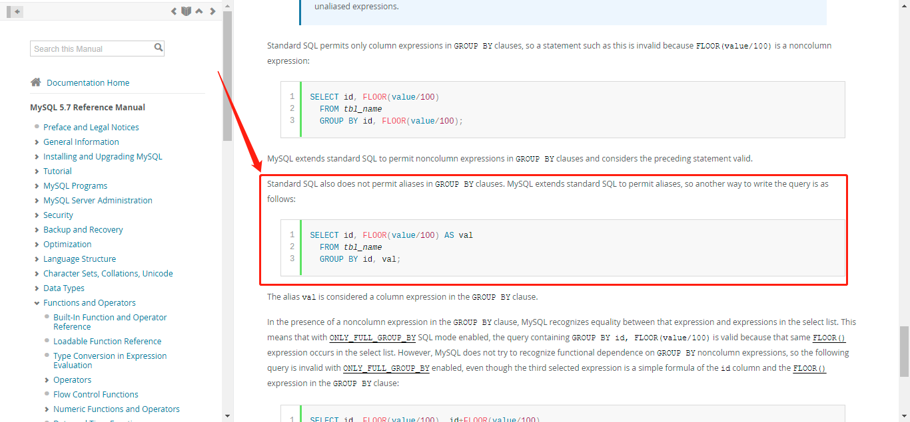

# MySQL执行顺序
+ 
```txt
(8) SELECT (9)DISTINCT <select_list>
(1) FROM <left_table>
(3) <join_type> JOIN <right_table>
(2)  ON <join_condition>
(4) WHERE <where_condition>
(5) GROUP BY <group_by_list>
(6) WITH {CUBE|ROLLUP}
(7) HAVING <having_condition>
(10) ORDER BY <order_by_list>
(11) LIMIT <limit_number>
```
## 01. MySQL执行顺序如下
### 1. FROM 
&nbsp;&nbsp;对FROM子句中的左表<left_table>和右表<right_table>执行笛卡尔积，产生虚拟表VT1.

### 2. ON连接
&nbsp;&nbsp;对虚拟表VT1 应用ON筛选，只有那些符合<join_condition>的**行**才被插入到虚拟表VT2中

### 3. JOIN连接
&nbsp;&nbsp;如果指定了OUTER JOIN保留表中未找到匹配的行将作为外部行添加到虚拟表 VT2，生成虚拟表 VT3。<**保留表**>如下：
   - LEFT OUTER JOIN把左表记为保留表
   - RIGHT OUTER JOIN把右表记为保留表
   - FULL OUTER JOIN把左右表都作为保留表
+ 在虚拟表 VT2表的基础上添加保留表中被过滤条件过滤掉的数据，非保留表中的数据被赋予NULL值，最后生成虚拟表 VT3（如果FROM子句包含两个以上的表，则对上一个连接生成的结果表VT3和下一个表重复执行步骤1~3，直到处理完所有的表为止）  

### 4. WHERE 过滤
&nbsp;&nbsp;对虚拟表 VT3应用WHERE过滤条件，只有符合<where_condition>的记录才被插入虚拟表VT4中。

### 5. GROUP BY 
&nbsp;&nbsp;根据GROUP BY 子句中的列，对VT4中的记录进行分组操作，产生VT5.
+ 那么VT5的数据形式是什么样子的呢?稍后介绍

###  6. CUBE|ROLLUP
&nbsp;&nbsp;对表VT5进行CUBE或ROLLUP操作，产生表VT6
   - CUBE 生成的结果数据集显示了所选列中值的所有组合的聚合
   - ROLLUP 生成的结果数据集显示了所选列中值的某一层次结构的聚合  
### 7. HAVING
&nbsp;&nbsp;对虚拟表VT6应用HAVING过滤，只有符合条件<having_condition>的记录才被插入虚拟表VT7中

### 8. SELECT
&nbsp;&nbsp;第二次执行SELECT操作，选择指定的列，插入到虚拟表VT8中
+ 第二次执行SELECT操作,什么意思?

### 9. DISTINCT
&nbsp;&nbsp;去除重复数据，产生虚拟表VT9

### 10. ORDER BY
&nbsp;&nbsp;将虚拟表VT9中的记录按照<order_by_list>进行排序操作，产生虚拟表VT10

### 11. LIMIT
&nbsp;&nbsp;取出指定行的记录，产生虚拟表VT11，并返回给查询用户。

--------------------------

## 02. 查询示例
### 02-1. 数据准备
+ 表customers
   ```sql
     CREATE TABLE `customers` (
       `customer_id` varchar(10) NOT NULL,
       `city` varchar(20) NOT NULL,
       PRIMARY KEY (`customer_id`)
      ) ENGINE=InnoDB DEFAULT CHARSET=latin1

      INSERT INTO `customers` VALUES ('163','HangZhou'),
                                     ('9you','ShangHai'),
                                     ('baidu','HangZhou'),
                                     ('TX','HangZhou');

      # 数据如下
         +-------------+----------+
         | customer_id | city     |
         +-------------+----------+
         | 163         | HangZhou |
         | 9you        | ShangHai |
         | baidu       | HangZhou |
         | TX          | HangZhou |
         +-------------+----------+                               
   ```

+ 表orders:
   ```sql
      CREATE TABLE `orders` (
         `order_id` int(11) NOT NULL AUTO_INCREMENT,
         `customer_id` varchar(10) DEFAULT NULL,
          PRIMARY KEY (`order_id`)
      ) ENGINE=InnoDB AUTO_INCREMENT=8 DEFAULT CHARSET=latin1;

      INSERT INTO `orders` VALUES 
      (1,'163'),
      (2,'163'),
      (3,'9you'),
      (4,'9you'),
      (5,'9you'),
      (6,'TX'),
      (7,NULL);

      # 数据如下
         +----------+-------------+
         | order_id | customer_id |
         +----------+-------------+
         |        1 | 163         |
         |        2 | 163         |
         |        3 | 9you        |
         |        4 | 9you        |
         |        5 | 9you        |
         |        6 | TX          |
         |        7 | NULL        |
         +----------+-------------+
   ```
## 02-2. 通过如下语句查询来自杭州且订单数量少于2的客户，并且查询他们的订单数量，查询结果按订单数量从小到大排序。(以下均是按照该SQL进行演示分析)
+ 查询SQL
   ```sql
   SELECT c.customer_id, COUNT(o.order_id) AS total_orders
   FROM customers AS c
   LEFT JOIN orders AS o
   ON c.customer_id = o.customer_id
   WHERE c.city = 'HangZhou'
   GROUP BY c.customer_id
   HAVING count(o.order_id) < 2
   ORDER BY total_orders DESC;

   # 执行结果如下
   +-------------+--------------+
   | customer_id | total_orders |
   +-------------+--------------+
   | TX          |            1 |
   | baidu       |            0 |
   +-------------+--------------+

   ```

## 02-3.执行步骤分析
### A. 第一步： 执行FROM操作，即执行笛卡尔积
&nbsp;&nbsp;第一步需要做的是对FROM子句前后的两张表进行笛卡尔积操作，也称作交叉连接，生成虚拟表VT1。如果FROM子句前的表包含a行数据，FROM子句后的表中包含b行数据，那么虚拟表VT1将包含a*b行数据。对于前面的SQL查询语句，会先执行表orders 和 customers的笛卡尔积操作：
  ```sql
    # 即语句 select * from customers,orders; 即可以获取customers表和orders表的笛卡尔积
      +-------------+----------+----------+-------------+
      | customer_id | city     | order_id | customer_id |
      +-------------+----------+----------+-------------+
      | 163         | HangZhou |        1 | 163         |
      | 9you        | ShangHai |        1 | 163         |
      | baidu       | HangZhou |        1 | 163         |
      | TX          | HangZhou |        1 | 163         |
      | 163         | HangZhou |        2 | 163         |
      | 9you        | ShangHai |        2 | 163         |
      | baidu       | HangZhou |        2 | 163         |
      | TX          | HangZhou |        2 | 163         |
      | 163         | HangZhou |        3 | 9you        |
      | 9you        | ShangHai |        3 | 9you        |
      | baidu       | HangZhou |        3 | 9you        |
      | TX          | HangZhou |        3 | 9you        |
      | 163         | HangZhou |        4 | 9you        |
      | 9you        | ShangHai |        4 | 9you        |
      | baidu       | HangZhou |        4 | 9you        |
      | TX          | HangZhou |        4 | 9you        |
      | 163         | HangZhou |        5 | 9you        |
      | 9you        | ShangHai |        5 | 9you        |
      | baidu       | HangZhou |        5 | 9you        |
      | TX          | HangZhou |        5 | 9you        |
      | 163         | HangZhou |        6 | TX          |
      | 9you        | ShangHai |        6 | TX          |
      | baidu       | HangZhou |        6 | TX          |
      | TX          | HangZhou |        6 | TX          |
      | 163         | HangZhou |        7 | NULL        |
      | 9you        | ShangHai |        7 | NULL        |
      | baidu       | HangZhou |        7 | NULL        |
      | TX          | HangZhou |        7 | NULL        |
      +-------------+----------+----------+-------------+
  ```

 ### B. 第二步： 应用ON过滤器
 &nbsp;&nbsp;SELECT查询共有3个过滤流程，分别是ON、WHERE、HAVING。ON是最先执行的过滤流程。根据上一小节产生的表VT1，过滤条件: ON c.customer_id = o.customer_id 

 &nbsp;&nbsp;在大多数的编程语言中，逻辑表达式的值只有两种：TRUE 和 FALSE。但是在关系数据库中起逻辑表达式作用的并非只有两种，还有一种称为三值逻辑的表达式。这是因为在数据库中对NULL值的比较与大多编程语言不同。在C语言中，NULL == NULL的比较返回的是1，即相等，而在关系型数据库中，NULL的比较就不一样了，如下：
   ```sql
      mysql> select 1 = NULL\G
      +----------+
      | 1 = NULL |
      +----------+
      |     NULL |
      +----------+

      #--------------------------

      mysql> select NULL = NULL;
      +-------------+
      | NULL = NULL |
      +-------------+
      |        NULL |
      +-------------+

      #-----------------

      mysql> select 2 = 2;
      +-------+
      | 2 = 2 |
      +-------+
      |     1 |
      +-------+

     #------------------------------

      mysql> select 1 = 2;
      +-------+
      | 1 = 2 |
      +-------+
      |     0 |
      +-------+

   ```
&nbsp;&nbsp;第一个NULL值的比较返回的是NULL而不是0，第二个NULL值的比较返回的仍然是NULL，而不是1.对于比较返回值为NULL的情况，用户应该将其视为UNKNOWN，即表示未知的。因为在某些情况下，NULL返回值可能表示1，即NULL等于NULL，而有时候NULL返回值可能代表0.

&nbsp;&nbsp; 对于在ON过滤条件下的NULL值比较，此时的比较结果为UNKNOWN，却被视为FALSE来处理，即两个NULL并不相同。但是在下面两种情况认为两个NULL值的比较是相等的(示例如附录01)：
1. GROUP BY 子句把所有的NULL值都分到一组
2. ORDER BY 子句中将所有NULL值排列在一起

&nbsp;&nbsp;因此在生成虚拟表VT2的时候，会增加一个额外的列来表示ON过滤条件的返回值，返回值有FALSE 、 TRUE 、 UNKNOWN,如下图：
```sql
         +-------------+-------------+----------+----------+-------------+
         |   Match     | customer_id | city     | order_id | customer_id |
         +-------------+-------------+----------+----------+-------------+
         | TRUE        |    163      | HangZhou |        1 | 163         |
         | FALSE       | 9you        | ShangHai |        1 | 163         |
         | FALSE       | baidu       | HangZhou |        1 | 163         |
         | FALSE       | TX          | HangZhou |        1 | 163         |
         | TRUE        | 163         | HangZhou |        2 | 163         |
         | FALSE       | 9you        | ShangHai |        2 | 163         |
         | FALSE       | baidu       | HangZhou |        2 | 163         |
         | FALSE       | TX          | HangZhou |        2 | 163         |
         | FALSE       | 163         | HangZhou |        3 | 9you        |
         | TRUE        | 9you        | ShangHai |        3 | 9you        |
         | FALSE       | baidu       | HangZhou |        3 | 9you        |
         | FALSE       | TX          | HangZhou |        3 | 9you        |
         | FALSE       | 163         | HangZhou |        4 | 9you        |
         | TRUE        | 9you        | ShangHai |        4 | 9you        |
         | FALSE       | baidu       | HangZhou |        4 | 9you        |
         | FALSE       | TX          | HangZhou |        4 | 9you        |
         | FALSE       | 163         | HangZhou |        5 | 9you        |
         | TRUE        | 9you        | ShangHai |        5 | 9you        |
         | FALSE       | baidu       | HangZhou |        5 | 9you        |
         | FALSE       | TX          | HangZhou |        5 | 9you        |
         | FALSE       | 163         | HangZhou |        6 | TX          |
         | FALSE       | 9you        | ShangHai |        6 | TX          |
         | FALSE       | baidu       | HangZhou |        6 | TX          |
         | TRUE        | TX          | HangZhou |        6 | TX          |
         | UNKNOWN     | 163         | HangZhou |        7 | NULL        |
         | UNKNOWN     | 9you        | ShangHai |        7 | NULL        |
         | UNKNOWN     | baidu       | HangZhou |        7 | NULL        |
         | UNKNOWN     | TX          | HangZhou |        7 | NULL        |
         +-------------+-------------+----------+----------+-------------+
```

 &nbsp;&nbsp;取出比较值为TRUE的记录，产生虚拟表VT2，结果如下： 
```sql
         +-------------+----------+----------+-------------+
         | customer_id | city     | order_id | customer_id |
         +-------------+----------+----------+-------------+
         | 163         | HangZhou |        1 | 163         |
         | 163         | HangZhou |        2 | 163         |
         | 9you        | ShangHai |        3 | 9you        |
         | 9you        | ShangHai |        4 | 9you        |
         | 9you        | ShangHai |        5 | 9you        |
         | TX          | HangZhou |        6 | TX          |
         +-------------+----------+----------+-------------+

```  

### C. 第三步： 添加外部行
&nbsp;&nbsp; 这一步只有在连接类型是OUTER JOIN时才发生，如LEFT OUTER JOIN , RIGHT OUTER JOIN , FULL OUTER JOIN.虽然在大多数时候可以省略OUTER关键字，但**OUTER代表的就是外部行**。关于保留表: 
  - LEFT OUTER JOIN把左表记为保留表；
  - RIGHT OUTER JOIN把右表记为保留表；
  - FULL OUTER JOIN把左右表都作为保留表。
&nbsp;&nbsp; **添加外部行的工作就是在VT2表的基础上添加保留表中被过滤掉的数据，非保留表中的数据被赋NULL值**，最后生成虚拟表VT3，如下图:
- 在这个例子中，保留表是customers，设置保留表的过程如下：
    + customers as c LEFT JOIN orders as o
    + 顾客baidu在VT2表中由于没有订单而被过滤，因此baidu作为外部行被添加到虚拟表VT2中，将非保留表中的数据赋值为NULL
        - 如果需要连接的表的数量大于2，则对虚拟表VT3重做本节首的步骤1（即**A. 第一步**） ~ 步骤3（即**C. 第三步**），最后产生的虚拟表作为下一个步骤的输出。
- 本例VT3表数据如下:
   ```sql
   +-------------+----------+----------+-------------+
   | customer_id | city     | order_id | customer_id |
   +-------------+----------+----------+-------------+
   | 163         | HangZhou |        1 | 163         |
   | 163         | HangZhou |        2 | 163         |
   | 9you        | ShangHai |        3 | 9you        |
   | 9you        | ShangHai |        4 | 9you        |
   | 9you        | ShangHai |        5 | 9you        |
   | TX          | HangZhou |        6 | TX          |
   | baidu       | HangZhou |     NULL | NULL        |
   +-------------+----------+----------+-------------+
   ```        

### D. 第四步: 应用WHERE过滤器
&nbsp;&nbsp; 对上一步骤产生的虚拟表VT3进行WHERE条件过滤，只有符合<where_condition>的记录才会输出到虚拟表VT4中。

&nbsp;&nbsp;在当前应用WHERE过滤器时，有两种过滤是不被允许的：
1. 【不能应用统计类过滤】由于数据还没有分组，因此现在还不能在WHERE过滤器中使用where_condition=MIN(col)这类统计的过滤
2. **由于没有进行列的选取操作，因此在SELECT过滤器中使用列名也是不被允许的，如SELECT city as c FROM t  WHERE c = 'ShangHai';是不允许出现的**
    - 这里的列的选取是指SELECT操作
    - where c = 'ShangHai' , 这里的c是别名

&nbsp;&nbsp;**如下查询以及产生的虚拟表VT4**：   
   ```sql
     ## 应用WHERE过滤，产生虚拟表VT4
     SELECT * FROM customers c
     LEFT JOIN orders o
    ON c.customer_id = o.customer_id WHERE c.city='HangZhou';

    ## 虚拟表VT4数据如下
      +-------------+----------+----------+-------------+
      | customer_id | city     | order_id | customer_id |
      +-------------+----------+----------+-------------+
      | 163         | HangZhou |        1 | 163         |
      | 163         | HangZhou |        2 | 163         |
      | TX          | HangZhou |        6 | TX          |
      | baidu       | HangZhou |     NULL | NULL        |
      +-------------+----------+----------+-------------+
   ```

&nbsp;&nbsp;此外，在WHERE过滤器中进行的过滤和在ON过滤器中进行的过滤是有所不同的：
   + 对于OUTER JOIN中的过滤，在ON过滤器过滤完成之后还会添加保留表中被ON条件过滤掉的记录。
   + WHERE 条件中被过滤掉的记录则是永久的过滤，在INNER JOIN中两者是没有差别的，因为没有添加外部行的操作。
   + 如下查询，可以查看出WHERE过滤和ON过滤的区别了
     ```sql
         ## 应用ON 过滤，仅做举例
         SELECT * FROM customers c
         LEFT JOIN orders o
         ON c.customer_id = o.customer_id AND c.city='HangZhou';

         ## 结果如下:
            +-------------+----------+----------+-------------+
            | customer_id | city     | order_id | customer_id |
            +-------------+----------+----------+-------------+
            | 163         | HangZhou |        1 | 163         |
            | 163         | HangZhou |        2 | 163         |
            | TX          | HangZhou |        6 | TX          |
            | 9you        | ShangHai |     NULL | NULL        |
            | baidu       | HangZhou |     NULL | NULL        |
            +-------------+----------+----------+-------------+

            # 对比该数据和表VT4中的数据，customer_id为9you的记录被加入到前者的（当前示例）的查询中，因为ON过滤条件虽然过滤掉了city不等于'HangZhou'的记录，但是由于查询是OUTER JOIN ,因此会对保留表中被排除的记录进行再次的添加操作。
     ```

### E. 第五步：分组
&nbsp;&nbsp;在本步骤中根据指定的列对上个步骤中产生的虚拟表进行分组，最后得到虚拟表VT5，如下：
   ```sql
      SELECT * FROM customers c
      LEFT JOIN orders o
      ON c.customer_id = o.customer_id
      WHERE c.city='HangZhou'
      GROUP BY c.customer_id;

      ## 虚拟表VT5数据如下(这是虚拟表，如果在终端执行SQL，实际输出并不是这个)：
      +-------------+----------+----------+-------------+
      | customer_id | city     | order_id | customer_id |
      +-------------+----------+----------+-------------+
      | 163         | HangZhou |        1 | 163         |
      | 163         | HangZhou |        2 | 163         |
      | TX          | HangZhou |        6 | TX          |
      | baidu       | HangZhou |     NULL | NULL        |
      +-------------+----------+----------+-------------+

      ## 或者将数据整理一下更好理解,如下，将数据分为了三个组，即c.customer_id为163，TX,baidu的数据各为一组
      +-------------+----------+----------+-------------+
      | customer_id | city     | order_id | customer_id |
      +-------------+----------+----------+-------------+
      | 163         | HangZhou |        1 | 163         |
      | 163         | HangZhou |        2 | 163         |
      |------------分组分界线-----------------------------|
      | TX          | HangZhou |        6 | TX          |
      |------------分组分界线-----------------------------|
      | baidu       | HangZhou |     NULL | NULL        |
      +-------------+----------+----------+-------------+
   ```

##### 分组与别名(AS)
&nbsp;&nbsp;MySQL对查询做了加强，使得在GROUP BY 后面可以使用SELECT中定义的别名。如下SQL:
   ```sql
       SELECT DATE_FORMAT(column_a,'%Y-%m-%d') AS RiQi , COUNT(*) 
       FROM table_A 
       WHERE <where_condition> 
       GROUP BY RiQi;
   ```
   - 这条SQL是可以正常执行的(已测试)，结果也是正确的。通过查询资料，得出如下结论:
      + 在mysql中，group by中可以使用别名；where中不能使用别名；order by中可以使用别名。其余像oracle，hive中别名的使用都是严格遵循sql执行顺序的，groupby后面不能用别名。mysql特殊是因为mysql中对查询做了加强。
          -  (官方文档也有说明: [https://dev.mysql.com/doc/refman/5.7/en/group-by-handling.html](https://dev.mysql.com/doc/refman/5.7/en/group-by-handling.html)),截图如下:
             - 

### F. 第六步： 应用ROLLUP 或 CUBE
##### ROLLUP
&nbsp;&nbsp; 如果指定了ROLLUP选项，那么将创建一个额外的记录添加到虚拟表VT5的最后，并生成虚拟表VT6

##### CUBE
&nbsp;&nbsp; 对于CUBE选项，MySQL数据库虽然支持该关键字的解析，但是并未实现功能。

### G. 第七步： 应用HAVING过滤
&nbsp;&nbsp; 在该步骤中对于上一步产生的虚拟表应用HAVING过滤器，**HAVING是对分组条件进行过滤的筛选器**,对于示例的查询语句，其分组条件为: HAVING count(o.order_id) < 2,因此将customer_id=163的订单从虚拟表中删除，生成的虚拟表VT7如下：
```sql
   ## SQL语句如下
   SELECT * FROM customers c
   LEFT JOIN orders o
   ON c.customer_id = o.customer_id
   WHERE c.city='HangZhou'
   GROUP BY c.customer_id
   HAVING  count(o.order_id) < 2;

   ## VT6数据如下
      +-------------+----------+----------+-------------+
      | customer_id | city     | order_id | customer_id |
      +-------------+----------+----------+-------------+
      | baidu       | HangZhou |     NULL | NULL        |
      | TX          | HangZhou |        6 | TX          |
      +-------------+----------+----------+-------------+
```

&nbsp;&nbsp;需要注意的是，在这个分组中不能使用count(1) 或者 count(*) , 因为这会把通过OUTER JOIN添加的行统计入内而导致最终查询结果和预期不一致。

### H. 第八步： 处理SELECT 列表
&nbsp;&nbsp; 虽然SELECT是查询中最先被指定的部分，但是知道步骤8时才真正进行处理，在这一步中，将SELECT中指定的列从上一步产生的虚拟表中选出。

&nbsp;&nbsp;  如上，示例SQL的SELECT部分为： 
  - SELECT c.customer_id, COUNT(o.order_id) AS total_orders

&nbsp;&nbsp;最后得到的虚拟表VT8如下
```sql
+-------------+--------------+
| customer_id | total_orders |
+-------------+--------------+
| baidu       |            0 |
| TX          |            1 |
+-------------+--------------+

```

### I.第九步： DISTINCT子句
&nbsp;&nbsp;如果在查询中指定了DISTINCT子句，则会创建一张内存临时表VT9(如果内存放不下就放到磁盘上)。这张临时表的表结构和上一步产生的虚拟表一样，不同的是对进行DISTINCT操作的列增加了一个唯一索引，以此来去除重复的数据。

### J.第十步： 应用ORDER BY 子句
&nbsp;&nbsp; 根据ORDER BY子句中指定的列上对上一步输出的虚拟表进行排列，返回新的虚拟表。对于示例，ORDER BY子句： ORDER BY total_orders DESC ，最后得到的虚拟表VT10：
```sql
+-------------+--------------+
| customer_id | total_orders |
+-------------+--------------+
| TX          |            1 |
| baidu       |            0 |
+-------------+--------------+
```

### K.第11步 LIMIT子句
&nbsp;&nbsp;在该步骤中应用LIMIT子句，从上一步骤的虚拟表中选出从指定位置开始的指定行数据。对于没有应用ORDER BY 的LIMIT子句，结果同样可能是无序的，因此LIMIT语句通常和ORDER BY子句一起使用。


-----------------
## 附录
### 01. GROUP BY 和 ORDER BY对于NULL值的处理
#### Step1. 造数据
```sql
  # 建表语句
  Create Table: CREATE TABLE `t` (
    `a` char(5) DEFAULT NULL
  ) ENGINE=InnoDB DEFAULT CHARSET=latin1

  # 数据
   insert into t select 'a';
   insert into t select NULL;
   insert into t select 'b';
   insert into t select 'c';
   insert into t select NULL;

   +------+
   | a    |
   +------+
   | a    |
   | NULL |
   | b    |
   | c    |
   | NULL |
   +------+

```

#### Step2 对表t中的列a进行ORDER BY操作，结果如下
```sql
   #-------------------------------ORDER BY 之前
   mysql> select * from t  \G
   *************************** 1. row ***************************
   a: a
   *************************** 2. row ***************************
   a: NULL
   *************************** 3. row ***************************
   a: b
   *************************** 4. row ***************************
   a: c
   *************************** 5. row ***************************
   a: NULL

   5 rows in set (0.00 sec)
   #-------------------------------ORDER BY 之后
   mysql> select * from t order by a \G
   *************************** 1. row ***************************
   a: NULL
   *************************** 2. row ***************************
   a: NULL
   *************************** 3. row ***************************
   a: a
   *************************** 4. row ***************************
   a: b
   *************************** 5. row ***************************
   a: c
   
   5 rows in set (0.00 sec)
```

#### Step3. 对表t中的列a进行GROUP BY操作，结果如下
```sql
   *************************** 1. row ***************************
   a: NULL
   *************************** 2. row ***************************
   a: a
   *************************** 3. row ***************************
   a: b
   *************************** 4. row ***************************
   a: c
   4 rows in set (0.00 sec)
```

#### Step4. 总结
&nbsp;&nbsp; 可见，对于ORDER BY的SQL查询语句，返回结果将两个NULL值先返回并排列在一起，对于GROUP BY的查询语句，返回NULL值的有两条记录

------

## 参考资料
1. 《MySQL技术内幕：SQL编程》
2. 最好的文档: 官方文档:[https://dev.mysql.com/doc/refman/5.7/en/](https://dev.mysql.com/doc/refman/5.7/en/)