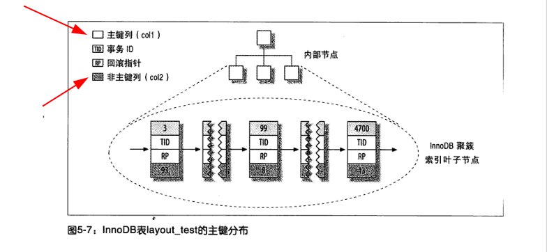
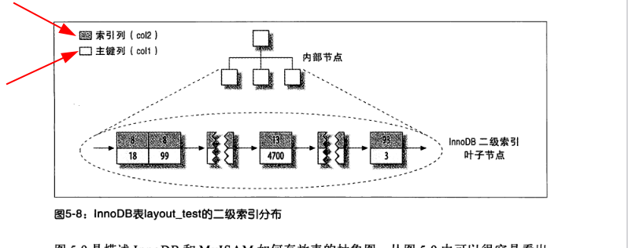

# InnoDB聚簇索引
## 什么是聚簇
&nbsp;&nbsp;聚簇索引并不是一种单独的索引类型，而是一种数据存储方式<sup>不仅是一种索引类型，还是一种数据存储方式</sup>

## 聚簇索引存储数据的方式
### 建表语句
```sql
    CREATE TABLE layout_test(
        col1 int not null,
        col2 int not null,
        PRIMARY KEY(col1),
        KEY(col2)
    )
```
### 聚簇索引数据存储方式


##### 注意事项
1. 数据行冗余的字段(事务ID、回滚指针),InnoDB中MVCC的实现基础

### 二级索引数据存储方式


##### 注意事项
1. 注意叶子节点存储的是什么

## 聚簇索引的插入方式和注意事项(InnoDB引擎对于数据的存储是物理连续还是逻辑连续)
### 当使用自增主键


&nbsp;&nbsp;如图，因为主键的值是顺序的，索引InnoDB把每一条记录都存储在上一条记录的后面，当达到页的最大填充因子时(InnoDB默认的最大填充因子是页大小的15/16，留出部分空间用于以后的修改)，下一条记录就会写入新的页中，一旦数据按照这种顺序的方式加载，主键页就会近似于被顺序的记录填满。这也是我们所期望的方式
RR 是针对于辅助索引进行的优化技术
如果查询能够使用覆盖索引，那么MRR不会带来优化的收益
MRR能带来优化是因为将随机I/O转换为了顺序I/
### 当使用UUID作为聚簇索引


&nbsp;&nbsp;因为新行的主键值不一定比之前插入的大，所以InnoDB无法简单的总是把新行插入到索引的最后，而是需要为新的行寻找合适的位置——通常是已有数据的中间位置，并分配空间。这会增加很多额外的工作，并导致数据分布不够优化。总结有如下缺点：
1. 写入的目标页可能已经刷到磁盘上并从缓存中移除，或者还没有被加载到缓存中，InnoDB在插入之前不得不找到并从磁盘中读取目标页到内存中，这将导致大量的随机I/O,即找到合适的插入位置
2. 因为写入是乱序的，InnoDB不得不频繁的做页分裂操作，以便为新的行分配空间，页分裂会导致移动大量数据，一次性插入最少需要修改三个页而不是一个页。为什么是三？这涉及到InnoDB存储引擎了
3. 由于频繁的页分裂，页会变得稀疏并被不规则地填充，所以最终数据会有碎片

>在把这些随机值载入到聚簇索引以后，也许需要做一次OPTIMIZE TABLE来重建表并优化页的填充。

>>因爲B+树将索引值存在非叶子节点中（具体的数据存在叶子节点中），而UUID相比于自增主键来说占用的内存更小，因此一次磁盘IO可以加载更多的节点，检索的效率更高

---
## 划重点
1. InnoDB将通过主键聚集数据，如果没有定义主键，InnoDB则会选择一个唯一的非空索引代替，如果没有这样的索引，InnoDB会隐式定义一个主键来作为聚簇索引。
    - 重点!!!
        + **InnoDB只聚集在同一个页面中的记录，包含相邻键值的页面可能会相距甚远**
           - 解析: 说明InnoDB在数据存储方面局部是 “物理连续”<sub>在一个页面上是物理连续的</sub> ，总体是逻辑连续的
           - 磁盘上存储数据的页是通过双向链表链接，每个页中的记录也是通过双向链表进行维护
        + 验证： 一张表两个主键会如何 ？
           - 会报错，这间接证明了一个表只能有一个聚簇索引
              ```txt
                  create table  test(
                     id int not null primary key  ,
                     id2 int not null primary key 
                  )
                  // 执行报错
                   [42000][1068] Multiple primary key defined
              ```
2. 二级索引（辅助索引）需要两次索引查找
    - 因为二级索引中叶子节点保存的不是指向行的物理位置的指针，而是行的主键值。因此使用二级索引查询需要:
        1. 存储引擎需要找到二级索引的叶子节点获得对应的主键值
        2. 根据第一步获取到的主键值去聚簇索引中查找对应的行。
        3. 第一，二步总共进行了两次查询(覆盖索引只需一次)

---
## 思考
### 1. 为什么一个表只能有一个聚簇索引?
&nbsp;&nbsp;“聚簇” 表示数据行和相邻的键值紧凑的存储在一起。因为无法同时将一个数据行放在两个不同的地方，所以一个表只能有一个聚簇索引。

---
## 参考资料
1. 《MySQL技术内幕InnoDB存储引擎第2版》
2. 《高性能MySQL · 第三版》