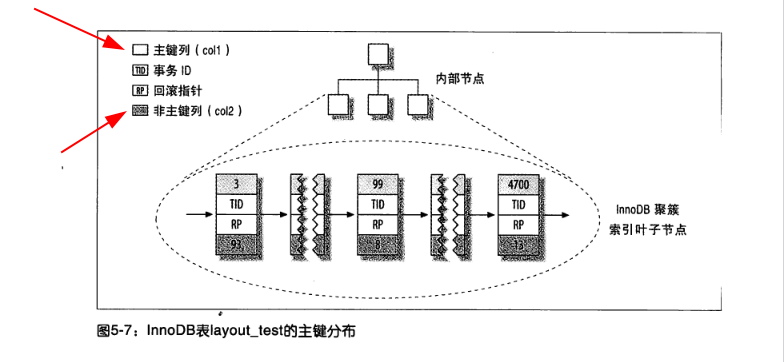
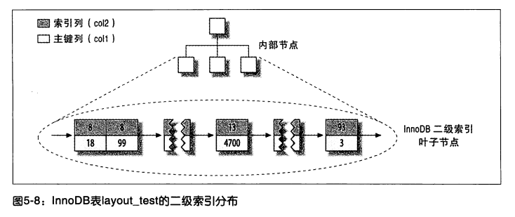
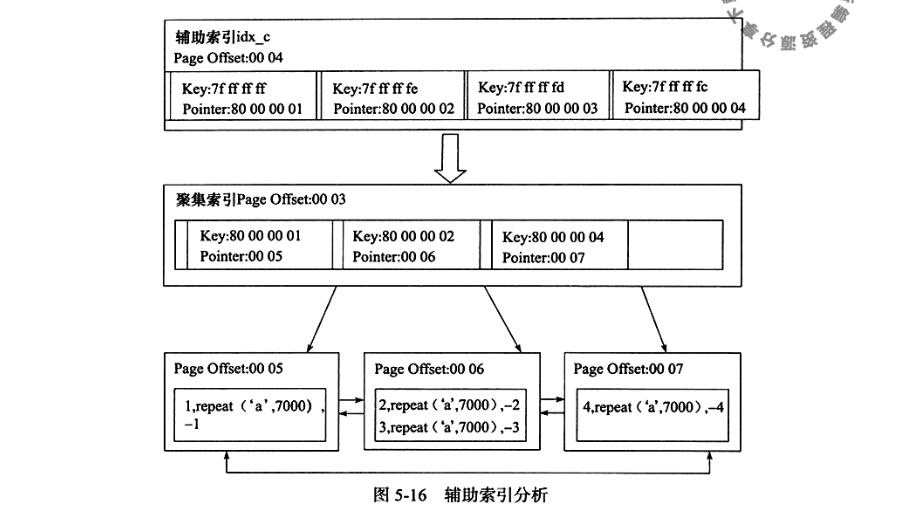
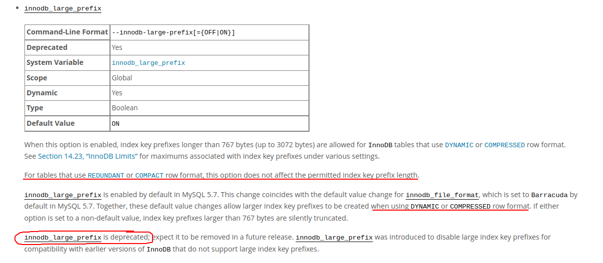
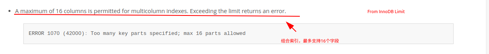

# MySQL索引
&nbsp;&nbsp;InnoDB支持一下几种常见的索引:
- B+树索引（B 代表的是Balance,而不是Binary）
  > 聚集索引（Clustered Index） & 辅助索引（Secondary Index），其内部都是使用B+树来实现的，即高度平衡的，叶子节点存放所有的数据。
- 全文索引
- 哈希索引
  > 哈希索引是辅助Buffer Pool而创建的，无法人为地在一张表上创建哈希索引。

### B+树索引
&nbsp;&nbsp;B+树索引并不能找到一个给定键值的具体行，B+树索引能找到的只是被查找数据行所在的页。然后数据通过把页读入到内存中，再在内存中查找，最后得到要查找的数据。
> 算法: 二分查找法 (回顾一下二叉树的搜索过程即是二分查找法: [DataStructs/BinarySearchTree/BST.c](https://gitee.com/WeiLU/DSA2))

#### [聚集索引](../005.MySQL索引/002.InnoDB聚簇索引.md)
&nbsp;&nbsp;聚集索引是按照每张表的主键构建一棵B+树，同时叶子节点存放的即为整张表的行记录数据，也将聚集索引的叶子节点称为数据页。
- 聚集索引的这个特性决定了索引组织表中数据也是索引的一部分。

&nbsp;&nbsp;同B+树数据结构一样，每个数据页都通过一个双向链表来进行链接。

&nbsp;&nbsp;由于实际的数据页只能按照一棵B+树进行排序，因此每张表只能拥有一个聚集索引。在多数情况下，查询优化器倾向于采用聚集索引，因为聚集索引能够在B+树索引的叶子节点中直接查询到数据，而不用会表查询<sup>见:[005.MySQL索引/002.InnoDB聚簇索引.md](../005.MySQL索引/002.InnoDB聚簇索引.md)</sup>

##### 数据组织方式<sup>物理连续？逻辑连续?</sup>
&nbsp;&nbsp;聚集索引（或者说B+树）数据组织方式为 **InnoDB只聚集在同一个页面上的数据，包含相邻键值的页面可能会相聚甚远**<sup>《高性能MySQL · 第三版》 P169</sup>,即： 一个页面上的数据在逻辑和物理上均是连续的，而不同页面上的数据仅在逻辑上是连续的，而页面是通过双向链表链接的;每个页中的记录也是通过双向链表进行维护的，物理存储上不按照主键存储。如下图:
- 

---

#### 辅助索引<sup>或称 二级索引</sup>
&nbsp;&nbsp;辅助索引，也称为二级索引，叶子节点并不包含行记录的全部数据。叶子节点除了包含键值以外，每个叶子节点中的索引行中还包含了一个书签(bookmark)——即聚集索引键，用于告诉InnoDB存储引擎哪里可以找到与索引相对应的行数据。
- 

##### 辅助索引数据查询方式<sup>什么是回表查询</sup>
&nbsp;&nbsp;当通过辅助索引查询数据时，InnoDB存储引擎回遍历辅助索引并通过叶级别的指针获得指向主键索引的主键，然后再通过主键索引来找到一个完整的行记录。<sup>即先通过辅助索引找到对应的主键索引的键，再通过主键索引查询行记录数据——回表查询</sup>

#### 聚集索引和辅助索引关系示意图
```txt
    CREATE TABLE t(
      a INT NOT NULL,
      b VARCHAR(8000)，
      c INT NOT NULL,
      PRIMARY KEY (a),
      KEY idx_c(c)
    ) ENGINE=INNODB;

    INSERT INTO t SELECT 1,REPEAT('a',7000),-1;
    INSERT INTO t SELECT 2,REPEAT('a',7000),-2;
    INSERT INTO t SELECT 3,REPEAT('a',7000),-3;
    INSERT INTO t SELECT 4,REPEAT('a',7000),-4;
```

&nbsp;&nbsp;按照如上测试数据，则表聚集索引和辅助索引数据组织逻辑示意图如下:
<sup>From: 《MySQL技术内幕InnoDB存储引擎第2版》 P200</sup>

&nbsp;&nbsp;从图中可以看出：
1. 数据是按照聚集索引组织的
2. 辅助索引不会指向具体的行数据，而存储的聚集索引的键值。
3. InnoDB 同一个页面的上的数据在逻辑和物理上都是连续的，不同页面上的数据则只在逻辑上连续。


---
## 什么是三星索引
&nbsp;&nbsp;三星索引是《Rrelational Database Index Design and the optimizers》 一书中提出来的：
```txt
   原文:
   The index earns one star if it places relevant rows adjacent to each other, a second star if its rows are sorted in the order the query needs, and a final star if it contains all the columns needed for the query.

   > 如果索引的相关行彼此相邻，则获得1颗星;如果索引的行按查询所需的顺序排序，则获得第二颗星;如果索引包含查询所需的所有列，则获得最后一颗星。
```

&nbsp;&nbsp;什么是三星索引？ 衡量一个索引是否达到最佳表现的三个维度
- 一星： 与查询相关的索引行时相邻的，也就是where条件后面的等值谓词可以匹配索引列顺序
  + where后面匹配条件，可以匹配联合索引的多个列：意义在于索引列匹配字段越多，索引片越窄，最终扫描的数据行越小
- 二星：索引行的顺序与查询语句需求一致，就是是order by 中的排列顺序和索引顺序是否一致
  + 如果结果集采用现有顺序读取，则会避免一次排序。
- 三星: 索引行中包含查询语句中所有的列
  + 即避免根据聚集索引键回表查询,也就是避免了一次随机IO  

---
## 附录
## 1. 索引最大长度
+ [https://dev.mysql.com/doc/refman/5.7/en/innodb-parameters.html](https://dev.mysql.com/doc/refman/5.7/en/innodb-parameters.html)
+ [https://dev.mysql.com/doc/refman/5.7/en/innodb-parameters.html#sysvar_innodb_large_prefix](https://dev.mysql.com/doc/refman/5.7/en/innodb-parameters.html#sysvar_innodb_large_prefix)
   > innodb_large_prefix  已经被废弃了

   > 005.MySQL索引/docs-en/MySQL____MySQL_5.7_Reference_Manual____14.15_InnoDB_Startup_Options_and_System_Variables.pdf
   
   > 
+ [14.22 InnoDB Limits](https://dev.mysql.com/doc/refman/5.7/en/innodb-limits.html): 005.MySQL索引/docs-en/MySQL____MySQL_5.7_Reference_Manual____14.23_InnoDB_Limits.pdf
+ 组合索引时，并没有对组合索引的长度做限制，仅对单列索引的长度。但组合索引有字段数量的限制:
  - 