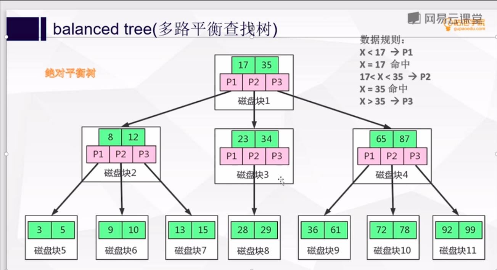
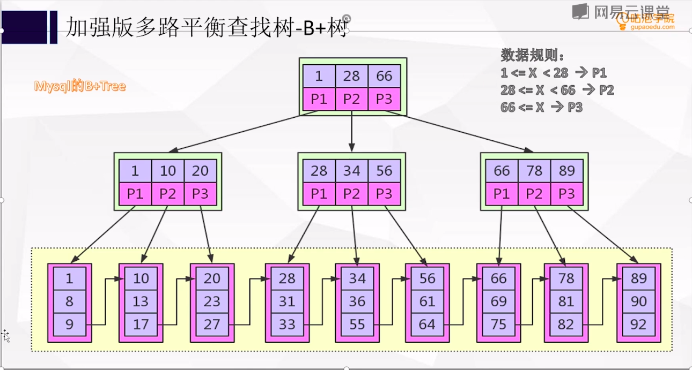
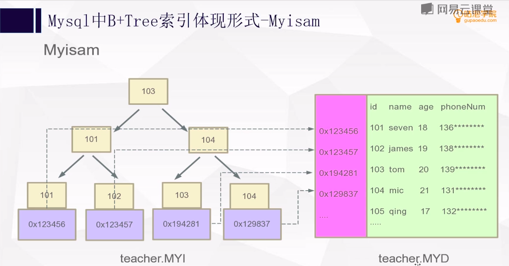
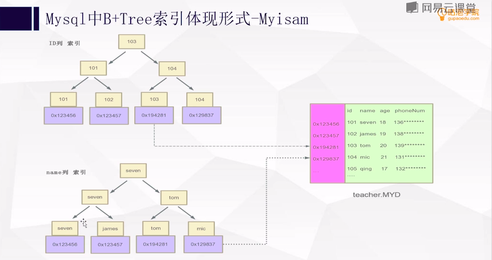
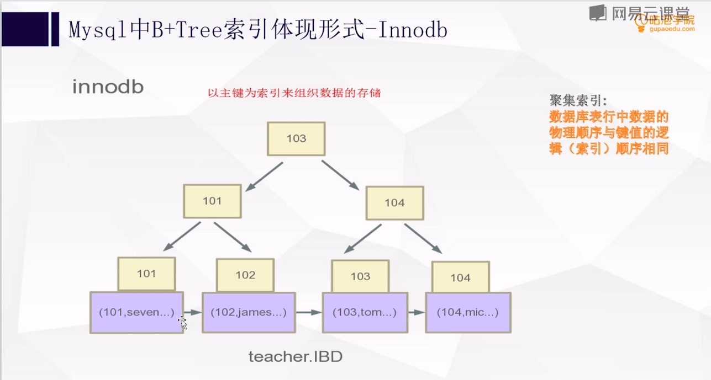
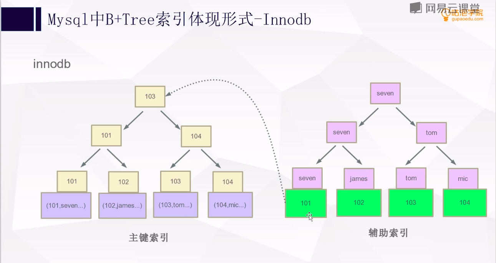
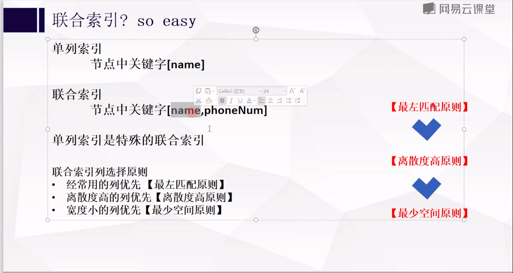
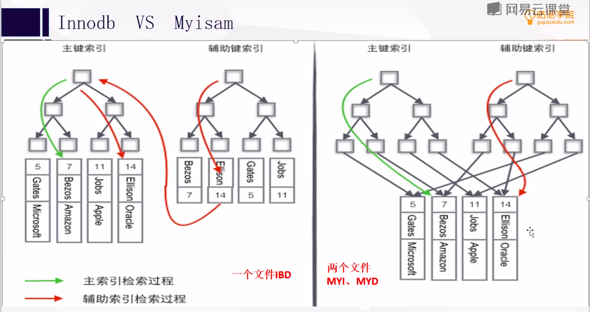

# 索引
+ 动态数据结构与算法:[https://www.cs.usfca.edu/~galles/visualization/Algorithms.html](https://www.cs.usfca.edu/~galles/visualization/Algorithms.html)

1. 树的高度
2. 树节点大小

## 1. 什么是索引
&nbsp;&nbsp;索引是一种加速对表中数据行检索而创建的一种分散存储的数据结构

## 2. 从B树(Balanced-tree)来分析MySQL索引
+ B-树是一种多路搜索树（并不一定是二叉的）
  - 如果有更多的分支，那么就有更少的高度，一般来说，在树结构中**数据所处的深度决定着他搜索时IO次数**,即深度越高，IO次数越多，也就效率越低
  - 一颗完全二叉树（complete binary tree）的高度大约为log2N(2为底)，而一颗完全M叉树（complete M-ary tree）的高度大约是logMN(M为底)

+ B树： 
### 分析
&nbsp;&nbsp;如上图，B树，有如下特点：
1. 数据是是直接存储在节点上的。
2. 如附录001，在内核读取文件的时候，如果每个节点的数据量太大，就会导致多次IO(因为每次IO获取的数据量有限)

## 2. 从B+树来分析MySQL索引
+ B+树: 
  1. 关键字搜索采用闭合区间
  2. 非叶子节点不存储数据,仅保存关键字和子节点的引用
  3. 关键字对应的数据存储在叶子节点上
  4. 叶子节点是顺序排列的，并且相邻的节点具有顺序引用的关系

### 分析
&nbsp;&nbsp;如上，B+树将数据均存储在叶子节点上，搜索时采用闭合区间，这就控制每个非叶子节点所占空间大小(即小于B树节点所占空间),因此这就会减少IO的次数，即快速筛选掉不匹配的数据。

## 3. B树和B+树的节点反思索引建立
&nbsp;&nbsp;节点所占空间大小会影响到MySQL查询数据时I/O的效率,因此在定义字段的长度以及类型的时候需要控制，这不仅仅是基于表所存储的数据所占磁盘大小的考虑，更是基于查询效率的考虑(若需要基于该字段建立索引，那么此时就会直接影响到该索引带来的收益了)

## 4. 不同存储引擎的索引
### 4.1 Myisam存储引擎
+ 
+ 

#### 对于Myisam存储引擎
1. 如图：在Myisam存储引擎中，索引都是平级的。即索引并没有什么分类
2. 如图： Myisam存储引擎叶子节点并非直接保存对应的数据，而是数据在磁盘中的位置。

### 4.2 InnoDB存储引擎
+ 
+ 

#### 对于InnoDB存储引擎
1. 如上图： InnoDB存储引擎中是以主键为索引来组织数据的存储的，此时的主键索引也称为聚簇(聚集)索引
   - 索引从大的方向可以分为聚簇索引和非聚簇索引(或称为非聚簇索引、二级索引、辅助索引)
   - 聚簇索引并不是一种单独的索引类型，而是一种数据存储方式 ----《高性能MYSQL》P162
2. 辅助索引：即二级索引，也是非聚簇索引
    + 如上图，非聚簇索引所使用的数据结构依旧是B+Tree，但是此时叶子节点所存储的数据并不是对应的真实数据了，而是行的主键值（即聚簇索引字段的值，如id值，前提是此时id为主键）。
        - 这意味着通过非聚簇索引查找行，存储引擎需要找到二级索引的叶子节点，获得对应的主键值，然后根据这个值去聚簇索引中查找对应的行。（这里是两次B+Tree查找，对于InnoDB，自适应哈希索引能够减少这样的重复动作）
##### InnoDB非聚簇索引
###### 联合索引
+ 
&nbsp;&nbsp; 如上图，联合索引建立原则：
1. 最左匹配原则
2. 离散度高原则
3. 最少空间原则

###### 覆盖索引
+ 
&nbsp;&nbsp;如果一个索引包含（或者说覆盖）所有需要查询的字段的值，则就称之为覆盖索引。

1. 由于InnoDB的聚簇索引，覆盖索引对于InnoDB表非常有用。InnoDB的二级索引在叶子节点保存了行的主键值，所以二级主键能够覆盖查询（即不用回表就可以查询出主键id的值），则可以避免对主键索引的二次查询。
2. 索引条目通常远小于数据行大小，所以如果只需要读取索引，那MySQL就会极大减少数据访问量，这对缓存的负载非常重要，因为这种情况下响应时间大部分花费在数据拷贝上。覆盖索引对于I/O密集型的应用也有帮助，因为索引比数据小，更容易全部放到内存中。
3. 因为索引是按照列值来顺序存储的，所以对于I/O密集型的范围查询回避随机从磁盘中读取每一行数据的I/O要少得多。
4. 一些存储引擎如Myisam在内存中仅缓存索引，数据则依赖操作系统来缓存，因此要访问数据需要一次系统调用。

## 5. Myisam和InnoDB区别
+ 

## 6. 从树这种结构来考虑索引的建立
&nbsp;&nbsp;即**不建议在频繁更新的列上建立索引**，因为索引所在的列的数据若频繁变动，则会导致每次均要维护索引，这也是一种性能消耗

## 附录
### 001. Linux内核读取文件
&nbsp;&nbsp;读取文件是基于页的，内核总是一次传输几个完整的数据页。如果进程发出read()系统调用来读取一些字节，而这些数据还不在RAM中，那么内核就要分配一个新页框，并使用文件的适当部分来填充这个页，把该页添加到页高速缓存，最后把所请求的字节数拷贝到进程地址空间中。----《深入理解Linux内核》 P628
