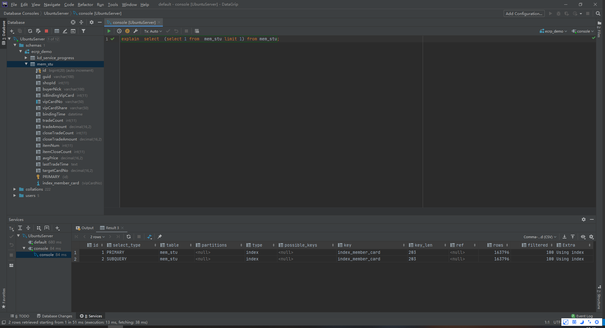
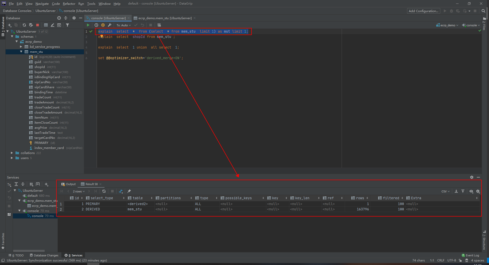
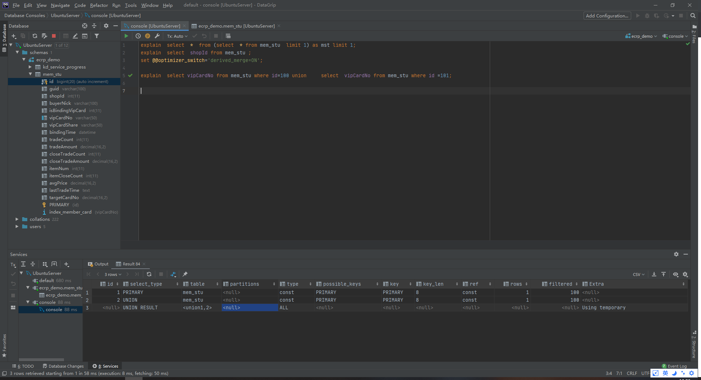
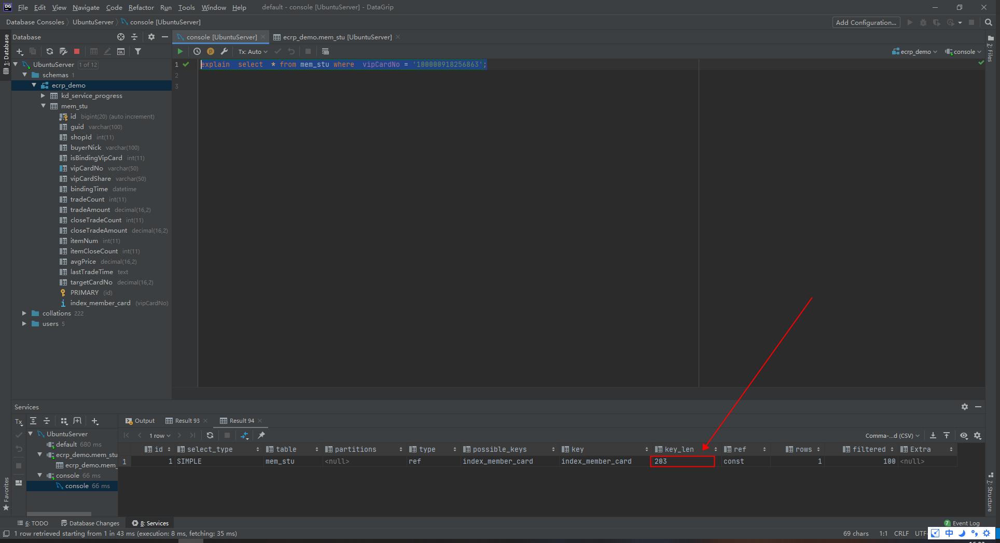
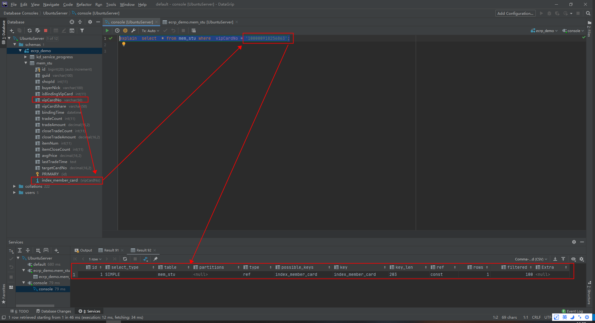
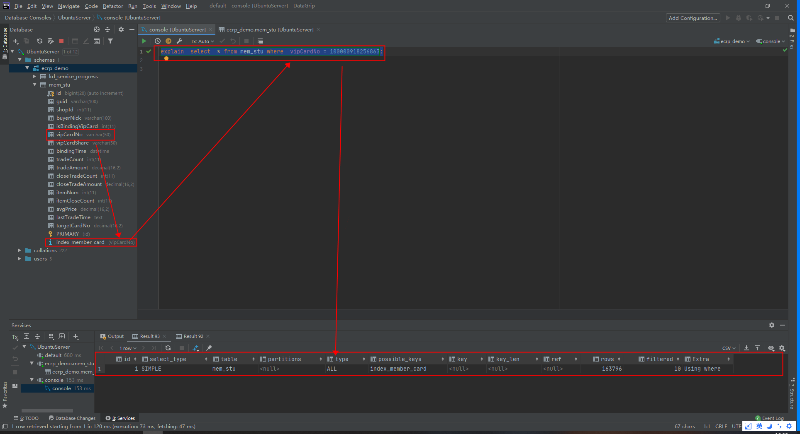

# Explain
## EXPLAIN Statement
```sql
  {EXPLAIN | DESCRIBE | DESC}
    tbl_name [col_name | wild]

  {EXPLAIN | DESCRIBE | DESC}
      [explain_type]
      {explainable_stmt | FOR CONNECTION connection_id}
  
  {EXPLAIN | DESCRIBE | DESC} ANALYZE [FORMAT = TREE] select_statement
  
  explain_type: {
      FORMAT = format_name
  }
  
  format_name: {
      TRADITIONAL
    | JSON
    | TREE
  }
  
  explainable_stmt: {
      SELECT statement
    | TABLE statement
    | DELETE statement
    | INSERT statement
    | REPLACE statement
    | UPDATE statement
  }
```
---

## 功能
可以使用explain来获取关于**查询执行计划**的信息，即:explain命令是查看查询优化器如何决定执行查询的主要方法，这个功能存在局限性，并不总会说出真相，但是他的输出是可以获取的最好信息。
   + explain 仅仅能解释SELECT查询(高版本中也能支持其他的)，不能对存储过程，INSERT,UPDATE,DELETE以及其他的语句做解释
## 使用方式
要使用explain，则只需要在查询的select关键字之前添加EXPLAIN即可。但是，需要注意的是：
   1. MySQL会在查询上设置一个标记，当执行查询是，这个标记会使其**返回关于在查询计划中每一步的信息，而不是执行他**(不是真正执行)
   2. 他会返回一行或者多行信息，显示出执行计划中的每一部分和执行顺序。
   3. 在查询中，每个表在输出中只有一行。若：
        + 若查询的是两个表的联接，则输出中将有两行。
        + 别名表单算一个表，因此，若将一个表与自己联接，输出行中也会有两行。
        + 这里的表意义较广，可以是一个子查询，一个union结果等。
### 请注意
**认为增加EXPLAIN时MySQL不会执行查询，这是错误的**，如果查询在FROM子句中包括子查询，则MySQL实际上会执行子查询，将其结果放在一个临时表中，然后完成**外层查询优化**，他必须在可以完成外层查询优化之前处理掉所有类似的子查询，这对于EXPLAIN是必须要做的(可能会在高版本中去掉该限制)。
### EXPLAIN只是一个近似的结果，别无其他，有时候他是一个很好的近似，但在其他时候，可能与真相相差甚远。见如下限制：
  1. explain不会反馈触发器，存储过程或者UDF会如何影响查询
  2. 不支持存储过程，仅支持select操作
  3. 不会反馈MySQL在执行查询的时候所做的特定优化
  4. 不会反馈关于查询的执行计划的所有信息
  5. 不区分具有相同名字的事物。例如，他对内存排序和临时文件都使用filesort，并且对磁盘上和内存中的临时表都显示为Using Temporary
  6. 可能会误导。例如，对一个有着很小limit的查询显示为全索引扫描。

---

## EXPLAIN 输出
&nbsp;&nbsp;EXPLAIN的每个输出行提供关于一个表的信息。每行包含表“EXPLAIN Output Columns”中总结的值，并在表中进行了更详细的描述。列名显示在表的第一列中;第二列提供了当使用FORMAT=JSON时在输出中显示的等价属性名。
### EXPLAIN Output Columns
|Column|	JSON Name|	Meaning|
|---|---|---|
|id	         |select_id     |The SELECT identifier|
|select_type	|None          |The SELECT type|
|table	      |table_name    |The table for the output row|
|partitions    |partitions    |The matching partitions|
|type          |access_type	|The join type|
|possible_keys	|possible_keys |The possible indexes to choose|
|key           |key           |The index actually chosen|
|key_len       |key_length    |The length of the chosen key|
|ref	         |ref           |The columns compared to the index|
|rows          |rows	         |Estimate of rows to be examined|
|filtered      |filtered      |Percentage of rows filtered by table condition|
|Extra	      |None          |Additional information|

```txt
   # Attensions
     a. JSON properties which are NULL are not displayed in JSON-formatted EXPLAIN output.
```
### EXPLAIN OUTPUT 列说明
#### id (JSON name: select_id)
&nbsp;&nbsp;The SELECT identifier. This is the sequential number of the SELECT within the query. The value can be NULL if the row refers to the union result of other rows. In this case, the table column shows a value like <unionM,N> to indicate that the row refers to the union of the rows with id values of M and N.(SELECT标识符。这是查询中的SELECT序号。如果该行引用其他行的并集结果时该值可能为NULL。在这种情况下,这一列可能会展示类似于<unionM,N>这样一个值，以指示该行引用 id 值为 M 和 N 的行的并集)

#### select_type (JSON name: none)
&nbsp;&nbsp;The type of SELECT, which can be any of those shown in the following table. A JSON-formatted EXPLAIN exposes the SELECT type as a property of a query_block, unless it is SIMPLE or PRIMARY. The JSON names (where applicable) are also shown in the table.(SELECT的类型，可以是下表中所示的任何类型。json格式的EXPLAIN将SELECT类型作为query_block的属性公开，除非它是SIMPLE或PRIMARY。JSON名称(如适用)也显示在表中)
|select_type Value|	JSON Name|	Meaning|
|---|---|---|
|SIMPLE	             |None	                     |Simple SELECT (not using UNION or subqueries)|
|PRIMARY	             |None	                     |Outermost(最外层) SELECT|
|UNION	             |None	                     |Second or later SELECT statement in a UNION|
|DEPENDENT UNION      |dependent (true)            |Second or later SELECT statement in a UNION, dependent on outer query|
|UNION RESULT	       |union_result	               |Result of a UNION.|
|SUBQUERY	          |None	                     |First SELECT in subquery|
|DEPENDENT SUBQUERY   |dependent (true)            |First SELECT in subquery, dependent on outer query|
|DERIVED	             |None	                     |Derived(派生的) table <sub>Derived table实际上是一种特殊的subquery，它位于SQL语句中FROM子句里面，可以看做是一个单独的表。MySQL5.7之前的处理都是对Derived table进行Materialize，生成一个临时表保存Derived table的结果，然后利用临时表来协助完成其他父查询的操作，比如JOIN等操作。MySQL5.7中对Derived table做了一个新特性（MySQL5.7 Merge derived table特性:见附录'Merge Derived Table'）。该特性允许将符合条件的Derived table中的子表与父查询的表合并进行直接JOIN。</sub>|
|DEPENDENT DERIVED    |dependent (true)            |Derived table dependent on another table|
|MATERIALIZED	       |materialized_from_subquery	|Materialized(实体化) subquery (说明MySQL对于此查询会创建临时表)|
|UNCACHEABLE SUBQUERY |cacheable (false)	         |A subquery for which the result cannot be cached and must be re-evaluated for each row of the outer query(不能将结果缓存的子查询，必须重新计算外部查询的每一行)|
|UNCACHEABLE UNION	 |cacheable (false)	         |The second or later select in a UNION that belongs to an uncacheable subquery (see UNCACHEABLE SUBQUERY)|

#### table (JSON name: table_name)
&nbsp;&nbsp; The name of the table to which the row of output refers. This can also be one of the following values:(输出行所指向的表的名称。这也可以是以下值之一)
- <unionM,N>: The row refers to the union of the rows with id values of M and N.(行是指id值为M和N的行的并集。)
- <derivedN>: The row refers to the derived table result for the row with an id value of N. A derived table may result, for example, from a subquery in the FROM clause.(The row refers to the derived table result for the row with an id value of N. A derived table may result, for example, from a subquery in the FROM clause.)
- <subqueryN>: The row refers to the result of a materialized subquery for the row with an id value of N.(行引用id值为N的行的物化子查询的结果)

#### partitions (JSON name: partitions)
&nbsp;&nbsp;The partitions from which records would be matched by the query. The value is NULL for nonpartitioned tables. (查询将从其中匹配记录的分区。对于非分区表，该值为NULL。)

#### type (JSON name: access_type)
&nbsp;&nbsp;The join type. For descriptions of the different types, see EXPLAIN Join Types.(连接类型，见附录 'EXPLAIN Join Types')

#### possible_keys (JSON name: possible_keys)
&nbsp;&nbsp;The possible_keys column indicates the indexes from which MySQL can choose to find the rows in this table. Note that this column is totally independent of the order of the tables as displayed in the output from EXPLAIN. That means that some of the keys in possible_keys might not be usable in practice with the generated table order.（possible_keys列表示MySQL可以从中选择查找该表中的行的索引。注意，这一列完全独立于EXPLAIN输出中显示的表的顺序。这意味着'possible_keys'中的一些索引在实际中可能无法用于生成的表顺序）

#### key (JSON name: key)
&nbsp;&nbsp;The key column indicates the key (index) that MySQL actually decided to use. If MySQL decides to use one of the possible_keys indexes to look up rows, that index is listed as the key value.(key列表示MySQL实际决定使用的键(索引)。如果MySQL决定使用一个'possible_keys'索引来查找行，那么该索引将被列为键值。).

&nbsp;&nbsp;It is possible that key may name an index that is not present in the possible_keys value. This can happen if none of the possible_keys indexes are suitable for looking up rows, but all the columns selected by the query are columns of some other index. That is, the named index covers the selected columns, so although it is not used to determine which rows to retrieve, an index scan is more efficient than a data row scan.(可能索引的名称没有出现在possible_keys中。这种情况出现在possible_keys中的索引都不适合查找行，但是所有的列可以通过其他索引查询到，也就是说，索引覆盖所选的列，因此尽管不使用索引来确定要检索哪些行，但索引扫描比数据行扫描更有效)


---

## EXPLAIN中的列
### id列
+ 这一列包含一个编号，标识SELECT所属的行。如果在语句中没有子查询或联合，那么只会有唯一的SELECT,于是每一行在这个列中都将显示一个1。否则，内层的SELECT语句一般会顺序编号，对应其在原始语句中的位置。
+ MySQL将SELECT分为简单和复杂类型，复杂类型可以分为三大类：
   1. 简单子查询
   2. 所谓的派生表(FROM中的子查询)
   3. UNION查询
##### 查询类型
###### 1. 简单子查询
+ 
###### 2. FROM子句中的子查询
+ 
+ 请注意
   1. 派生表（FROM子句中的子查询）可以在没有 grouping, aggregates, or ORDER BY ...  LIMIT 子句时合并到他们的父查询中(即在执行计划中不会出现DERIVED)。这个优化默认开启，可通过如下关闭：
       + [set @@optimizer_switch='derived_merge=OFF'](https://mariadb.com/kb/en/derived-table-merge-optimization/)
###### 3. UNION查询
+ 
+ 需要注意的是：
   1. **当使用union all的时候，则不会出现第3行(UNION RESULT)内容，具体原因暂不知晓**，待后续补充。这可能也是union all 性能高于union 的原因吧

## select_type列
这一列显示对应行是简单还是复杂的select。SIMPLE代表查询不包含子查询和union。如果查询有任何复杂的子部分，则最外层标记为PRIMARY,其他部分标记如下：
##### 标记：SUBQUERY
+ 包含在SELECT列表中的子查询中的SELECT标记为SUBQUERY
##### 标记：DERIVED
+ 表示包含在FROM子句的子查询中的SELECT,MySQL会递归执行并将结果放到一个临时表中。服务器内部称之为派生表，因为该临时表是从子查询中派生出来的。
##### 标记：UNION
+ 在UNION中的第二个和随后的SELECT被标记为UNION，第一个SELECT被标记为就好像以部分外查询来执行。这就是之前的例子中在UNION中的第一个SELECT显示为PRIMARY的原因。如果UNION被FROM子句中的子查询包含，那么他的第一个SELECT会被标记为DERIVED
##### 标记：UNION RESULT
+ 用来从UNION的匿名临时表中检索结果的SELECT被标记为UNION RESULT

## table列
这一列显示了对应行正在访问哪一个表(有时候显示的是表的别名)
## type列
访问类型----即MySQL决定如何查找表中的行。从最差到最优分别为:
##### ALL
+ 即全表扫描，意味着MySQL必须扫描整张表，从头到尾，去找到需要的行。
##### index
+ 这个和全表扫描一样，只是MySQL扫描表时按照索引的顺序进行而不是行(**当type列的值是index时，则说明MySQL使用了索引扫描来做排序**)。主要优点是避免了排序，最大的缺点是要承担按照索引顺序读取整张表的开销。
   - 如果在Extra列中看到Using Index，则说明MySQL使用了覆盖索引（**即回表查询**），他只扫描了索引的数据，而不是按照索引的顺序每一行。比按照索引顺序全表扫描的开销要少得多。
##### range
范围扫描就是有限制的索引扫描，他开始索引里的某一点，返回匹配这个值域的行。这比全索引扫描好一些，因为他不用遍历全部索引。   

##### ref
这是一种索引访问，他返回所有匹配某个单个值的行。然而，他可能找到多个符合条件的行，因此，他是查找和扫描的混合体。此类索引访问只有当使用非唯一索引或者唯一索引的非唯一前缀才会发生。

##### eq_ref
使用这种索引查询，MySQL知道最多只返回一条符合条件的记录。这种访问方法可以在MySQL中使用主键或者唯一性索引查找时看到。MySQL对这类访问类型的优化做的非常好，因为他知道无须估计匹配行的范围或在找到匹配行之后再继续查找。
##### const，system
当MySQL能对查询的某部分进行优化并将其转换为一个常量时，他就会使用这些访问类型。例如，通过将某一行的主键放入到where子句中的方式来选取此行的主键，MySQL就能把这个查询转换为一个常量。

##### NULL
这种访问方式意味着MySQL能在优化阶段分析查询语句，在执行阶段甚至用不着再访问表或者索引。

## possible_keys列
显示了查询可以使用哪些索引，但是这只是说可以使用，但不一定会使用
## key列
这一列显示了MySQL将会使用哪个索引来优化对该表的访问。
  + 即对于possible_keys列和key列，possible_keys列揭示了哪一个索引能有助于高效地查找，而key显示的是优化采用哪一个索引可以最小化查询成本。
## key_len列
该列显示了MySQL在索引里使用的**字节数**。如果MySQL正在使用的只是索引里的某些列，那么就可以使用这个值来计算出具体是那些列。
   - key_len计算需要注意：变长字段需要额外的2个字节，固定长度字段不需要额外的字节。而null都需要1个字节的额外空间，所以以前有个说法：索引字段最好不要为NULL，因为NULL让统计更加复杂，并且需要额外一个字节的存储空间。
   - ken_len显示了在索引字段中可能的最大长度，而不是表中数据使用的实际字节数。即ken_len通过查找表的定义而被计算出，而不是表中的数据。
   - 
       + member_card索引的长度:50 x 4(utf8mb4下一个字符所占字节数) + 2(变长类型的长度记录) + 1(允许为NULL的) = 203
## ref列
显示之前的表在key列的索引中查找值所用的列或者常量。
## rows列
显示MySQL估计为了找到所需的行而需要读取的行数。
   - 这个数字是内嵌循环关联计划里的循环数目。也就是说他不是MySQL认为他最终需要从表里读取到的行数，而是MySQL为了找到符合查询的每一点上标准的那些行而必须读取的行的平均数。
   - 这个是MySQL认为他需要检查的行数，而不是结果集里的行数。
## filtered列
显示的是针对与表中符合某个条件（where子句或者连接条件）的记录数的百分比所做的一个悲观估算。如果将rows列和这个百分比相乘，就可以知道MySQL估算他和查询计划里前一个表关联的行数。
## Extra列
显示的是不适合在其他列显示的额外信息，重要的值有
##### 1. Using index
表示Mysql将使用覆盖索引，以避免访问表
##### 2. Using where
意味着MySQL服务器将在存储引擎检索行后再进行过滤。
##### 3. Using temporary
意味着MySQL在对查询结果排序是会使用到一个临时表。但不能区分是内存临时表还是磁盘临时表。
##### 4. Using filesort
意味着MySQL会对结果使用一个外部索引排序，而不是按照索引次序从表里读取行
##### 5. Using index Condition
查找使用了索引，但是需要回表查询数据

## 注意事项
### 1. 当值索引中的字段的数据类型相同是，才能使用索引
+ 
     - 当值的类型与你传入的值的类型一致时候（字段类型为字符串，传入的值的类型也为字符串），使用了索引
+ 
     - 当值的类型与你传入的值的类型不一致时候（字段类型为字符串，传入的值的类型为数字类型），索引失效

---
## 附录
### Merge Derived Table
&nbsp;&nbsp;Derived table实际上是一种特殊的subquery，它位于SQL语句中FROM子句里面，可以看做是一个单独的表。MySQL5.7之前的处理都是对Derived table进行Materialize，生成一个临时表保存Derived table的结果，然后利用临时表来协助完成其他父查询的操作，比如JOIN等操作。MySQL5.7中对Derived table做了一个新特性。该特性允许将符合条件的Derived table中的子表与父查询的表合并进行直接JOIN。
#### 实践如下
```sql
    # 环境
    mysql> select version();
    +-----------+
    | version() |
    +-----------+
    | 5.7.35    |
    +-----------+
    1 row in set (0.00 sec)

    ## 数据准备
    mysql> show create table trade \G
    *************************** 1. row ***************************
           Table: trade
    Create Table: CREATE TABLE `trade` (
      `trade_id` bigint(20) NOT NULL AUTO_INCREMENT,
      `total_price` bigint(20) NOT NULL,
      `buyer_id` varchar(20) NOT NULL,
      PRIMARY KEY (`trade_id`)
    ) ENGINE=InnoDB AUTO_INCREMENT=3 DEFAULT CHARSET=latin1
    1 row in set (0.00 sec)
    
    mysql> select * from trade;
    +----------+-------------+------------+
    | trade_id | total_price | buyer_id   |
    +----------+-------------+------------+
    |        1 |          20 | Wei.Wang.1 |
    |        2 |          30 | Wei.Wang.2 |
    +----------+-------------+------------+
    2 rows in set (0.00 sec)

    mysql> show create table order_ \G
    *************************** 1. row ***************************
           Table: order_
    Create Table: CREATE TABLE `order_` (
      `order_id` bigint(20) NOT NULL AUTO_INCREMENT,
      `trade_id` bigint(20) NOT NULL,
      `item_id` varchar(50) NOT NULL,
      `price` bigint(20) NOT NULL,
      PRIMARY KEY (`order_id`)
    ) ENGINE=InnoDB AUTO_INCREMENT=5 DEFAULT CHARSET=latin1
    1 row in set (0.00 sec)
    
    mysql> select * from order_;
    +----------+----------+-----------+-------+
    | order_id | trade_id | item_id   | price |
    +----------+----------+-----------+-------+
    |        1 |        1 | item_id_1 |    10 |
    |        2 |        1 | item_id_2 |    10 |
    |        3 |        2 | item_id_1 |    10 |
    |        4 |        2 | item_id_3 |    20 |
    +----------+----------+-----------+-------+
    4 rows in set (0.00 sec)

    ## 关闭 'derived_merge'
       set optimizer_switch='derived_merge=off';
    mysql> explain select * from (select * from trade where trade_id = 1) as trade inner join (select * from order_ where trade_id=1) as orderT on orderT.trade_id = trade.trade_id;
    +----+-------------+------------+------------+--------+---------------+-------------+---------+-------+------+----------+-------------+
    | id | select_type | table      | partitions | type   | possible_keys | key         | key_len | ref   | rows | filtered | Extra       |
    +----+-------------+------------+------------+--------+---------------+-------------+---------+-------+------+----------+-------------+
    |  1 | PRIMARY     | <derived2> | NULL       | system | NULL          | NULL        | NULL    | NULL  |    1 |   100.00 | NULL        |
    |  1 | PRIMARY     | <derived3> | NULL       | ref    | <auto_key0>   | <auto_key0> | 8       | const |    1 |   100.00 | NULL        |
    |  3 | DERIVED     | order_     | NULL       | ALL    | NULL          | NULL        | NULL    | NULL  |    4 |    25.00 | Using where |
    |  2 | DERIVED     | trade      | NULL       | const  | PRIMARY       | PRIMARY     | 8       | const |    1 |   100.00 | NULL        |
    +----+-------------+------------+------------+--------+---------------+-------------+---------+-------+------+----------+-------------+
    4 rows in set, 1 warning (0.01 sec)
    
    mysql> 
    ## 打开 'derived_merge'
       set optimizer_switch='derived_merge=on';
   
    mysql> explain select * from (select * from trade where trade_id = 1) as trade inner join (select * from order_ where trade_id=1) as orderT on orderT.trade_id = trade.trade_id;
    +----+-------------+--------+------------+-------+---------------+---------+---------+-------+------+----------+-------------+
    | id | select_type | table  | partitions | type  | possible_keys | key     | key_len | ref   | rows | filtered | Extra       |
    +----+-------------+--------+------------+-------+---------------+---------+---------+-------+------+----------+-------------+
    |  1 | SIMPLE      | trade  | NULL       | const | PRIMARY       | PRIMARY | 8       | const |    1 |   100.00 | NULL        |
    |  1 | SIMPLE      | order_ | NULL       | ALL   | NULL          | NULL    | NULL    | NULL  |    4 |    25.00 | Using where |
    +----+-------------+--------+------------+-------+---------------+---------+---------+-------+------+----------+-------------+
    2 rows in set, 1 warning (0.00 sec)
    
    mysql> 

    # 可以发现，当 ‘derived_merge’ 打开，3,2两个DERIVED查询被合并到了1这个主查询上,尽而简化了执行计划，同时也提高了执行效率。
    ## 只要Derived table里不包含如下条件就可以利用该特性进行优化：
           UNION clause
           GROUP BY
           DISTINCT
           Aggregation
           LIMIT or OFFSET
           Derived table里面包含用户变量的设置。
```

## 参考资料
1. [13.8.2 EXPLAIN Statement](https://dev.mysql.com/doc/refman/8.0/en/explain.html)
2. http://mysql.taobao.org/monthly/2017/03/05/