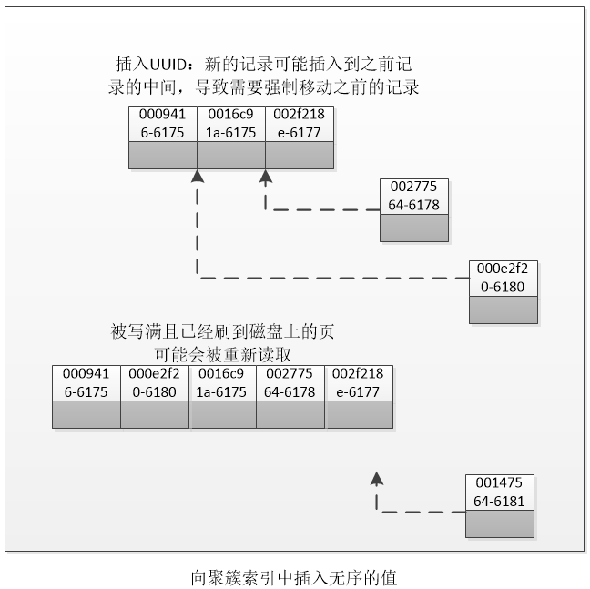

# 为什么主键ID必须是自增的
&nbsp;&nbsp;先结合《005.索引.md》，从而得知了InnoDB的索引所使用的数据结构是B+Tree，基于这个前提，来考虑一下为什么主键ID必须自增。

## 使用反证法来证明
&nbsp;&nbsp;从性能的考虑出发，使用UUID来作为聚集索引则会很糟糕：他使得聚簇索引的插入变得完全随机，这是最坏的情况，使得数据没有任何聚集特性。

### 当使用自增主键

&nbsp;&nbsp;如图，因为主键的值是顺序的，索引InnoDB把每一条记录都存储在上一条记录的后面，当达到页的最大填充因子时(InnoDB默认的最大填充因子是页大小的15/16，留出部分空间用于以后的修改)，下一条记录就会写入新的页中，一旦数据按照这种顺序的方式加载，主键页就会近似于被顺序的记录填满。这也是我们所期望的方式

### 当使用UUID作为聚簇索引

&nbsp;&nbsp;因为新行的主键值不一定比之前插入的大，所以InnoDB无法简单的总是把新行插入到索引的最后，而是需要为新的行寻找合适的位置——通常是已有数据的中间位置，并分配空间。这会增加很多额外的工作，并导致数据分布不够优化。总结有如下缺点：
1. 写入的目标页可能已经刷到磁盘上并从缓存中移除，或者还没有被加载到缓存中，InnoDB在插入之前不得不找到并从磁盘中读取目标页到内存中，这将导致大量的随机I/O,即找到合适的插入位置
2. 因为写入是乱序的，InnoDB不得不频繁的做页分裂操作，以便为新的行分配空间，页分裂会导致移动大量数据，一次性插入最少需要修改三个页而不是一个页。为什么是三？这涉及到InnoDB存储引擎了
3. 由于频繁的页分裂，页会变得稀疏并被不规则地填充，所以最终数据会有碎片

&nbsp;&nbsp;在把这些随机值载入到聚簇索引以后，也许需要做一次OPTIMIZE TABLE来重建表并优化页的填充。