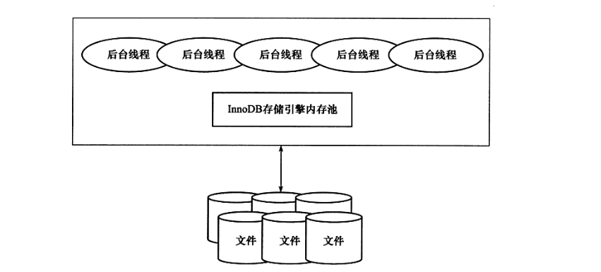

# InnoDB架构
&nbsp;&nbsp;如下图，简单的显示了InnoDB存储引擎的体系架构，从图可见，InnoDB存储引擎有多个内存块，可以认为这些内存块组成了一个大的内存池。
> 

## 后台线程
&nbsp;&nbsp;后台线程的主要作用是负责刷新内存池中的数据，保证缓存池中的内存缓存是最近的数据。并且将已经修改的数据文件刷新到磁盘文件，同时保证在数据库发生异常的情况下InnoDb能恢复到正常运行状态.

|线程类型|功能介绍|
|---|---|
|Master Thread|主要负责将缓冲池中的数据异步刷新到磁盘，保证数据的一致性，包括脏页的刷新、合并插入缓存，Undo页的回收等|
|IO Thread|InnoDB中使用了大量的Async IO来处理写请求，而IO Thread的工作就是负责这些IO请求的回调|
|Purge Thread|负责undo 页的回收(在事务提交之后)|
|Page Cleaner Thread |将之前版本的脏页的刷新操作都放到单独的线程中完成，减轻原Master Thread的工作以及对于用户查询线程的阻塞，进一步提升存储引擎的性能|

---
## 缓冲池
&nbsp;&nbsp;传送门: [003.MySQL事务/006.InnoDB事务日志/002.InnoDB缓存池.md](../../003.MySQL事务/006.InnoDB事务日志/002.InnoDB缓存池.md)

- 额外的内存池
  + 在InnoDB存储引擎中，对内存的管理是通过一种称为内存堆的方式进行的。在对一些数据结构本身进行分配时，需要从额外的内存池中进行申请，当该区域内存不够时，会从缓冲池中申请。
    - 例如，分配了缓冲池，但是每个缓冲池中的帧缓冲还有对应的缓冲控制对象，这些对象记录了一些诸如LRU、锁、等待等信息，而这个对象的内存需要从额外的内存池中申请。
    > 因此，在申请很大的InnoDB缓冲池时也应该考虑相应地增加这个值。
- 重做日志缓冲
  + [重做日志缓存](../../003.MySQL事务/006.InnoDB事务日志/000.redo.log.md)
- Master Thread
