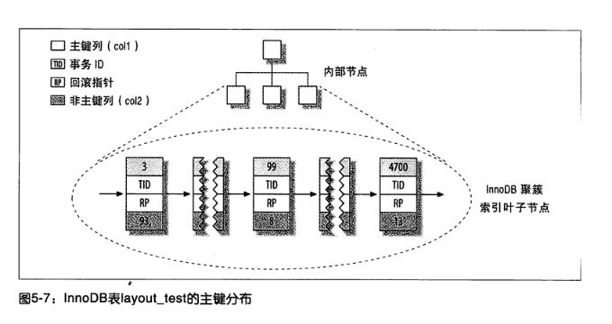
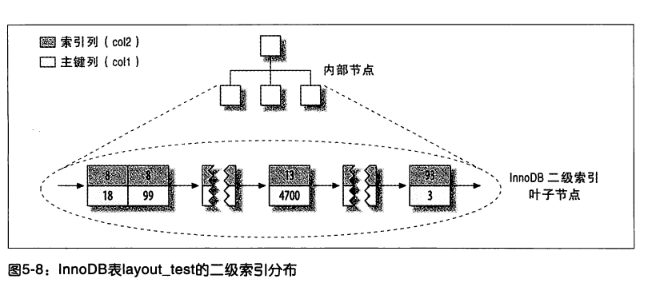

# InnoDB数据存储方式
```sql
  // 示例表
   CREATE TABLE layout_test(
       col1 int not null,
       col2 int not null,
       PRIMARY KEY(col1),
       KEY(col2)
   );
```
## 主键存储(索引组织表)
&nbsp;&nbsp;InnoDB的数据分布，因为InnoDB存储引擎支持聚簇索引，所以使用非常不同的方式存储同样的数据。如下图，InnoDB存储数据的方式:
+ 
  
  - 《高性能MySQL》 P173
  - 聚簇索引的每一个叶子节点(即每行数据)都包含了主键值，事务ID，用于事务和MVCC的回滚指针以及所有的剩余列。如果主键是一个前缀索引，InnoDB也会包含完整的主键列和剩下的其他列。

### 索引组织表
&nbsp;&nbsp;在InnoDB存储引擎中，表都是根据主键顺序阻止存放的，这种存储方式的表称为索引组织表。

&nbsp;&nbsp;在InnoDB中，每张表都有一个主键，如果在创建表时没有显示定义主键，则InnoDB会按照如下方式选择或创建主键:
1. 首先判断表中是否有非空的唯一索引，若有，则该列即为主键。
2. 若不符合条件1,则InnoDB自动创建一个6字节大小的指针。


---
## 辅助索引存储(二级索引)
&nbsp;&nbsp;InnoDB二级索引存储方式如下图:
+ 

  - InnoDB二级索引的叶子节点存储的不是“行指针”，而是主键值，并以此**作为**指向行的指针。
  - + 使用主键值当作指针会让二级索引占用更多的空间，但换来的好处是，InnoDB在移动时无需更新二级索引中的这个 "指针"


---

## 参考资料
1. 《高性能MySQL·第三版》 P166