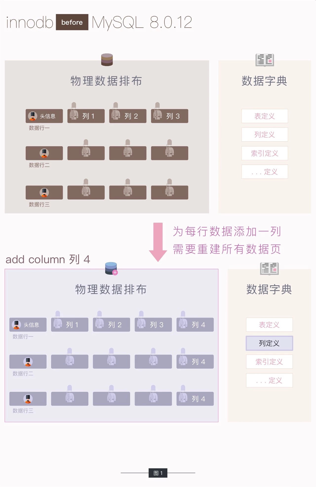

# ALGORITHM=INSTANT : MySQL 8.0: InnoDB now supports Instant ADD COLUMN
## 摘要

## 文档内容
Instant DDL has been one of the most requested InnoDB features for a very long time. With ever larger and rapidly growing datasets the ability to do DDL instantly is a must have feature in any web scale database.  Developers constantly need to add new columns to meet the constantly changing business requirements.  The ability to add ADD COLUMNs instantly is the first in a series of DDL statements that we plan to do instantly. The move to  a new transactional data dictionary in MySQL 8.0 has made this task a lot easier for us.  Prior to MySQL 8.0 the meta-data (data dictionary) was stored in flat files called .frm files. The .frm files are in  an arcane format that is long past its use by date.(很长一段时间以来，即时DDL一直是InnoDB最受欢迎的特性之一。随着越来越大和快速增长的数据集，即时做DDL的能力是任何web规模数据库必须具备的功能。开发人员需要不断地添加新的列来满足不断变化的业务需求。立即添加add COLUMNs的能力是我们计划立即执行的一系列DDL语句中的第一个。在MySQL 8.0中迁移到新的事务性数据字典使我们的任务变得容易得多。在MySQL 8.0之前，元数据(数据字典)存储在称为.frm文件的平面文件中。.frm文件是一种神秘的格式，早在使用日期之前就已经过时了。)

This INSTANT ADD COLUMN patch was contributed by the Tencent Games DBA Team. We would like to thank and acknowledge this important and timely contribution by Tencent Games.(这个INSTANT ADD COLUMN补丁由腾讯游戏DBA团队贡献。我们要感谢并感谢腾讯游戏这一重要而及时的贡献。)

### Background
MySQL 5.6 was the first release to support  INPLACE DDL. Prior to MySQL 5.6 the only way to do DDL was to COPY the rows one by one.  INPLACE DDL  is mostly handled by InnoDB while COPY row by row is handled in the server layer.  Up until 8.0 (see labs release), InnoDB used to add columns to a table by rebuilding the table even for the INPLACE DDL algorithm.(MySQL 5.6是第一个支持INPLACE DDL的版本。在MySQL 5.6之前，执行DDL的唯一方法是逐个复制行。INPLACE DDL主要由InnoDB处理，而COPY则由服务器层逐行处理。在8.0之前，InnoDB使用INPLACE DDL算法通过重建表来添加列。)
   - For large tables it can take a long time especially in a Replication setup.(对于大型表，这可能需要很长时间，特别是在复制设置中。)
   - Disk space requirements will be more than double, roughly the same size as the existing table.(磁盘空间需求将增加一倍以上，与现有表的大小大致相同。)
   - The DDL operation is resource hungry and puts a high demand on CPU, Memory and IO. This steals resources from user transactions.(DDL操作需要大量资源，对CPU、内存和IO都有很高的要求。这会从用户事务中窃取资源。)
   - If replication was involved, user may have to wait a even longer time for slave to be ready. The DDL is externalized after it completes. （如果涉及复制，slave要一直要等待到DDL的完成，才能开始同步。）

### New INSTANT algorithm
Many users have asked us about a way to avoid time consuming schema changes. This can now be achieved by (always) specifying ALGORITHM=INSTANT , this will guarantee that either the operation is done instantly or not at all. Furthermore, if ALGORITHM is not specified at all, server will first try the DEFAULT=INSTANT algorithm. If it can not be done, then server will try INPLACE algorithm; and if that can not be supported by SE, server will finally try COPY algorithm. The new syntax looks like:（许多用户向我们询问如何避免耗时的模式更改。现在可以通过(总是)指定ALGORITHM=INSTANT来实现这一点，这将保证操作要么立即完成，要么根本不执行。此外，如果根本没有指定ALGORITHM，服务器将首先尝试DEFAULT=INSTANT算法。如果无法做到，则服务器将尝试INPLACE算法;如果SE不支持，服务器最终会尝试COPY算法。新的语法看起来像:）
  ```sql
      ALTER TABLE table_name [alter_specification], ALGORITHM=INSTANT;
  ```
The benefit of the INSTANT algorithm is that only metadata changes are made in the data dictionary. There is no need to acquire metadata lock during SE changes and we don’t touch the data of the table. This change impacts the LOCK=… semantics too. There is no need to specify the LOCK for INSTANT algorihtm. With  ALGORITHM=INSTANT, LOCK can not be set to any other value  than DEFAULT, otherwise you will get  an error:（INSTANT算法的好处是只在数据字典中进行元数据更改。在SE更改期间不需要获取元数据锁，也不需要触及表的数据。这个变化也影响了LOCK=…语义。不需要为INSTANT算法指定LOCK。使用ALGORITHM=INSTANT, LOCK不能设置为除DEFAULT之外的任何值，否则会得到错误:）
```sql
   ALTER TABLE t1 ALTER COLUMN i SET DEFAULT 11, ALGORITHM=INSTANT, LOCK=NONE;
   ERROR HY000: Incorrect usage of ALGORITHM=INSTANT and LOCK=NONE/SHARED/EXCLUSIVE
   # ALGORITHM=INSTANT and LOCK=DEFAULT are OK though.
   ALTER TABLE t1 ALTER COLUMN i SET DEFAULT 13, ALGORITHM=INSTANT, LOCK=DEFAULT;
```

If you set ALGORITHM=INSTANT for any operation that cannot be done instantly you will get an error, as below. The idea here is to fail upfront and fail quickly and not do a silent conversion and switch to another algorithm behind the scenes.(如果您为任何不能立即完成的操作设置ALGORITHM=INSTANT，您将得到一个错误，如下所示。这里的想法是提前失败，快速失败，而不是做一个无声的转换，然后在幕后切换到另一个算法。)
```sql
    ALTER TABLE t1 ALTER COLUMN i SET DEFAULT 12, DROP COLUMN j, ALGORITHM=INSTANT;
    ERROR 0A000: ALGORITHM=INSTANT is not supported for this operation. Try ALGORITHM=COPY/INPLACE.
```

Currently, InnoDB supports INSTANT algorithm for these operations:（ALGORITHM=INSTANT 允许的操作）
+ Change index option
+ Rename table (in ALTER way)
+ SET/DROP DEFAULT
+ MODIFY COLUMN
+ Add/drop virtual columns
+ Add columns(non-generated) – We call this instant ADD COLUMN

You can specify more than one operation in a single statement with ALGORITHM=INSTANT.(使用ALGORITHM=INSTANT可以在一条语句中指定多个操作。)

Here are some simple examples for the operations which can be done instantly:(以下是一些可以立即完成的简单操作示例:)
```sql
    mysql> CREATE TABLE t1 (a INT, b INT, KEY(b));
    Query OK, 0 rows affected (0.70 sec)
    
    mysql> # Modify the index can be instant if it's a trivial change
    mysql> ALTER TABLE t1 DROP KEY b, ADD KEY b(b) USING BTREE, ALGORITHM = INSTANT; 
    Query OK, 0 rows affected (0.14 sec)
    Records: 0  Duplicates: 0  Warnings: 0
    
    mysql> # Rename the table through ALTER TABLE can be instant
    mysql> ALTER TABLE t1 RENAME TO t2, ALGORITHM = INSTANT;
    Query OK, 0 rows affected (0.26 sec)
    
    mysql> # SET DEFAULT to a column can be instant
    mysql> ALTER TABLE t2 ALTER COLUMN b SET DEFAULT 100, ALGORITHM = INSTANT;
    Query OK, 0 rows affected (0.09 sec)
    Records: 0  Duplicates: 0  Warnings: 0
    
    mysql> # DROP DEFAULT to a column can be instant
    mysql> ALTER TABLE t2 ALTER COLUMN b DROP DEFAULT, ALGORITHM = INSTANT;
    Query OK, 0 rows affected (0.08 sec)
    Records: 0  Duplicates: 0  Warnings: 0
    
    mysql> # MODIFY COLUMN can be instant
    mysql> ALTER TABLE t2 ADD COLUMN c ENUM('a', 'b', 'c'), ALGORITHM = INSTANT;
    Query OK, 0 rows affected (0.35 sec)
    Records: 0  Duplicates: 0  Warnings: 0
    
    mysql> ALTER TABLE t2 MODIFY COLUMN c ENUM('a', 'b', 'c', 'd', 'e'), ALGORITHM=INSTANT;
    Query OK, 0 rows affected (0.12 sec)
    Records: 0  Duplicates: 0  Warnings: 0
    
    mysql> # ADD/DROP virtual column can be instant
    mysql> ALTER TABLE t2 ADD COLUMN (d INT GENERATED ALWAYS AS (a + 1) VIRTUAL), ALGORITHM = INSTANT;
    Query OK, 0 rows affected (0.38 sec)
    Records: 0  Duplicates: 0  Warnings: 0
    
    mysql> ALTER TABLE t2 DROP COLUMN d, ALGORITHM = INSTANT;
    Query OK, 0 rows affected (0.40 sec)
    Records: 0  Duplicates: 0  Warnings: 0
    
    mysql> # Do two operations instantly in the same statement
    mysql> ALTER TABLE t2 ALTER COLUMN a SET DEFAULT 20, ALTER COLUMN b SET DEFAULT 200, ALGORITHM = INSTANT;
    Query OK, 0 rows affected (0.20 sec)
    Records: 0  Duplicates: 0  Warnings: 0
    
    mysql> DROP TABLE t2;
    Query OK, 0 rows affected (0.36 sec)
```

### How does it work?
The problem we face is  how to parse the physical record on a page once the metadata changes after an instant ADD COLUMN? Note that the physical record here means the record stored in the leaf pages of a clustered index. Existing secondary indexes and even the non-leaf pages (internal nodes of the B-Tree) of the clustered index are not impacted.(我们面临的问题是，一旦元数据在ADD COLUMN之后发生变化，如何解析页面上的物理记录?注意，这里的物理记录是指存储在聚集索引的叶页中的记录。现有的二级索引甚至聚集索引的非叶页(B-Tree的内部节点)都不受影响。)

InnoDB has two main row formats,  the redundant and compact row formats. The row format dynamic is a minor variant of compact. The compact and its derived row formats removed some of the meta data from the redundant row format, to save space. Due to this “space saving” change we always need to lookup the meta-data from the internal meta-data structures when we have to deserialise the data in the physical rows on a page. To make instant add column work  we need to add some metadata to the physical record on a page for DYNAMIC and COMPACT row formats. This additional meta-data not required for the REDUNDANT row format because the number of columns is already stored in the physical record.(InnoDB有两种主要的行格式:冗余行格式和紧凑行格式。动态行格式是compact的一个小变体。紧凑及其派生的行格式从冗余行格式中删除了一些元数据，以节省空间。由于这种“节省空间”的变化，当我们必须对页面上物理行的数据进行反序列化时，我们总是需要从内部元数据结构中查找元数据。为了使即时添加列工作，我们需要为DYNAMIC和COMPACT行格式的页面上的物理记录添加一些元数据。冗余行格式不需要这个额外的元数据，因为列的数量已经存储在物理记录中。)

The  extra information is kept in the physical record along with some meta-data  in the data dictionary.  This is very different to some of the downstream hacks based on the same Tencent patch that store similar meta-data in obscure and unused parts of the tablespace. We think that storing the meta-data in the appropriate data dictionary tables and making it transactionally consistent makes it more robust and is a more natural fit. This new metadata is stored in the physical record. This new meta-data  includes a flag that is stored in info_bits. This new information in the info_bits  is used to track if the record was created after first instant ADD COLUMN or not. We also use info_bits to track the number of fields/columns in the physical record. The number of columns when the table undergoes first instant ADD COLUMN and all default value of newly added columns are stored in the data dictionary. These two pieces of information are stored in se_private_data column of the data dictionary tables.(额外的信息与数据字典中的一些元数据一起保存在物理记录中。这与一些基于腾讯补丁的下游黑客非常不同，后者将类似的元数据存储在表空间的模糊和未使用的部分。我们认为将元数据存储在适当的数据字典表中，并使其在事务上保持一致，可以使其更健壮，更自然。这个新的元数据存储在物理记录中。这个新的元数据包含一个存储在info_bits中的标志。info_bits中的新信息用于跟踪记录是否在第一个即时ADD COLUMN之后创建。我们还使用info_bits来跟踪物理记录中的字段/列的数量。表第一次进行即时ADD COLUMN操作时的列数以及所有新添加列的默认值都存储在数据字典中。这两条信息存储在数据字典表的se_private_data列中。)

With this extra information, it’s now possible for the ADD COLUMN operation to be executed instantly, without modifying any of the rows in the table. If there is no instant ADD COLUMN then all rows in a table will be in the same format as before. After an instant ADD COLUMN is issued, any update to the table will write rows in the new format along. The default values if any are looked up from the data dictionary.(有了这些额外的信息，现在可以立即执行ADD COLUMN操作，而不修改表中的任何行。如果没有即时ADD COLUMN，那么表中的所有行将采用与以前相同的格式。在发出即时ADD COLUMN之后，对表的任何更新都将以新格式写入行。如果有默认值，则从数据字典中查找。)

In every instant ADD COLUMN, the default value of the newly added columns is  tracked separately. The default value of these columns can be changed at any time.  Therefore both the number of instant columns and default values can be discarded after the table gets rebuilt or truncated, furthermore, the rows in the table can be changed into old format as before. If the table is a partitioned table, then it’s possible that different partitions have different number of instant columns, and require different number of default values. If some partitions get rebuilt, truncated or re-created, the rows in the partition can be changed into old format as before too.(在每个即时ADD COLUMN中，将单独跟踪新添加列的默认值。这些列的默认值可以随时更改。因此，在表被重建或截断后，即时列的数量和默认值都可以被丢弃，此外，表中的行可以像以前一样更改为旧格式。如果表是一个分区表，那么不同的分区可能有不同数量的即时列，并且需要不同数量的默认值。如果重新构建、截断或重新创建某些分区，分区中的行也可以像以前一样更改为旧格式。)

### How to observe
User can observe the result of instant ADD COLUMN via views from information_schema. More specifically, some new fields are added to I_S.innodb_tables and I_S.innodb_columns. Please note that for other operations which can be done instantly, there is no need to provide new status for observation. Please see example below:(用户可以通过来自information_schema的视图来观察即时添加列的结果。更具体地说，一些新字段被添加到I_S.innodb_tables和I_S.innodb_columns。请注意，对于其他可以立即进行的操作，无需提供新的状态以供观察。请看下面的例子:)
```sql
   mysql> CREATE TABLE t1 (a INT, b INT);
   Query OK, 0 rows affected (0.06 sec)
   
   mysql> SELECT table_id, name, instant_cols FROM information_schema.innodb_tables WHERE name LIKE '%t1%';
   +----------+---------+--------------+
   | table_id | name    | instant_cols |
   +----------+---------+--------------+
   |     1065 | test/t1 |            0 |
   +----------+---------+--------------+
   1 row in set (0.22 sec)
   
   mysql> SELECT table_id, name, has_default, default_value FROM information_schema.innodb_columns WHERE table_id = 1065;
   +----------+------+-------------+---------------+
   | table_id | name | has_default | default_value |
   +----------+------+-------------+---------------+
   |     1065 | a    |           0 | NULL          |
   |     1065 | b    |           0 | NULL          |
   +----------+------+-------------+---------------+
   2 rows in set (0.38 sec)
     
```

As we can see, a new column called ‘instant_cols’ which represents the number of instant columns is introduced in innodb_tables, while two new columns about the default value called ‘has_default’ and ‘default_value’ are introduced in innodb_columns.(正如我们所看到的，innodb_tables中增加了一个名为“instant_cols”的新列，它代表了即时列的数量，而innodb_columns中增加了两个关于默认值的新列，名为“has_default”和“default_value”。)
```sql
    mysql> ALTER TABLE t1 ADD COLUMN c INT, ADD COLUMN d INT DEFAULT 1000, ALGORITHM=INSTANT;
    Query OK, 0 rows affected (0.07 sec)
    Records: 0  Duplicates: 0  Warnings: 0
    
    mysql> SELECT table_id, name, instant_cols FROM information_schema.innodb_tables WHERE name LIKE '%t1%';
    +----------+---------+--------------+
    | table_id | name    | instant_cols |
    +----------+---------+--------------+
    |     1065 | test/t1 |            2 |
    +----------+---------+--------------+
    1 row in set (0.03 sec)
    
    mysql> SELECT table_id, name, has_default, default_value FROM information_schema.innodb_columns WHERE table_id = 1065;
    +----------+------+-------------+---------------+
    | table_id | name | has_default | default_value |
    +----------+------+-------------+---------------+
    |     1065 | a    |           0 | NULL          |
    |     1065 | b    |           0 | NULL          |
    |     1065 | c    |           1 | NULL          |
    |     1065 | d    |           1 | 800003e8      |
    +----------+------+-------------+---------------+
    4 rows in set (0.36 sec)
```

Note that the table_id didn’t change. It’s not a rebuild of the table any more! And as we can see the ‘instant_cols’ is now set to 2, this  means that there are column a and column b in the table when the first instant ADD COLUMN happens. The default values of column c and d are remembered in the innodb_columns. The User can now know if a column is added instantly if the has_default is 1. Also if ‘has_default’ is 1, the default value of this column is stored in ‘default_value’ field. The default_value of d is set to the internal binary format of the value 1000.(注意，table_id没有改变。它不再是重建表了!正如我们所看到的，' instant_cols '现在被设置为2，这意味着当第一个即时ADD列发生时，表中有列a和列b。列c和d的默认值被保存在innodb_columns中。如果has_default为1，用户现在可以知道是否立即添加了一个列。此外，如果' has_default '为1，则该列的默认值存储在' default_value '字段中。d的default_value被设置为值1000的内部二进制格式。)
```sql
    mysql> ALTER TABLE t1 ADD COLUMN e VARCHAR(100) DEFAULT 'Hello MySQL!';
    Query OK, 0 rows affected (0.06 sec)
    Records: 0  Duplicates: 0  Warnings: 0
    
    mysql> SELECT table_id, name, instant_cols FROM information_schema.innodb_tables WHERE name LIKE '%t1%';
    +----------+---------+--------------+
    | table_id | name    | instant_cols |
    +----------+---------+--------------+
    |     1065 | test/t1 |            2 |
    +----------+---------+--------------+
    1 row in set (0.03 sec)
    
    mysql> SELECT table_id, name, has_default, default_value FROM information_schema.innodb_columns WHERE table_id = 1065;
    +----------+------+-------------+--------------------------+
    | table_id | name | has_default | default_value            |
    +----------+------+-------------+--------------------------+
    |     1065 | a    |           0 | NULL                     |
    |     1065 | b    |           0 | NULL                     |
    |     1065 | c    |           1 | NULL                     |
    |     1065 | d    |           1 | 800003e8                 |
    |     1065 | e    |           1 | 48656c6c6f204d7953514c21 |
    +----------+------+-------------+--------------------------+
    5 rows in set (0.36 sec)
```

After another instant ADD COLUMN, again the table_id didn’t change. The ‘instant_cols’ won’t change, and default values of column e is also remembered.(在另一个ADD COLUMN之后，table_id仍然没有改变。' instant_cols '不会改变，列e的默认值也会被记住。)

### Side effects and trade offs (副作用和权衡)
Since the instant ADD COLUMN won’t rebuild the table any more, so there are some side effects:(由于即时ADD列将不再重建表，所以有一些副作用:)
- In older versions the row size would have been be checked upfront, and so the ADD COLUMN will have failed at the start. However, with the new instant ADD COLUMN, row size will only be checked by future updates to the rows.(在旧版本中，行大小将被预先检查，因此ADD COLUMN将在开始时失败。但是，使用新的即时ADD COLUMN，行大小将仅在将来对行进行更新时检查。)
- In earlier versions, if the table or index was corrupted, it was possible to ‘fix’ things by rebuilding the table. With instant ADD COLUMN it is more challenging and we are looking at ways to mitigate this.(在早期版本中，如果表或索引损坏，可以通过重建表来“修复”问题。使用即时添加列，它更具挑战性，我们正在寻找减轻这种情况的方法。)


## 图示原理
### MySQL8.0.12 之前: 添加一列需要重建所有数据页

## 参考资料
1. [https://dev.mysql.com/blog-archive/mysql-8-0-innodb-now-supports-instant-add-column/](https://dev.mysql.com/blog-archive/mysql-8-0-innodb-now-supports-instant-add-column/)