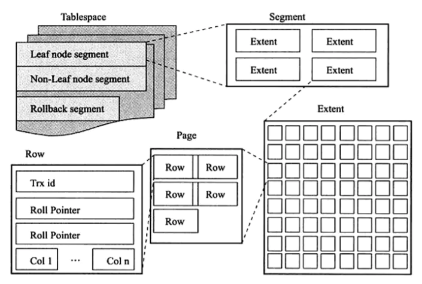
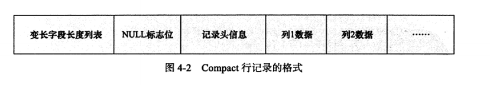

# InnoDB的逻辑存储结构
&nbsp;&nbsp;从InnoDB的逻辑存储结构来看，所有数据都被逻辑地存放在一个空间中，称为表空间。表空间又由段(segment)、区(extent)、页(page)组成。InnoDB的逻辑存储结构如下:


## 表空间<sup>可先浏览: [003.MySQL事务/006.InnoDB事务日志/003.Double-Write.md#表空间简记](../../003.MySQL事务/006.InnoDB事务日志/003.Double-Write.md) 获取独立表空间&&共享表空间概念</sup>
&nbsp;&nbsp;如果开启了innodb_file_per_table参数，则每张表的表空间内存放的只是数据、索引和插入缓存BitMap页，其他类的信息，如回滚(undo)信息，插入缓存索引页，系统事务信息，Double write buffer等还是存放在原来的共享表空间内<sup><font color="red">可以打开MySQL的调试，观察数据库系统文件夹: 001.SOURCE_CODE/build/000.build-scripts/data</font></sup>
- 所以，即使开启了innodb_file_per_table,共享表空间还是会不断的增大。

## 段
&nbsp;&nbsp;表空间由各个段组成，常见的段有数据段，索引段，回滚段等。

&nbsp;&nbsp;InnoDB存储引擎表是索引组织表,因此数据即索引，索引即数据。即: 
+ 数据段即B+树的叶子节点(Leaf node segment)
+ 索引段即为B+树的非索引节点(Non-Leaf node segment)
+ 回滚段:
  > 这些段是帮助理解逻辑存储的重要部分

## 区
&nbsp;&nbsp;区是由连续页组成的空间，<font color="red">**在任何情况下(即不论页的大小怎么变化)，每个区的大小都为1MB**</font>。为了保证区中的页的连续性，InnoDB会一次性从磁盘申请4~5个区。在默认的情况下，InnoDB存储引擎的页大小为16KB，即一个区中一共有64个连续的页。


## 页（或称为块）
&nbsp;&nbsp;<font color="red">**页是InnoDB磁盘管理的最小单位**</font>，在InnoDB存储引擎中，默认每个页的大小：16KB，从InnoDB1.2.x开始，可以通过参数innodb_page_size将页的大小设置为4K、8K、16K。若设置完成，则所有表中页的大小都为innodb_page_size,不可以对其再次进行修改。

&nbsp;&nbsp;InnoDB中常见的页:
- 数据页
- undo页
- 系统页
- 事务数据页
- 插入缓冲位图页
- 插入缓冲空闲列表页
- 未压缩的二进制大对象页
- 压缩的二进制大对象页

## 行
&nbsp;&nbsp;InnoDB是面向列的(row-oriented),即数据是按行进行存放的。每个页存放的行记录也是有硬性定义的，最多存放 (16KB / 2) - 200 行的记录，即7992 ( (16KB * 1024 / 2) -200) 行记录。

### InnoDB行记录格式
&nbsp;&nbsp;InnoDB提供了Compact 和 Redundant两种格式来存放行记录数据。Redundant是为了兼容之前版本而保留的
```txt
     mysql> SHOW TABLE STATUS LIKE 'people' \G
     *************************** 1. row ***************************
                Name: people
              Engine: InnoDB
             Version: 10
          Row_format: Dynamic # 该表的行的格式为 Dynamic
                Rows: 2
      Avg_row_length: 8192
         Data_length: 16384
     Max_data_length: 0
        Index_length: 0
           Data_free: 0
      Auto_increment: 5
         Create_time: 2022-03-19 01:30:02
         Update_time: NULL
          Check_time: NULL
           Collation: latin1_swedish_ci
            Checksum: NULL
      Create_options: 
             Comment: 
     1 row in set (0.00 sec)

```

#### Compact 行记录格式
&nbsp;&nbsp;MySQL5.0引入的。一个页中存放的行数据越多，其性能就越高。


&nbsp;&nbsp;如上图，Compact行记录格式：
1. 首部是一个**非NULL**变长长度列表<sup>每个varchar字段的长度均会在此描述他的长度</sup>，按照列的顺序逆序放置，长度<sup>单个varchar字段的长度</sup>为:
   - 若列的长度小于255字节，则用1字节表示;
   - 若列长度大于255字节，用2字节表示;
2. NULL标识位: 指示该行数据是否有NULL值，有则用1表示，该部分占用1字节。
3. 记录头信息，固定占用5字节。信息如下:
   |名称|大小(bit)|描述|
   |---|---|---|
   |() |1  |未知|
   |() |1  |未知|
   |deleted_flag |1  |该行是否已经被删除|
   |min_rec_flag |1  |为1,如果该记录时预先被定义为最小的记录|
   |n_owned |4  |该记录拥有的记录数|
   |heap_no |13 |索引堆中该条记录的排序记录|
   |record_type |3  |记录类型，000表示普通;001 表示B+树节点指针;010表示Infimum;011表示Supermum,1xx表示保留|
   |next_record |16  |页中下一条记录的相对位置|
4. 实际存储的每个列的数据，注意：
   - NULL不占该部分任何空间<sub>除了标识位占用空间外，实际存储不占任何空间</sub>
   - <font color="red">**隐藏列**</font><sup>重要，实现MVCC和一致性非锁定读的核心</sup>
      1. 事务ID列（6字节）
      2. 回滚指针（7字节）
      3. rowid (InnoDB表没有定义主键时会自动加上)

##### 瞧一下(数据是如何存储的)
```txt
  # 数据准备
  mysql: [Warning] Using a password on the command line interface can be insecure.
  Welcome to the MySQL monitor.  Commands end with ; or \g.
  Your MySQL connection id is 8
  Server version: 8.0.30-debug Source distribution
  
  Copyright (c) 2000, 2022, Oracle and/or its affiliates.
  
  Oracle is a registered trademark of Oracle Corporation and/or its
  affiliates. Other names may be trademarks of their respective
  owners.
  
  Type 'help;' or '\h' for help. Type '\c' to clear the current input statement.
  
  mysql> use stu;
  Reading table information for completion of table and column names
  You can turn off this feature to get a quicker startup with -A
  
  Database changed
  mysql> create table mytest(
      -> t1 varchar(10),
      -> t2 varchar(10),
      -> t3 char(10),
      -> t4 varchar(10)
      -> ) engine = innodb charset=LATIN1 ROW_FORRMAT=COMPACT;
  Query OK, 0 rows affected (0.09 sec)
  
  mysql> insert INTO mytest values('a','bb','bb','ccc');
  Query OK, 1 row affected (0.02 sec)
  
  mysql> insert INTO mytest values('d','ee','ee','fff');
  Query OK, 1 row affected (0.02 sec)
  
  mysql> insert INTO mytest values('d',NULL,NULL,'fff');
  Query OK, 1 row affected (0.01 sec)
  
  mysql> insert INTO mytest values('d','ee','ee','fff');
  Query OK, 1 row affected (0.01 sec)
  
  mysql> insert INTO mytest values('d',NULL,NULL,'fff');
  Query OK, 1 row affected (0.02 sec)

  # 测试
    hexdump -C -v mytest.ibd > mytest.txt
    > 二进制内容转为16进制查看(Linux: man hexdump)
    
    部分内容如下:
    00010070  73 75 70 72 65 6d 75 6d  03 02 01 00 00 00 10 00  |supremum........|
    00010080  2c 00 00 00 00 02 00 00  00 00 00 27 18 82 00 00  |,..........'....|
    00010090  01 0b 01 10 61 62 62 62  62 20 20 20 20 20 20 20  |....abbbb       |
    000100a0  20 63 63 63 03 02 01 00  00 00 18 00 2b 00 00 00  | ccc........+...|
    000100b0  00 02 01 00 00 00 00 27  19 81 00 00 01 08 01 10  |.......'........|
    000100c0  64 65 65 65 65 20 20 20  20 20 20 20 20 66 66 66  |deeee        fff|
    000100d0  03 01 06 00 00 20 00 20  00 00 00 00 02 02 00 00  |..... . ........|
    000100e0  00 00 27 1e 82 00 00 01  1d 01 10 64 66 66 66 03  |..'........dfff.|
    000100f0  02 01 00 00 00 28 00 2b  00 00 00 00 03 00 00 00  |.....(.+........|
    00010100  00 00 29 11 82 00 00 01  09 01 10 64 65 65 65 65  |..)........deeee|
    00010110  20 20 20 20 20 20 20 20  66 66 66 03 01 06 00 00  |        fff.....|
    00010120  30 ff 4d 00 00 00 00 03  01 00 00 00 00 29 12 81  |0.M..........)..|
    00010130  00 00 01 05 01 10 64 66  66 66 00 00 00 00 00 00  |......dfff......|
    00010140  00 00 00 00 00 00 00 00  00 00 00 00 00 00 00 00  |................|
    00010150  00 00 00 00 00 00 00 00  00 00 00 00 00 00 00 00  |................|
    00010160  00 00 00 00 00 00 00 00  00 00 00 00 00 00 00 00  |................|
    00010170  00 00 00 00 00 00 00 00  00 00 00 00 00 00 00 00  |................|

    第一行数据从0x00010078开始，整理如下:
    03 02 01                   // 非NULL变长字段长度列表，逆序。注意，是非NULL
    00                         // NULL标识位，第一行没有NULL值
    00 00 10 00 2c             // Record Header,固定5字节长度
    00 00 00 00 02 00          // RowID InnoDB自动创建，6字节
    00 00 00 00 27 18          // TransactionID , 6字节
    82 00 00 01 0b 01 10       // Roll Pointer , 7字节
    61                         // 列1数据 ‘a’
    62 62                      // 列2数据'bb'
    62 62 20 20 20 20 20 20 20 20  // 列3数据 'bb' , 固定长度CHAR字段在未完全占用其长度空间时，会用0x20(空格ascii码值为0x20,即十进制32)来进行填充
    63 63 63                // 列4数据 'ccc'

   第二行数据: 从记录头可知，第二行数据从0x00010080(next_record的地址哦!!!) + 0x002c = 0x000100AC(下一行记录的next_record地址),即:
   03 02 01                    // 非NULL变长字段长度列表，逆序。注意，是非NULL
   00                          // NULL标识位，第二行没有NULL值，为0
   00 00 18 00 2b              // Record Header,固定5字节长度
   00 00 00 00 02 01           // RowID InnoDB自动创建，6字节
   00 00 00 00 27 19           // TransactionID , 6字节
   81 00 00 01 08 01 10        // Roll Pointer , 7字节
   64                          // 列1数据 ‘d’
   65 65                       // 列2数据 'ee'
   65 65 20 20 20 20 20 20 20 20 // 列3数据 ‘ee’
   66 66 66                   // 列4数据 'fff'
  
  第三行数据： 从第二行记录头可以得知，第三行数据从 0x000100AC(next_record的地址哦) + 0x002b = 0x000100D7(下一行记录的next_record地址)
  03 01                       // 非NULL变长字段长度列表，逆序。注意，是非NULL，变长字段有两个为非NULL，因此，这里使用两位表示.
  06                          // NULL标识位，第三行有NULL值.0x06转换为二进制为00000110,为1的值代表第2,3列的数据为NULL
  00 00 20 00 20              //Record Header,固定5字节长度
  00 00 00 00 02 02           // RowID InnoDB自动创建，6字节. 通过这几条数据可以看到，rowID是自增的
  00 00 00 00 27 1e           // TransactionID , 6字节
  82 00 00 01 1d 01 10        // Roll Pointer , 7字节
  64            // 列1数据 'd'
  66 66 66      // 列4数据 'fff'
  // 发现，存储列数据部分并没有存储NULL列，因此，不论是CHAR还是VARCHAR类型，在compact格式下，NULL都不占任何存储空间。

  // 简单计算一下第四行数据next_record的地址: 0x000100D7 + 0x20 = 0x000100F7 , 余下的可以自己推导
```

##### 再总结一下(从宏观角度理解数据的存储方式:Compact 行格式)
&nbsp;&nbsp;关键理解next_record的功能<sup><font color="red">是如何辅助形成单链表的</font></sup>：
+ next_record: 它表示当前记录的真实数据下一条记录的真实数据的的地址偏移量。比方说说第一条记录的next_record值为36，意味着下一条记录的真实数据的地址向后找36个字节便是下一条记录的真实数据。这就是一个链表，可以通过它找到下一条记录。但是需要注意是的：下一条记录指的并不是按照我们插入顺序的下一条记录，而是按照主键由大到小的顺序的下一条记录。而且规定最小记录的下一条记录就是本页中主键值的最小记录，而本页中主键值最大的记录的下一条记录记录的就是最大记录。如下图
```txt
   +---+-----------+---+
   |   |next_record|   | (最小记录)  ->
   +---+-----------+---+
            |   (向下剪头，指向下一条记录的next_record)，抽象指向，即： 下一行记录的next_record地址 = 本行next_record地址 + next_record值(偏移量)
            v
   +---+-----------+---+
   |   |next_record|   | (第一条记录)
   +---+-----------+---+
            |   (向下剪头，指向下一条记录的next_record)
            v
   +---+-----------+---+
   |   |next_record|   | (第二条记录)
   +---+-----------+---+
            |   (向下剪头，指向下一条记录的next_record)
            v
   +---+-----------+---+
   |   |next_record|   | (最大记录，next_record为0，即：最大值没有下一条记录，它是单链表中的最后一条记录)
   +---+-----------+---+

   // 从上面抽象的图来看，最终存储是形成一个单链表的形式的
```

---

#### Redundant 行记录格式
&nbsp;&nbsp;为了兼容MySQL5.0之前的版本的页格式。

#### 行溢出数据
&nbsp;&nbsp;InnoDB存储引擎可以将一条记录中的某些数据存储在真正的数据页面之外： 一般认为BLOB,LOB这样的大对象列类型的存储会把数据存放在数据页面之外，但是，BLOB可以不将数据放在溢出页面，而且即便是VARCHAR列数据类型依然有可能被存放为行溢出数据。
##### 关于VARCHAR
```txt
    # latin1 单字节字符集

    # VARCHAR 最大长度并不是65535
    mysql> create table test(
    -> a varchar(65535) 
    -> )  charset=latin1 engine=innodb;
    ERROR 1118 (42000): Row size too large. The maximum row size for the used table type, not counting BLOBs, is 65535. This includes storage overhead, check the manual. You have to change some columns to TEXT or BLOBs

   # 长度为65532时表创建成功。
   mysql> create table test( a varchar(65532) )  charset=latin1 engine=innodb;
   Query OK, 0 rows affected (0.03 sec)
   ## 这里为什么是65532(多了一个" NOT NULL "),之所以是65532(超过255个字节，则用2字节表示长度，反之，使用一个字节表示长度即可),是因为NULL标志位的存储(NULL 标志位指示该行数据中是否有NULL值)
   mysql> create table test1( a varchar(65533) not null )  charset=latin1 engine=innodb;
   Query OK, 0 rows affected (0.02 sec)


   # 如下描述，行大小最大值为65535字节，而VARCHAR(N),这里的N表示的是该字段字符数量(在实际存储是，记录的还是使用的字节数，包括CHAR)。如果列的长度总长超过该值，则表依然无法创建.如下:
     mysql> create table test3(
         a varchar(20000) not null,
         b varchar(20000) not null ,
         c varchar(20000) not null ,
         d varchar(20000) not null )  charset=latin1 engine=innodb;
      ERROR 1118 (42000): Row size too large. The maximum row size for the used table type, not counting BLOBs, is 65535. This includes storage overhead, check the manual. You have to change some columns to TEXT or BLOBs

      InnoDB数据页的大小为16KB，即16384个字节，怎么能存放65532字节呢?因此，在一般情况下，InnoDB存储引擎的数据都是存储在页类型为B-Tree Node中。但是发生行溢出时，数据存放在页类型为Uncompress BLOB页中。
      > 数据都是存放在Uncompress BLOB 页中，那么数据页中又存放了什么数据呢?
      >> 数据页存放的是varchar(65532)的前768字节的前缀数据，之后的偏移量，指向行溢出页


   # 行&&列的限制: https://dev.mysql.com/doc/refman/5.7/en/column-count-limit.html
   # Row Size Limits
    The maximum row size for a given table is determined by several factors:
    给定表的最大行大小由如下几个因素决定:
      The internal(内部的) representation(代表) of a MySQL table has a maximum row size limit of 65,535 bytes, even if the storage engine is capable(有能力的，允许的) of supporting larger rows. BLOB and TEXT columns only contribute(捐助，促成) 9 to 12 bytes toward the row size limit because their contents are stored separately(单独地) from the rest of the row.
      # 即使存储引擎支持更大的行，MySQL内部表示最大的行的大小为65535字节。 BLOB and TEXT也仅占用9 ~ 12字节，因为这个限制，他的内容和其他部分是分开存储的。
      
      The maximum row size for an InnoDB table, which applies(申请，应用) to data stored locally within a database page, is slightly(稍微) less than half a page for 4KB, 8KB, 16KB, and 32KB innodb_page_size settings. For example, the maximum row size is slightly less than 8KB for the default 16KB InnoDB page size. For 64KB pages, the maximum row size is slightly less than 16KB. See Section 14.23, “InnoDB Limits”.
      # 对于4KB, 8KB, 16KB, and 32KB 的innodb_page_size设置，存储在本地数据库页中的，InnoDB中表最大行应略小于页大小的一半。例如: 对于16KB的页，最大行应略小于8KB；对于64KB的页，最大行的大小应略小于16KB;
      
      If a row containing variable-length columns exceeds the InnoDB maximum row size, InnoDB selects variable-length columns for external(外部的) off-page storage until the row fits within the InnoDB row size limit. The amount of data stored locally for variable-length columns that are stored off-page differs by row format. For more information, see Section 14.11, “InnoDB Row Formats”.
      # 如果一条记录包含了可变长度的字段，且超过了InnoDB行的最大值.InnoDB将可变长度的列放到外部页面存储，直到这条记录的大小在InnoDB行大小限制内。在额外的页存储的可变长度的列的数据量因行格式而不同。
```

#### Compressed 和 Dynamic 行记录格式
&nbsp;&nbsp;InnoDB1.0.x版本开始引入新的文件格式，以前支持的Compact 和 Redundant 称为Antelope 文件格式，新的文件格式称为Barracuda文件格式。Barracude文件格式下拥有两种新的行记录格式:
- Compressed 
- Dynamic

&nbsp;&nbsp;新的两种行记录格式对于存放在BLOB页中的数据采用了完全行溢出的方式，如下图:
- 
- ```txt
     在数据页中只存放了20个字节的指针，实际的数据存放在Off Page中，而之前的Compact 和 Redundant 两种格式会存放768个前缀字节.

     Compressed 行记录格式的另外一个功能： 存储在其中的行数据会以zlib算法进行压缩，因此对于BLOB、TEXT、VARCHAR 这类大长度类型的数据能够进行非常有效的存储。

     >> InnoDB行格式: https://dev.mysql.com/doc/refman/5.7/en/innodb-row-format.html#innodb-row-format-compressed

     <<< Dynamic 行格式与Compact 行格式几乎一致，不同在于行溢出的处理方式。
     <<< COMPRESSED行格式提供与DYNAMIC行格式相同的存储特性和功能，但增加了对表和索引数据压缩的支持。
     <<<<< COMPRESSED 对写入有较大影响，使CPU负载和使用率更高对于读取影响不大。但节省磁盘
  ```
- 