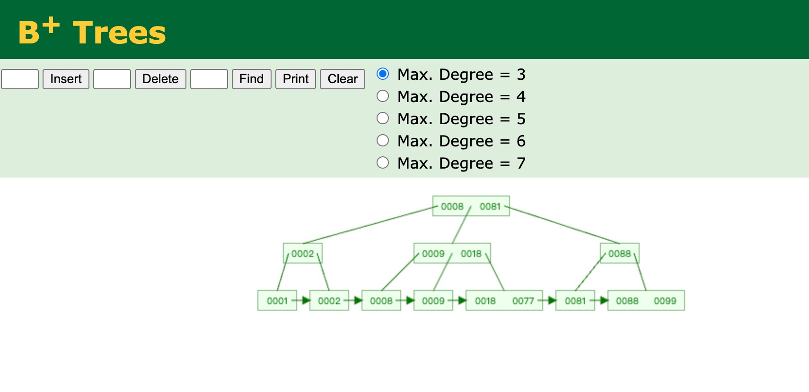
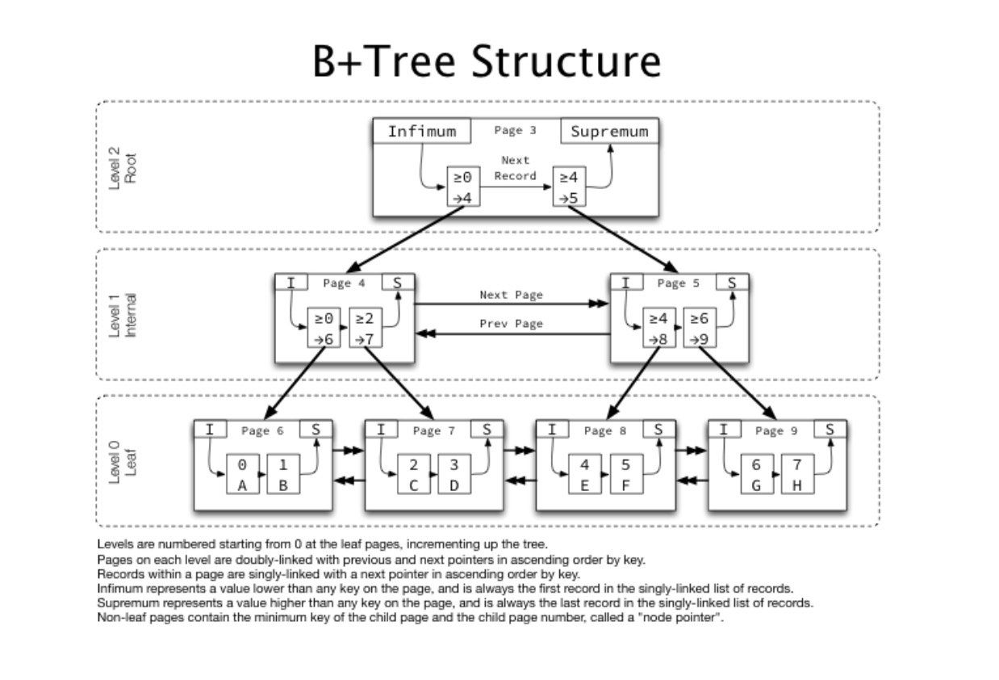

# InnoDB-Page-Structure
> 阅读:  [MySQL Technical Insider-InnoDB Engine#4.4　InnoDB数据页结构](../../../007.参考资料/MySQL%20Technical%20Insider-InnoDB%20Engine.epub)   [Berries-Kernel/001.UNIX-DOCS/033.文件系统]

## 尝试从源码分析InnoDB数据页结构
|类型|源码|备注|
|-|-|-|
|查找过程 (Search)|- page_cur_search_with_match:[mysql-server-8.4.0-LTS/storage/innobase/page/page0cur.cc]|-|
|-|-|-|
|File Header定义|- [mysql-server-8.4.0-LTS/storage/innobase/include/fil0types.h]|- 借助 [MySQL Technical Insider-InnoDB Engine#4.4　InnoDB数据页结构](../../../007.参考资料/MySQL%20Technical%20Insider-InnoDB%20Engine.epub) 理解|
|-|-|-|
|Page Header定义|- [mysql-server-8.4.0-LTS/storage/innobase/include/page0types.h]|- 借助 [MySQL Technical Insider-InnoDB Engine#4.4　InnoDB数据页结构](../../../007.参考资料/MySQL%20Technical%20Insider-InnoDB%20Engine.epub) 理解|

## B+树结构
- 

### Innodb 中的B+Tree
- 

## 参考资料
- https://blog.jcole.us/2013/01/10/btree-index-structures-in-innodb/
- https://blog.jcole.us/2013/01/03/the-basics-of-innodb-space-file-layout/
- https://blog.jcole.us/2013/01/07/the-physical-structure-of-innodb-index-pages/
- https://blog.jcole.us/2013/01/03/the-basics-of-innodb-space-file-layout/
- https://blog.jcole.us/category/mysql/innodb/page/3/
- https://smartkeyerror.oss-cn-shenzhen.aliyuncs.com/Psyduck/MySQL/InnoDB-Page.pdf
- https://blog.jcole.us/2013/01/07/the-physical-structure-of-innodb-index-pages/
- https://dev.mysqlserver.cn/doc/refman/8.4/en/innodb-file-space.html
- https://bbs.huaweicloud.com/blogs/442878
- [数据结构可视化工具:Data Structure Visualizations](https://www.cs.usfca.edu/~galles/visualization/BPlusTree.html)