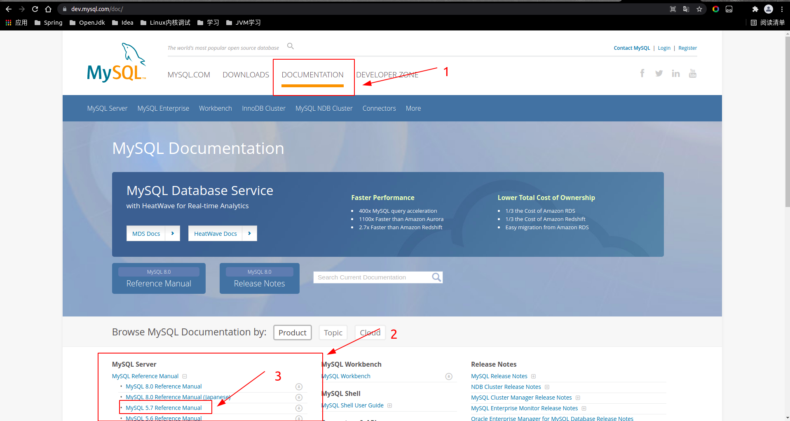

# MySQL学习笔记
&nbsp;&nbsp;打好基本功.书本为主，官方文档、实验为辅

&nbsp;&nbsp;最好的文档: 官方文档: [https://dev.mysql.com/doc/](https://dev.mysql.com/doc/)
- 

## 存储引擎
### 1. InnoDB
&nbsp;&nbsp;InnoDB只聚集在同一个页面中的记录，包含相邻键值的页面可能会相距甚远(通过双向链表访问)
  - 摘自《高性能MySQL 第三版》 P169

### 顺序IO与随机IO
&nbsp;&nbsp; 顺序IO要比随机IO快得多

### B+树的节点大小和页的关系
&nbsp;&nbsp; 当节点越小(如 包含的键值少(如单列索引相对于多列索引来说节点所占内存较小))，那么理论上一个页能存放的记录应该更多，那么遍历的更快，查询优化器也可能选择这个占内存小的索引