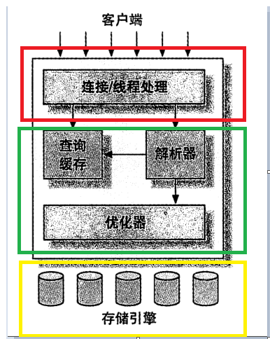

# MySQL学习笔记
&nbsp;&nbsp;打好基本功.书本为主，官方文档、实验为辅

&nbsp;&nbsp;最好的文档: 官方文档: [https://dev.mysql.com/doc/](https://dev.mysql.com/doc/)
- 

---

## MySQL逻辑架构
&nbsp;&nbsp;MySQL逻辑架构，如下为MySQL逻辑架构图:

### 分层说明
#### 第一层：Server层(服务层)
&nbsp;&nbsp;该层服务并不是MySQL特有，大多数基于网络的客户端/服务端的工具或者服务都有类似的架构。比如连接处理、授权认证、安全等

#### 第二层：核心服务层
&nbsp;&nbsp;大多数MySQL的核心服务都在这一层，包括查询解析、分析、优化、缓存以及所有的内置函数(如日期，时间，数学和加密函数)，所有跨存储引擎的功能都在这一层实现：存储过程、触发器、视图等

#### 第三层：存储引擎层 
&nbsp;&nbsp; 存储引擎负责MySQL中数据的存储和读取。server通过API与存储引擎进行通信，这些接口屏蔽了不同存储引擎之间的差异，使得这些差异对上层的查询过程透明。存储引擎API包含几十个底层函数，用于执行诸如： 开始一个事务、根据主键提取一行记录等操作。但存储引擎不会解析SQL，不同存储引擎之间也不会相互通信，而只是简单地响应上层(server层)等请求

---

## 存储引擎
### 1. InnoDB
&nbsp;&nbsp;InnoDB只聚集在同一个页面中的记录，包含相邻键值的页面可能会相距甚远(通过双向链表访问)
  - 摘自《高性能MySQL 第三版》 P169

### 顺序IO与随机IO
&nbsp;&nbsp; 顺序IO要比随机IO快得多

### B+树的节点大小和页的关系
&nbsp;&nbsp; 当节点越小(如 包含的键值少(如单列索引相对于多列索引来说节点所占内存较小))，那么理论上一个页能存放的记录应该更多，那么遍历的更快，查询优化器也可能选择这个占内存小的索引